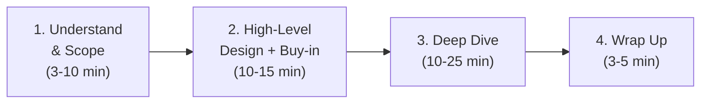

# System Design Interview — A 4-Step Framework (Revision Handbook)

> **Source:** *System Design Interview – An Insider's Guide* (Alex Xu) — "A Framework For System Design Interviews" chapter
> **Audience:** Senior engineer / EM preparing to **take or give** system design interviews
> 🏷️ Tags: `#SystemDesign` `#Interview` `#Architecture` `#Scalability`

> 💡 **Labeling:** **[Source]** = from the chapter · **[AI-added]** = expanded by me for interview depth · ⚠️ = watch-out.

---

# Table of Contents

- [The Mindset](#the-mindset)
- [What Interviewers Actually Assess](#what-interviewers-actually-assess)
- [The 4-Step Framework](#the-4-step-framework)
  - [Step 1 — Understand the Problem & Scope](#step-1--understand-the-problem--establish-scope)
  - [Step 2 — High-Level Design & Buy-In](#step-2--propose-high-level-design--get-buy-in)
  - [Step 3 — Design Deep Dive](#step-3--design-deep-dive)
  - [Step 4 — Wrap Up](#step-4--wrap-up)
- [Time Allocation](#time-allocation-45-min-session)
- [Dos & Don'ts](#dos--donts)
- [Red Flags to Avoid](#-red-flags-to-avoid)
- [Worked Mini-Example: News Feed](#worked-mini-example-news-feed)
- [Cheat Sheet](#-cheat-sheet-one-page)
- [Flashcards](#flashcards)
- [Mnemonics](#mnemonics)
- [Revision Timers](#revision-timers)
- [Glossary](#glossary)
- [Confidence Checklist](#confidence-checklist)
- [Related Topics](#related-topics-to-study-next)

---

## The Mindset

**[Source]** System design interviews feel intimidating because questions are deliberately **vague and broad** ("design product X"). But **no one expects a real, complete system in an hour** — real systems take hundreds of engineers.

⭐ **The point of the interview:** it simulates two co-workers collaborating on an **ambiguous, open-ended problem**. There is **no perfect answer**. The **process matters more than the final design** — it's your chance to show design thinking, defend choices, and take feedback well.

> 🟡 **Interview favorite framing:** "The final design is less important than how you get there."

---

## What Interviewers Actually Assess

**[Source]** It's **much more than technical design skill**. Strong signals they look for:

| Signal | What it shows |
|---|---|
| 🤝 **Collaboration** | Treating the interviewer as a teammate |
| 💪 **Working under pressure** | Staying structured when it's ambiguous |
| 🧩 **Resolving ambiguity constructively** | Turning vague asks into concrete scope |
| ❓ **Asking good questions** | Often *specifically* looked for |

**[AI-added]** As a senior/EM candidate, the bar shifts toward **trade-off reasoning, bottleneck analysis, and resource estimation** — not just drawing boxes.

---

## The 4-Step Framework



---

### Step 1 — Understand the Problem & Establish Scope

**[Source] ⚠️ Don't be like "Jimmy"** — the kid who blurts answers fast. Answering quickly **without understanding requirements is a huge red flag**. It's not a trivia contest.

⭐ **Slow down. Ask clarifying questions. Write down assumptions** (if the interviewer tells you to assume, note it on the board — you'll need it later).

**[Source] Questions to open with:**

- What specific **features** are we building?
- How many **users**?
- Expected **scale/growth** at 3 months, 6 months, 1 year?
- What's the company's **tech stack** / existing services to leverage?

> 🔵 **[AI-added] Also worth asking:** read-heavy vs write-heavy? Latency/consistency requirements? Any regional/compliance constraints?

---

### Step 2 — Propose High-Level Design & Get Buy-In

**[Source]** Goal: an initial blueprint the interviewer **agrees with**. Collaborate — many interviewers love to get involved.

- **Draw box diagrams** of key components: clients (mobile/web), APIs, web servers, data stores, cache, CDN, message queue.
- **Back-of-the-envelope calculations** to check the design fits the scale — **think out loud**, and check first if estimation is even needed.
- **Walk concrete use cases** — helps frame the design and surfaces edge cases.
- **API endpoints & DB schema?** Depends on the problem. Too low-level for "design Google search"; fair game for "backend for a multiplayer poker game." **Ask the interviewer.**

---

### Step 3 — Design Deep Dive

**[Source]** By now you've: agreed on scope, sketched the blueprint, gotten feedback, and have hints on where to focus.

- Work **with** the interviewer to **prioritize components**.
- Every interview differs: some want high-level focus; **senior interviews** often go into **performance characteristics, bottlenecks, and resource estimation**; most want you to dig into specific components.
- ⭐ **[Source] Time management is essential** — don't get lost in minutiae that don't demonstrate ability.

> ⚠️ **[Source] Example of a bad rabbit-hole:** deep-diving Facebook's EdgeRank ranking algorithm — burns precious time, doesn't prove you can design something scalable.

**[AI-added] Good deep-dive picks:** URL shortener → hash function design. Chat system → latency reduction + online/offline presence.

---

### Step 4 — Wrap Up

**[Source]** Follow-up discussion. Directions:

- **Identify bottlenecks & improvements** — ⚠️ **never say your design is perfect.** There's always something to improve; this shows critical thinking.
- **Recap your design** — especially if you proposed multiple solutions (refreshes the interviewer after a long session).
- Discuss **error cases** (server failure, network loss).
- Discuss **operations**: monitoring metrics, error logs, rollout.
- Discuss the **next scale curve**: "if this supports 1M users, what changes for 10M?"
- Propose **further refinements** you'd make with more time.

---

## Time Allocation (45-min session)

**[Source]** Rough guide (actual depends on scope):

| Step | Time |
|---|---|
| 1 — Understand & scope | 3–10 min |
| 2 — High-level design + buy-in | 10–15 min |
| 3 — Deep dive | 10–25 min |
| 4 — Wrap up | 3–5 min |

---

## Dos & Don'ts

**[Source]**

| ✅ Dos | ❌ Don'ts |
|---|---|
| Always ask for clarification | Be unprepared for typical questions |
| Understand the requirements | Jump to a solution before clarifying |
| Accept there's no single "best" answer (startup ≠ scaled company) | Over-detail one component too early |
| Communicate your thinking out loud | Think in silence |
| Suggest multiple approaches | Assume you're done after the design |
| Design the most **critical components first** | Give up when stuck (ask for hints instead) |
| Bounce ideas off the interviewer as a teammate | Assume your assumptions are correct |
| Never give up | Forget: you're done only when the interviewer says so |

---

## 🚩 Red Flags to Avoid

**[Source]**

- ⚠️ **Over-engineering** — "a real disease": delighting in design purity, ignoring trade-offs, blind to the compounding cost of over-built systems.
- ⚠️ **Narrow-mindedness** and **stubbornness**.
- ⚠️ Answering fast without understanding ("Jimmy" behavior).

---

## Worked Mini-Example: News Feed

**[Source]** Sample clarifying exchange:

| You ask | Interviewer |
|---|---|
| Mobile, web, or both? | Both |
| Most important features? | Make a post; see friends' feed |
| Sort order? | Reverse chronological (keep it simple) |
| Max friends per user? | 5,000 |
| Traffic? | 10M DAU |
| Media in feed? | Images and videos |

**[Source]** The design splits into two flows:
- **Feed publishing** — on post, data is written to cache/DB and fanned out into friends' feeds.
- **News feed building** — aggregate friends' posts in reverse chronological order.

**[AI-added]** Deep-dive components that typically appear: **Fanout Service** (fanout-on-write vs fanout-on-read trade-off), **Message Queue + Fanout Workers**, and layered caches (Post / User / News Feed).

---

## 🧾 Cheat Sheet (one page)

```text
4 STEPS  (45 min)
  1. UNDERSTAND & SCOPE (3-10)   -> ask features/users/scale/stack; write assumptions
  2. HIGH-LEVEL + BUY-IN (10-15) -> box diagram; back-of-envelope; walk use cases
  3. DEEP DIVE (10-25)           -> prioritize components; trade-offs; watch the clock
  4. WRAP UP (3-5)               -> bottlenecks, errors, ops, next scale curve, recap

GOLDEN RULES
  - Process > final design. No perfect answer.
  - Don't be Jimmy: clarify before solving.
  - Never say "it's perfect." Communicate out loud. Ask for hints.
  - Critical components first. You're done when THEY say so.

RED FLAGS: over-engineering, ignoring trade-offs, stubbornness, silence.
```

---

## Flashcards

| # | Q | A |
|---|---|---|
| 1 | The 4 steps? | Understand/Scope → High-level+Buy-in → Deep dive → Wrap up |
| 2 | What matters most? | The **process**, not the final design |
| 3 | Is there a best answer? | No — depends on requirements (startup vs scaled) |
| 4 | "Jimmy" mistake? | Answering fast without understanding requirements |
| 5 | Step 1 questions? | Features, users, scale/growth, tech stack |
| 6 | Non-technical signals assessed? | Collaboration, pressure, ambiguity, good questions |
| 7 | Biggest red flag? | Over-engineering / ignoring trade-offs |
| 8 | Step 2 deliverable? | Agreed high-level box diagram + estimates |
| 9 | Should you include API/schema? | Depends on problem — ask |
| 10 | Deep-dive risk? | Rabbit-holing on minutiae; poor time management |
| 11 | Never say what in wrap-up? | "My design is perfect / can't be improved" |
| 12 | Wrap-up topics? | Bottlenecks, errors, ops/monitoring, next scale curve |
| 13 | When are you done? | When the **interviewer** says so |
| 14 | Time for deep dive (45m)? | 10–25 min (the largest block) |
| 15 | Design order? | Most **critical** components first |

---

## Mnemonics

- **The 4 steps — "U-H-D-W" → "Understand, How, Dig, Wrap"** (Understand → High-level → Deep dive → Wrap).
- **Step 1 questions — "FUST": F**eatures, **U**sers, **S**cale, **T**ech stack.
- **The golden rule — "Don't be Jimmy"**: clarify before you solve.

---

## Revision Timers

**⏱️ 30-Second**
> Four steps in 45 min: (1) Understand & scope — clarify before solving, don't be Jimmy; (2) High-level design + buy-in — box diagram, back-of-envelope; (3) Deep dive — prioritize critical components, watch the clock; (4) Wrap up — bottlenecks, errors, ops, next scale curve. Process > final design.

**⏱️ 2-Minute**
> Add the *why*: it simulates real collaboration on an ambiguous problem — interviewers assess collaboration, composure, ambiguity-handling, and question-asking as much as design. Step 1: ask features/users/scale/stack, write assumptions. Step 2: draw components (clients, LB, servers, cache, CDN, queue, DB), estimate, walk use cases, ask before adding API/schema detail. Step 3: prioritize with the interviewer; seniors get pushed on bottlenecks and estimation; avoid rabbit holes like EdgeRank. Step 4: never claim perfection; cover errors, ops, and the next scale curve.

**⏱️ 5-Minute**
> Everything above **plus** the Dos/Don'ts, the red flags (over-engineering is the big one), the time budget (deep dive is the biggest block), and the news-feed example (clarifying Q&A → publish/build flows → fanout + queue + layered caches).

---

## Glossary

| Term | Meaning |
|---|---|
| **Back-of-the-envelope** | Rough capacity/throughput estimate to sanity-check a design |
| **Fanout** | Distributing a post into many followers' feeds (on-write vs on-read) |
| **DAU** | Daily Active Users — a core scale metric |
| **Bottleneck** | The component that limits overall system throughput |
| **Over-engineering** | Adding complexity/purity beyond what requirements justify |
| **Buy-in** | Interviewer's agreement on your high-level blueprint before deep dive |

---

## Confidence Checklist

- [ ] I can name the 4 steps and their rough time budget from memory.
- [ ] I lead with clarifying questions (FUST), not a solution.
- [ ] I draw a high-level diagram and get buy-in before deep-diving.
- [ ] I prioritize the most critical component first.
- [ ] I always discuss bottlenecks, errors, ops, and the next scale curve.
- [ ] I never claim the design is perfect, and I communicate out loud.

**Interview Difficulty:** 🟡 Medium — the framework is simple; discipline (clarify, time-manage, avoid over-engineering) is what separates strong candidates.

---

## Related Topics to Study Next

- **Back-of-the-envelope estimation** (QPS, storage, bandwidth)
- **Core building blocks** — load balancers, caching, CDN, message queues, DB replication/sharding
- **CAP theorem & consistency models**
- **Specific designs** — URL shortener, chat system, news feed, rate limiter
- **Trade-off patterns** — fanout-on-write vs on-read, SQL vs NoSQL, push vs pull

---

🏷️ `#SystemDesign` `#Interview` `#Architecture` `#Scalability` `#EngineeringLeadership`
