# Deployment Strategies — Cloud-Native Study Notes

**Audience:** Software Engineers · DevOps Engineers · Solution Architects · Tech Leads · Engineering Managers
**Purpose:** Revision reference + Senior/Principal/Architect interview preparation
**Currency:** Reflects practice as of mid-2026

---

## Table of Contents

- [How to use these notes](#how-to-use-these-notes)
- [What changed recently (verified July 2026)](#what-changed-recently-verified-july-2026)
- [The mental model: four primitives](#the-mental-model-four-primitives)
- [Part 1 — The Nine Core Strategies](#part-1--the-nine-core-strategies)
  - [1. Recreate Deployment](#1-recreate-deployment)
  - [2. Rolling Deployment](#2-rolling-deployment)
  - [3. Rolling Deployment with Batches](#3-rolling-deployment-with-batches)
  - [4. Blue-Green Deployment](#4-blue-green-deployment)
  - [5. Canary Deployment](#5-canary-deployment)
  - [6. A/B Testing Deployment](#6-ab-testing-deployment)
  - [7. Shadow Deployment (Traffic Mirroring)](#7-shadow-deployment-traffic-mirroring)
  - [8. Ring-Based Deployment](#8-ring-based-deployment)
  - [9. Feature Toggle Deployment (Feature Flags)](#9-feature-toggle-deployment-feature-flags)
  - [10. Immutable Deployment](#10-immutable-deployment)
- [Part 2 — Composite Patterns and Deployment Contexts](#part-2--composite-patterns-and-deployment-contexts)
  - [11. Progressive Delivery](#11-progressive-delivery)
  - [12. Dark Launch](#12-dark-launch)
  - [13. Big Bang Deployment](#13-big-bang-deployment)
  - [14. Zero Downtime Deployment](#14-zero-downtime-deployment)
  - [15. Multi-Region Deployment](#15-multi-region-deployment)
  - [16. Multi-Cloud Deployment](#16-multi-cloud-deployment)
  - [17. Database Deployment Strategies](#17-database-deployment-strategies)
  - [18. Serverless Deployment](#18-serverless-deployment)
  - [19. Edge Deployment](#19-edge-deployment)
- [Part 3 — Kubernetes Implementation](#part-3--kubernetes-implementation)
  - [3.1 Rolling update — the default](#31-rolling-update--the-default)
  - [3.2 Blue-Green on Kubernetes](#32-blue-green-on-kubernetes)
  - [3.3 Canary with Gateway API (current recommendation)](#33-canary-with-gateway-api-current-recommendation)
  - [3.4 Canary with Istio](#34-canary-with-istio)
  - [3.5 Legacy — ingress-nginx canary](#35-legacy--ingress-nginx-canary)
  - [3.6 Blue-Green and Canary via Argo CD (GitOps)](#36-blue-green-and-canary-via-argo-cd-gitops)
  - [3.7 ConfigMaps, Secrets and the restart problem](#37-configmaps-secrets-and-the-restart-problem)
- [Part 4 — AWS Implementation](#part-4--aws-implementation)
  - [4.1 Service map](#41-service-map)
  - [4.2 Strategy-by-service matrix](#42-strategy-by-service-matrix)
  - [4.3 CodeDeploy — the strategy engine](#43-codedeploy--the-strategy-engine)
  - [4.4 ALB weighted target groups — canary without a mesh](#44-alb-weighted-target-groups--canary-without-a-mesh)
  - [4.5 AWS AppConfig — feature flags natively](#45-aws-appconfig--feature-flags-natively)
  - [4.6 ASG instance refresh with checkpoints — batched rolling on VMs](#46-asg-instance-refresh-with-checkpoints--batched-rolling-on-vms)
  - [4.7 Cost, limitations and best practices](#47-cost-limitations-and-best-practices)
- [Part 5 — Azure Implementation](#part-5--azure-implementation)
  - [5.1 Service map](#51-service-map)
  - [5.2 Strategy-by-service matrix](#52-strategy-by-service-matrix)
  - [5.3 App Service deployment slots — blue-green done properly](#53-app-service-deployment-slots--blue-green-done-properly)
  - [5.4 Container Apps — revision-based traffic splitting](#54-container-apps--revision-based-traffic-splitting)
  - [5.5 Azure App Configuration — feature flags with targeting](#55-azure-app-configuration--feature-flags-with-targeting)
  - [5.6 Azure Pipelines with environments and gates](#56-azure-pipelines-with-environments-and-gates)
  - [5.7 Azure-specific notes](#57-azure-specific-notes)
- [Part 6 — CI/CD Platform Integration](#part-6--cicd-platform-integration)
- [Part 7 — Comparison Tables](#part-7--comparison-tables)
  - [7.1 Master comparison](#71-master-comparison)
  - [7.2 Head-to-head](#72-head-to-head)
- [Part 8 — Decision Matrix](#part-8--decision-matrix)
  - [8.1 By application characteristic](#81-by-application-characteristic)
  - [8.2 Decision tree](#82-decision-tree)
- [Part 9 — AWS vs Azure Comparison](#part-9--aws-vs-azure-comparison)
- [Part 10 — Advantages & Disadvantages Reference](#part-10--advantages--disadvantages-reference)
- [Part 11 — Production Case Studies](#part-11--production-case-studies)
  - [Netflix — automated canary analysis](#netflix--automated-canary-analysis)
  - [Amazon — ring-like staged deployment at extreme frequency](#amazon--ring-like-staged-deployment-at-extreme-frequency)
  - [Microsoft — the Windows Insider ring model](#microsoft--the-windows-insider-ring-model)
  - [GitHub — Scientist and shadow validation](#github--scientist-and-shadow-validation)
  - [Intuit — progressive delivery at scale with Argo Rollouts](#intuit--progressive-delivery-at-scale-with-argo-rollouts)
  - [Uber, Spotify, LinkedIn, Airbnb, Meta — the common pattern](#uber-spotify-linkedin-airbnb-meta--the-common-pattern)
- [Part 12 — Quick Revision](#part-12--quick-revision)
  - [One-page cheat sheet](#one-page-cheat-sheet)
  - [Common production issues & troubleshooting](#common-production-issues--troubleshooting)
  - [Architect-level scenarios](#architect-level-scenarios)
  - [Key takeaways](#key-takeaways)

---

## How to use these notes

| If you have… | Read |
|---|---|
| 10 minutes | [Mental model](#the-mental-model-four-primitives) + [Cheat sheet](#one-page-cheat-sheet) |
| 1 hour | Mental model + Part 1 (nine core strategies) + [Comparison tables](#part-6--comparison-tables) |
| Interview tomorrow | Mental model + [Decision matrix](#part-7--decision-matrix) + [Interview questions](#architect-level-scenarios) + [Cheat sheet](#one-page-cheat-sheet) |
| A design review | Part 1 + your platform section (Part 3/4/5) + [Common production issues](#common-production-issues--troubleshooting) |

---

## What changed recently (verified July 2026)

These are the items most likely to make older study material wrong. Each was checked against current sources.

| Change | Status | Impact on this topic |
|---|---|---|
| **ingress-nginx retired** | Announced Nov 2025 by Kubernetes SIG Network; **end-of-life March 2026** — no further releases, bug fixes or security patches | ~50% of clusters used it. NGINX-annotation-based canary (`nginx.ingress.kubernetes.io/canary`) is now **legacy**. Covered below, but plan migration. |
| **Gateway API is the successor** | GA; v1.4 GA Oct 2025, v1.6.0 as of June 2026. GatewayClass / Gateway / HTTPRoute stable | Traffic splitting for canary now belongs in `HTTPRoute` `backendRefs` weights — a typed, validated field rather than an annotation |
| **AWS CodeCommit reversed course** | Closed to new customers July 2024; **returned to full GA 24 Nov 2025** after customer pushback. Git LFS planned 2026 | Older material saying "CodeCommit is dead" is wrong. It is available again — though GitHub remains the industry default source stage. |
| **Amazon CodeCatalyst → maintenance mode; AWS Proton → sunset** | Announced alongside the CodeCommit reversal | Do not architect new pipelines on either |
| **Argo Rollouts and Flagger both healthy** | Both production-grade and actively maintained | The choice is ecosystem-driven (Argo CD → Rollouts, Flux → Flagger), not maturity-driven |

> [!WARNING]
> If you are running ingress-nginx in production today, you are running an internet-exposed component that receives no security patches. This is the single most urgent item in this document.

---

## The mental model: four primitives

Most people memorise 20 strategy names and then freeze when an interviewer asks about a strategy they haven't seen. Don't memorise the list — memorise the primitives. **Every named strategy is a combination of four independent choices.**

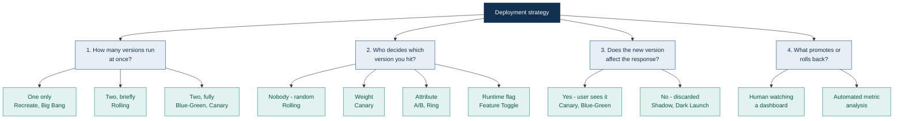

Work any strategy back to these four answers and you can derive its properties instead of recalling them:

| Strategy | Versions live | Routing decided by | User sees new version | Promotion |
|---|---|---|---|---|
| Recreate | 1 | n/a | Yes | Manual |
| Rolling | 2 (transiently) | Nothing — random | Yes | Automatic |
| Blue-Green | 2 (fully) | Atomic switch | Yes, all at once | Manual/gated |
| Canary | 2 (fully) | Weight | Yes, a subset | Metric-driven |
| A/B Testing | 2+ | User attribute | Yes, a cohort | Statistical significance |
| Shadow | 2 (fully) | Duplicated, response discarded | **No** | Manual |
| Ring | 2 (fully) | Population membership | Yes, by ring | Ring-by-ring gate |
| Feature Toggle | 1 binary, 2 code paths | Runtime flag | Configurable | Flag change |
| Immutable | 2 (fully) | Any of the above | Depends | Depends |

> [!TIP]
> **The single most valuable insight in this document:** Feature Toggle is on a different axis from all the others. Every other strategy controls *which build is running*. Feature toggles control *which code path executes inside a build*. That is why they compose with everything else — and why "deploy" and "release" become separate events once you adopt them. Say this in an interview and you will sound like someone who has actually run this.

### The two questions that decide everything

1. **Can you run two versions of your application simultaneously?** If the answer is no — because of a database schema, a stateful protocol, or a licence — then Recreate is your only honest option and every clever strategy below is unavailable to you. This is almost always a *database* constraint, not an application one.
2. **Can you detect a bad release from metrics within your rollout window?** If not, canary and progressive delivery give you a false sense of safety. You will roll out 100% of a broken release slowly instead of quickly.

---

# Part 1 — The Nine Core Strategies

---

## 1. Recreate Deployment

### 1.1 Definition

Stop every instance of the old version, then start the new version. There is a window where nothing is running. Also called "stop-start" or "highlander" deployment.

### 1.2 Why it exists

It exists because it is the only strategy that **guarantees exactly one version is live at any moment**. That guarantee matters more than you would think:

- A database migration that is not backward-compatible will corrupt data if two versions write concurrently
- A singleton background job (a scheduler, a ledger reconciler) must not run twice
- Licensing sometimes forbids concurrent instances
- Some stateful protocols cannot tolerate mixed-version peers

It is also the default when you have no orchestration at all. Every team starts here.

### 1.3 Architecture

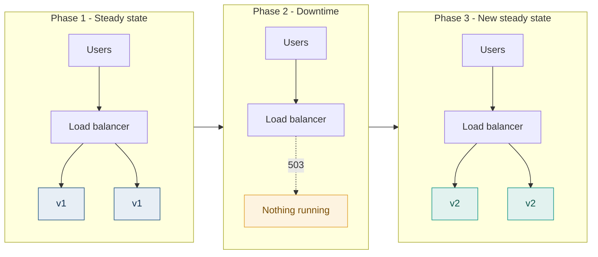

### 1.4 How it works

1. Deployment triggered
2. Load balancer drains connections (if you are careful) or drops them (if you are not)
3. All old instances terminated
4. **Downtime begins** — requests return 5xx or hang
5. New instances started
6. Health checks pass
7. Load balancer registers new instances
8. **Downtime ends**

**Request flow during the gap:** the load balancer has zero healthy targets. Depending on configuration it returns 503, times out, or queues until a timeout fires. Clients see errors. There is no way to hide this at the infrastructure layer — only a maintenance page in front of it.

### 1.5 Deployment workflow

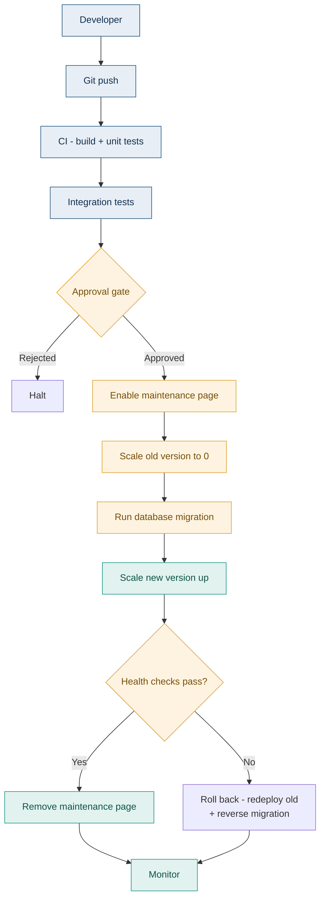

### 1.6 Step-by-step implementation

| Stage | Action | Why it matters |
|---|---|---|
| 1 | Announce the maintenance window | Recreate is the one strategy where users must be told |
| 2 | Put up a static maintenance page (CDN-served, not app-served) | If it is served by the app, it goes down with the app |
| 3 | Stop accepting new work — drain queues, pause schedulers | Half-processed messages are the usual source of corruption |
| 4 | Take a database backup / snapshot | Your only rollback path if the migration is destructive |
| 5 | Scale old version to zero, wait for full termination | Do not overlap; the whole point is that you do not |
| 6 | Run the schema migration | Now safe, because nothing is connected |
| 7 | Deploy and start the new version | |
| 8 | Wait for health checks and warm-up | JIT, connection pools, caches |
| 9 | Smoke test against the real environment | Before real users, not after |
| 10 | Remove maintenance page, resume schedulers | |
| 11 | Monitor intensively for one hour | Errors surface under real load, not under smoke tests |

### 1.7 Rollback mechanism

**How it works:** redeploy the previous artefact by the same process — another full downtime window. If the migration was destructive, restore the database snapshot.

**Triggered when:** health checks fail, smoke tests fail, or error rate exceeds threshold after the maintenance page is removed.

| Advantages | Limitations |
|---|---|
| Conceptually simple — no traffic-splitting state to unwind | Requires a **second** downtime window |
| No possibility of mixed-version data corruption | Rollback time equals deployment time (minutes, not seconds) |
| Database restore is a clean, well-understood operation | Data written between deploy and rollback is lost on a restore |
| | Rollback under pressure, at 2am, with users waiting |

### 1.8 Monitoring

| Layer | What to watch |
|---|---|
| **Health checks** | Startup probe with a generous threshold — cold start is the risk here, not steady state |
| **Metrics** | Time-to-healthy (the real duration of your outage), error rate for 60 min post-deploy, connection pool saturation |
| **Logs** | Migration output captured and retained; startup exceptions |
| **Traces** | Less useful here — there is no version comparison to make |
| **Alerts** | Alert if downtime exceeds the announced window. That is the SLO that matters. |

### 1.9 Real-world example

**Core banking and ERP batch systems.** Overnight maintenance windows on systems like SAP, Temenos or Finacle are Recreate deployments. The batch cycle stops, schema changes apply, the system restarts. The business has accepted a nightly window in exchange for the guarantee that no two versions ever touch the ledger concurrently.

**Why they use it:** correctness of financial data outranks availability. A mixed-version write to a general ledger is unrecoverable in a way that a two-hour outage is not.

### 1.10 Best practices

- Serve the maintenance page from the **CDN or load balancer**, never from the application
- Take a database snapshot immediately before the migration, every time, with no exceptions
- Practise the rollback in a staging environment with production-sized data — restore time scales with data volume and surprises people
- Automate the whole sequence; a human executing 11 manual steps at 2am will skip one
- Publish the window to users well in advance and finish early

### 1.11 Common mistakes

| Mistake | Consequence |
|---|---|
| Serving the maintenance page from the app | The page goes down with the app; users see a raw 502 |
| Not draining message queues first | Messages consumed by v1, half-processed, redelivered to v2 with different semantics |
| No database snapshot | The migration fails halfway and there is no way back |
| Assuming rollback is fast | Restoring a 500 GB database is not a five-minute operation |
| Not pausing scheduled jobs | A cron fires mid-migration against a half-migrated schema |
| Testing the migration only on an empty database | It works in 2 seconds in dev and takes 40 minutes in production |

### 1.12 Interview questions

**Beginner — When would you deliberately choose Recreate over Rolling?**
When you cannot have two versions live simultaneously. The usual reason is a non-backward-compatible database migration; other reasons are singleton background jobs, licence restrictions, and stateful protocols that reject mixed-version peers.

**Intermediate — How do you minimise downtime in a Recreate deployment?**
Pre-pull container images to every node so start time is not download time. Optimise application startup (lazy-load non-critical components, tune JVM). Separate the migration from the deployment where possible. Warm caches before removing the maintenance page. But be clear that you are minimising, not eliminating — if downtime is unacceptable, Recreate is the wrong strategy.

**Advanced — Your Recreate deployment's migration takes 40 minutes on production data but 2 seconds in staging. What do you do?**
First, fix the staging data volume — testing migrations against empty databases is the root cause. Then restructure the migration itself: make it online (add nullable columns, backfill in batches outside the deployment, add constraints later), or use a tool like gh-ost or pt-online-schema-change that builds a shadow table and swaps. The deeper answer is that a 40-minute migration should not be in the deployment path at all; decouple schema change from code deploy using the expand-and-contract pattern (see Part 2.7).

**Scenario — Mid-deployment the new version fails health checks. Old version is already gone. Walk me through the next 10 minutes.**
Keep the maintenance page up — do not expose a broken service. Capture logs and the failing health-check response before changing anything, because you will lose the evidence on redeploy. Decide immediately between fix-forward and rollback based on whether you understand the failure; if you do not understand it within about two minutes, roll back rather than debug in production. If the migration ran and is not backward-compatible, rollback means database restore, so check whether any writes have occurred since. Communicate an updated window to stakeholders before they ask.

**Architect — A team proposes Recreate for a customer-facing API with a 99.95% availability SLO. Assess.**
99.95% is roughly 22 minutes of downtime per month total. A single Recreate deployment plausibly consumes the entire monthly budget, and you would have zero left for genuine incidents. The strategy is incompatible with the SLO at any meaningful deployment frequency. The real question is *why* they think they need it — it is almost always a database constraint. I would direct effort at making migrations backward-compatible via expand-and-contract, which unlocks Rolling or Blue-Green, rather than at negotiating the SLO down.

### Summary

Recreate trades availability for the guarantee of a single live version. It is the correct choice when mixed-version execution is genuinely unsafe, and the wrong choice everywhere else. If you find yourself defending it, check whether the real constraint is a database migration you could make backward-compatible instead.

---

## 2. Rolling Deployment

### 2.1 Definition

Replace instances of the old version with the new version **incrementally**, a few at a time, until the whole fleet is updated. No downtime, no extra infrastructure. This is the default in Kubernetes, ECS, and most autoscaling groups.

### 2.2 Why it exists

It removes Recreate's downtime **without doubling your infrastructure** the way Blue-Green does. You reuse the same capacity, replacing it piece by piece. For the large majority of stateless services this is the right default and nothing more sophisticated is needed.

### 2.3 Architecture

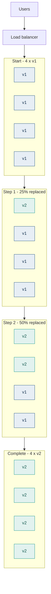

### 2.4 How it works

Two parameters govern everything:

| Parameter | Meaning | Effect |
|---|---|---|
| `maxUnavailable` | How many instances may be down at once | Higher = faster, less capacity headroom |
| `maxSurge` | How many *extra* instances may exist above desired count | Higher = faster, needs spare capacity |

The controller loops: bring up `maxSurge` new instances → wait for readiness → terminate an equal number of old ones → repeat.

**Request flow during rollout:** the load balancer holds a mix of v1 and v2 targets. A given user's requests hit **either version, unpredictably, request by request**. This is the defining property of Rolling and the source of all its problems.

> [!WARNING]
> During a rolling deployment, a single user's session can bounce between v1 and v2 on consecutive requests. If v2 changed an API response shape, a session format, or a cache key, that user sees inconsistent behaviour. **Backward compatibility between adjacent versions is not optional in Rolling — it is a hard requirement.**

### 2.5 Deployment workflow

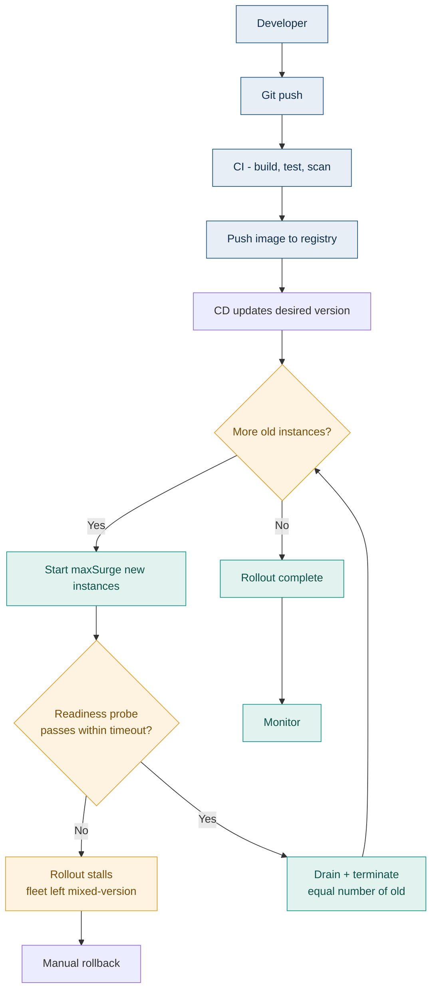

### 2.6 Step-by-step implementation

1. **Verify backward compatibility** — v2 must tolerate v1's data, and v1 must tolerate v2's. This is a code review checklist item, not an afterthought.
2. **Configure readiness probes correctly.** The probe must return healthy only when the instance can genuinely serve traffic — dependencies connected, caches warm enough, migrations applied. A probe that returns 200 from a static handler makes rolling deployment dangerous, because traffic arrives before the app is ready.
3. **Configure liveness probes conservatively.** A liveness probe that is too aggressive kills instances that are merely slow, turning a rollout into a restart loop.
4. **Set a PodDisruptionBudget** (Kubernetes) or minimum healthy percent (ECS/ASG) so the rollout cannot take the service below quorum.
5. **Set `maxSurge` and `maxUnavailable`** deliberately. `maxSurge: 25%, maxUnavailable: 0` is the safe default — never dips below capacity, needs 25% headroom.
6. **Configure graceful shutdown.** On SIGTERM: stop accepting new requests, fail the readiness probe, finish in-flight work, then exit. `terminationGracePeriodSeconds` must exceed your longest request.
7. **Set `progressDeadlineSeconds`** so a stalled rollout fails loudly rather than sitting half-deployed forever.
8. **Deploy and watch** — error rate, latency, and the ratio of healthy v1 to v2.

> [!TIP]
> The most common rolling-deployment bug is a readiness probe that passes before the pod can actually serve. Add a `preStop` hook with a short sleep (5–10s) so the load balancer has time to observe the readiness failure and stop routing before the process exits. Without it you drop requests on every single pod replacement.

### 2.7 Rollback mechanism

**How it works:** trigger a *second* rolling deployment back to the previous version. It is the same mechanism in reverse.

**Triggered when:** error-rate or latency alarms fire, readiness probes fail repeatedly, or `progressDeadlineSeconds` is exceeded.

| Advantages | Limitations |
|---|---|
| No extra infrastructure required | **Rollback is as slow as deployment** — minutes, not seconds |
| Fully automated in every orchestrator | Fleet passes through a mixed-version state again on the way back |
| `kubectl rollout undo` is a single command | Anything v2 wrote in an incompatible format is still there |
| Partial rollouts can be halted mid-flight | Cannot roll back a database migration this way |

> [!NOTE]
> This is the sharpest contrast with Blue-Green. Blue-Green rollback is a load-balancer switch measured in **seconds**. Rolling rollback is a full redeployment measured in **minutes**. If your recovery-time requirement is tight, that difference alone can decide the strategy.

### 2.8 Monitoring

| Layer | What to watch |
|---|---|
| **Health checks** | Readiness (can it serve?), liveness (is it wedged?), startup (is it still booting?) — three distinct questions, three distinct probes |
| **Metrics** | Error rate **split by version label**, p50/p95/p99 latency by version, pod restart count, rollout progress |
| **Logs** | Structured logs carrying a version field — otherwise you cannot attribute an error to a version |
| **Traces** | Tag spans with the version. This is how you find "the new version is slow only on the checkout path". |
| **Alerts** | Error rate delta between versions, rollout exceeding progress deadline, restart loop detection |

**The critical instrumentation point:** every metric, log and trace must carry a **version label**. Without it, during a rolling deployment you see an aggregate error rate that is a blend of both versions, and a v2 that is failing 100% of the time looks like a fleet-wide 25% error rate. Attribution is everything.

### 2.9 Real-world example

**The default for most Kubernetes workloads across the industry.** Stateless HTTP services at nearly every organisation running Kubernetes use rolling updates without modification, because the properties match: no downtime, no extra cost, fully automated, and adequate safety when the service is genuinely stateless and versions are compatible.

**Why:** the operational simplicity is worth more than the marginal safety of canary for the large majority of services. Sophisticated strategies are reserved for the small number of services where a bad release is genuinely expensive.

### 2.10 Best practices

- **`maxUnavailable: 0` for user-facing services.** Never dip below full capacity during a deploy.
- Enforce **N-1 compatibility** as a review standard: version N must interoperate with N-1 in both directions.
- Label every metric, log and trace with the version. Non-negotiable.
- Use a PodDisruptionBudget so node drains and rollouts cannot collectively breach quorum.
- Set `progressDeadlineSeconds` so failures are loud.
- Keep the previous ReplicaSet (`revisionHistoryLimit`) so `rollout undo` actually works.
- Add a `preStop` sleep to close the readiness/termination race.

### 2.11 Common mistakes

| Mistake | Consequence |
|---|---|
| Readiness probe that returns 200 unconditionally | Traffic routed to instances that cannot serve; errors during every deploy |
| No graceful shutdown handling | In-flight requests killed on every pod replacement |
| Assuming users stick to one version | Session bouncing between v1 and v2 produces inconsistent UX and corrupt session state |
| Metrics not labelled by version | Cannot tell whether the new version is the problem |
| `maxUnavailable: 25%` on a 4-replica service | Loses a quarter of capacity during deploy; a traffic spike mid-rollout causes an outage |
| Shipping a breaking API change | v1 and v2 clients coexist; one of them breaks |
| Rolling with a non-backward-compatible migration | The classic production incident — see Part 2.7 |

### 2.12 Interview questions

**Beginner — What are `maxSurge` and `maxUnavailable`?**
`maxSurge` is how many extra instances may run above the desired count during a rollout; `maxUnavailable` is how many may be missing. Together they control the speed/safety trade-off. `maxSurge: 25%, maxUnavailable: 0` never dips below capacity but needs 25% spare headroom.

**Intermediate — Why is backward compatibility mandatory in rolling deployments?**
Because both versions serve traffic simultaneously and the load balancer does not pin a user to a version. Consecutive requests from the same user can hit different versions. Any change to API response shape, session format, cache key structure or message schema will break as a result.

**Advanced — Requests are dropped during every rolling deployment despite readiness probes. Why?**
Almost certainly the termination race. When a pod is deleted, two things happen in parallel: the endpoint is removed from the Service, and SIGTERM is sent to the container. Endpoint propagation to every kube-proxy and load balancer is *not* instantaneous, so traffic keeps arriving for a short window after the process starts shutting down. The fix is a `preStop` hook that sleeps 5–10 seconds — the container keeps serving while endpoint removal propagates, then shuts down. Also ensure `terminationGracePeriodSeconds` exceeds your longest request duration.

**Scenario — Rollout has stalled at 50%. Half the fleet is v1, half is v2, and it has been sitting there for 20 minutes. What is happening and what do you do?**
The new pods are failing readiness, so the controller will not proceed, and `progressDeadlineSeconds` either is not set or has not fired. Diagnose first: `kubectl describe` the failing pods and check probe failures, image pull errors, resource limits, and missing config or secrets. Meanwhile the service is running at reduced effective capacity in a mixed state, so decide quickly. If v2 is clearly broken, `kubectl rollout undo` immediately. Longer-term, set `progressDeadlineSeconds` so this fails loudly rather than hanging, and consider whether automated rollback on failed rollout should be wired into the pipeline.

**Architect — When would you move a service off Rolling onto something more sophisticated, and what would you move it to?**
Three triggers. First, if rollback time matters — Rolling rollback takes as long as deployment, so a tight RTO argues for Blue-Green. Second, if failures are not caught by health checks but only by business metrics (conversion rate, transaction success) — that argues for Canary with automated analysis. Third, if the blast radius of a bad release is very large — a payment path, say — which argues for Canary or Ring. Absent one of these, Rolling's operational simplicity usually wins, and moving to something more complex adds failure modes without buying safety.

### Summary

Rolling is the correct default for stateless services. Its two hard requirements are backward compatibility between adjacent versions and correctly configured probes with graceful shutdown. Its main weakness is rollback speed. Most teams should use Rolling for most services and reserve sophisticated strategies for the few where a bad release is genuinely expensive.

---

## 3. Rolling Deployment with Batches

### 3.1 Definition

Rolling deployment where instances are replaced in **explicit, fixed-size batches with a pause and verification gate between each batch**, rather than in a continuous stream.

### 3.2 Why it exists

Plain Rolling is continuous — the controller replaces instances as fast as readiness allows. That gives you no natural point at which to *check whether things are still fine*. Batching inserts deliberate checkpoints so a bad release is caught after 10% of the fleet rather than 100%.

It is the conceptual bridge between Rolling and Canary: it introduces the idea of a **gate**, without yet introducing traffic weighting.

### 3.3 Architecture

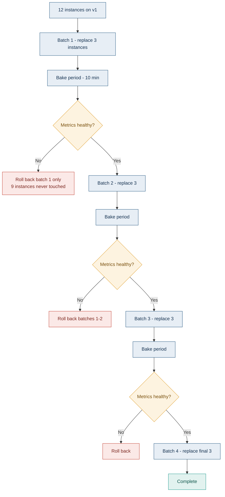

### 3.4 How it works

Identical to Rolling, with one addition: after each batch reaches readiness, the deployment **pauses for a bake period** and evaluates health criteria before proceeding. The criteria may be a human approval, an automated metric query, or both.

**Request flow:** same as Rolling — a mix of versions, randomly distributed. The difference is the *proportion* is held stable during each bake period, which makes metric comparison statistically meaningful in a way that a continuously-changing ratio is not.

### 3.5 Deployment workflow

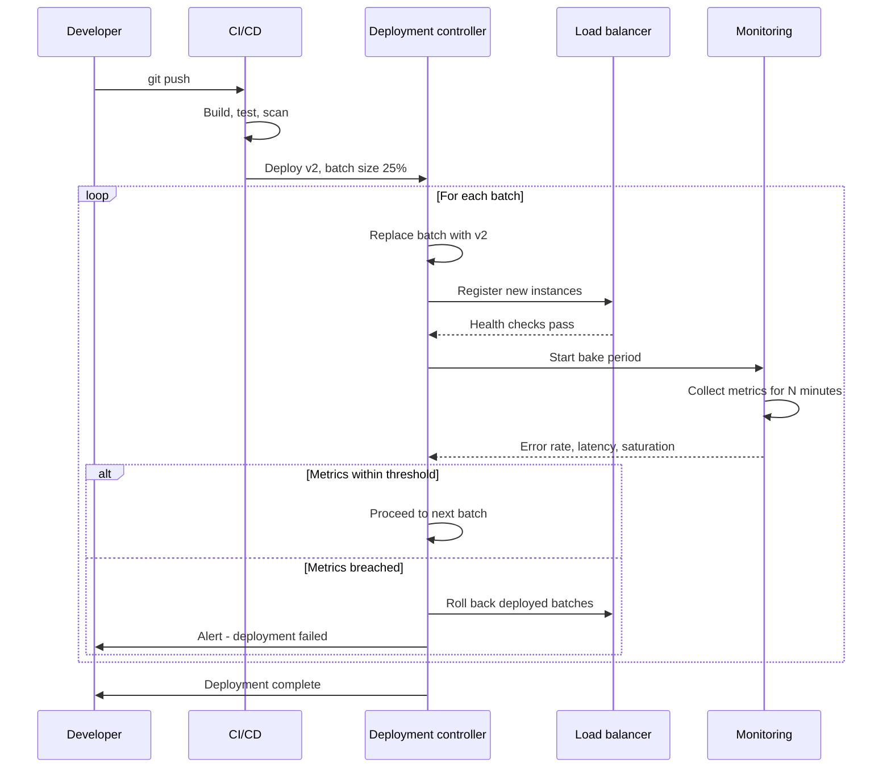

### 3.6 Step-by-step implementation

| Stage | Action |
|---|---|
| 1 | Choose batch size. Smaller = safer but slower. 10–25% is typical. |
| 2 | Choose bake duration. Must be long enough to collect statistically meaningful data — for low-traffic services this is the binding constraint, not the batch size. |
| 3 | Define health criteria **numerically** before deploying, not during |
| 4 | Deploy batch 1 |
| 5 | Bake — collect metrics, compare against baseline (previous version) not against an absolute threshold |
| 6 | Gate: proceed, pause, or roll back |
| 7 | Repeat until complete |
| 8 | Final verification across the whole fleet |

> [!NOTE]
> **Bake time is the hard part, not batch size.** If your service handles 10 requests per minute, a 10-minute bake on a 25% batch gives you about 25 requests to judge by. That is statistically worthless. Low-traffic services cannot do meaningful automated batch verification — for them, use a longer bake or accept human judgement.

### 3.7 Rollback mechanism

**How it works:** roll back only the batches already deployed. The untouched majority of the fleet never ran the bad code.

**Triggered by:** breach of the defined health criteria at any gate, or manual intervention during a bake period.

| Advantages | Limitations |
|---|---|
| Blast radius bounded by batch size | Total deployment time much longer — bake periods dominate |
| Rollback touches only deployed batches — faster than full Rolling | Still no traffic control; you cannot say "1% of users" |
| Natural human approval points for regulated environments | Still requires backward compatibility |
| Statistically stable comparison windows | Low-traffic services cannot verify meaningfully |

### 3.8 Monitoring

Everything from Rolling, plus:

- **Baseline comparison** — compare batch metrics against the *previous version currently serving*, not against a fixed threshold. Absolute thresholds produce false alarms during traffic peaks and miss regressions during troughs.
- **Statistical confidence** — track sample size per bake window; refuse to promote on insufficient data rather than promoting on noise
- **Per-batch dashboards** — you need to see which batch introduced a change

### 3.9 Real-world example

**AWS Elastic Beanstalk "Rolling with additional batch"** and **EC2 Auto Scaling Group instance refresh** with `MinHealthyPercentage` and a checkpoint pause are direct implementations. Many enterprise teams use ASG instance refresh with checkpoints for exactly this reason: a fleet of EC2 instances updated 20% at a time with a 15-minute pause and a CloudWatch alarm gate.

**Why:** it retrofits verification gates onto existing VM-based infrastructure without requiring a service mesh or a doubled environment.

### 3.10 Best practices

- Define numeric success criteria **before** deploying, in code, in the pipeline definition
- Compare against the running baseline, not an absolute number
- Make the first batch the smallest — most failures surface immediately
- Automate the gate; a human watching a dashboard at 2am approves everything
- Set an overall deployment timeout so a stuck deploy fails rather than hangs

### 3.11 Common mistakes

| Mistake | Consequence |
|---|---|
| Bake period too short for the traffic volume | Gate passes on statistical noise |
| Absolute thresholds instead of baseline comparison | False alarms at peak, missed regressions at trough |
| Human approval gates on every batch | Deployment takes all day; humans rubber-stamp |
| All batches the same size | The safety benefit is front-loaded; batch 1 should be smallest |
| No overall timeout | A deployment sits half-complete indefinitely |

### 3.12 Interview questions

**Beginner — How does batched rolling differ from plain rolling?**
Explicit pauses and verification gates between fixed-size batches, rather than continuous replacement. It bounds blast radius and creates a decision point.

**Intermediate — How do you choose batch size and bake duration?**
Batch size from acceptable blast radius and available capacity headroom. Bake duration from the traffic volume needed for a statistically meaningful comparison — which for low-traffic services is the binding constraint and may make automated verification infeasible.

**Advanced — Why compare against a baseline rather than a fixed threshold?**
A fixed threshold cannot distinguish "the new version is broken" from "it is Monday morning and traffic tripled". Comparing the canary batch against the currently-serving previous version at the same moment controls for time-of-day, traffic mix and downstream dependency state. This is the same reasoning behind Netflix's Kayenta and the analysis templates in Argo Rollouts.

**Scenario — Batch 1 shows a 0.3% error rate against a baseline of 0.1%. Threshold is 0.5%. Promote?**
Numerically it passes, but the error rate tripled, and that is a signal. I would want to know the sample size — 0.3% of 300 requests is one error and means nothing; 0.3% of 300,000 is a real regression. I would also want the errors broken down by endpoint and type, because a tripling concentrated on one endpoint is a specific bug while a diffuse tripling is more likely noise. If sample size is adequate and the increase is concentrated, hold and investigate rather than promote. This is exactly why relative-change criteria belong alongside absolute thresholds.

**Architect — Batched rolling or canary?**
Canary if you can control traffic weight and need a small, precisely-sized exposure — 1% of users rather than 25% of instances. Batched rolling if you are on VM infrastructure without a mesh or weighted routing, because it gives you gates without requiring that machinery. The honest framing is that batched rolling is what you use when canary is not available; where both are available, canary is strictly better at bounding user impact.

### Summary

Batched rolling introduces verification gates to rolling deployment without requiring traffic-splitting infrastructure. It bounds blast radius by instance count rather than by user percentage. Its practical limit is statistical: bake windows must contain enough traffic to judge by, which rules out meaningful automation for low-volume services.

---

## 4. Blue-Green Deployment

### 4.1 Definition

Run **two complete, identical production environments**. Blue serves all live traffic; Green sits idle running the new version. When Green is verified, flip all traffic to it in a single atomic switch. Blue is kept intact as an instant rollback target.

### 4.2 Why it exists

It solves Rolling's two weaknesses at once:

- **Rollback speed.** Rolling rollback is a full redeployment (minutes). Blue-Green rollback is a routing change (seconds).
- **Mixed-version state.** Rolling forces backward compatibility because both versions serve simultaneously. Blue-Green has a single instant of transition, so — for the application tier at least — you avoid the mixed-version problem entirely.

The price is that you pay for two environments.

### 4.3 Architecture

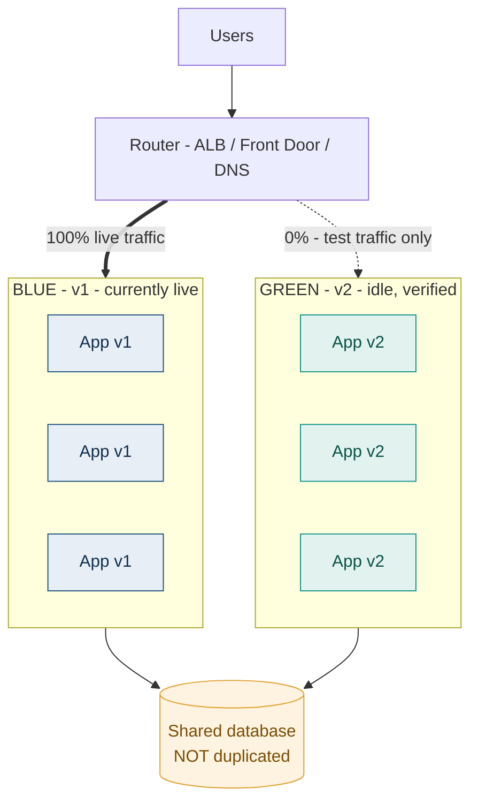

> [!WARNING]
> **The database is almost never duplicated.** Both environments share one database. This is the detail that breaks naive Blue-Green: your "instant rollback" is only instant for the *application*. If v2 wrote data in a format v1 cannot read, flipping the router back does not undo that. Blue-Green gives you fast application rollback, not fast data rollback.

### 4.4 How it works

1. Blue serves 100% of traffic
2. Deploy v2 to Green — full environment, same size as Blue
3. Green runs smoke tests, integration tests, and synthetic traffic against the **real** database
4. Optionally expose Green on a private hostname for internal verification
5. **Switch**: router flips 100% of traffic from Blue to Green atomically
6. Monitor closely
7. Keep Blue running, untouched, for a defined hold period (typically 1–24 hours)
8. After the hold period, either decommission Blue or repurpose it as the next Green

**Request flow:** before the switch, every request goes to Blue. After the switch, every request goes to Green. There is no in-between state at the routing layer — which is the point. In-flight requests on Blue complete on Blue via connection draining.

### 4.5 Deployment workflow

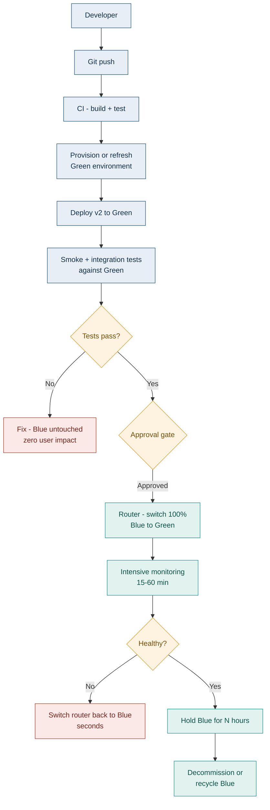

### 4.6 Step-by-step implementation

| Stage | Action | Notes |
|---|---|---|
| 1 | Provision Green at full production size | Under-sizing Green is the most common cause of post-switch failure |
| 2 | Deploy v2 to Green | |
| 3 | Point Green at the **production** database | Testing against a copy hides real-data bugs |
| 4 | Run smoke tests against Green's private endpoint | |
| 5 | Warm Green — caches, connection pools, JIT | A cold environment receiving 100% of traffic instantly will fall over |
| 6 | Send synthetic/shadow traffic to Green | Optional but strongly recommended at scale |
| 7 | Switch the router | See routing mechanisms below |
| 8 | Watch error rate, latency, saturation for 15–60 min | |
| 9 | Hold Blue unchanged | This is your rollback |
| 10 | Decommission or recycle Blue | |

**Routing mechanisms, ranked by switch speed:**

| Mechanism | Switch time | Notes |
|---|---|---|
| Load balancer target group swap | Seconds | Best option. ALB listener rule, Azure App Gateway backend pool |
| Service selector change (Kubernetes) | Seconds | Change the Service's label selector from `version: v1` to `v2` |
| Weighted routing set to 0/100 | Seconds | Front Door, ALB weighted target groups |
| App Service slot swap (Azure) | Seconds | Purpose-built for this; also warms the target |
| **DNS change** | **Minutes to hours** | **Avoid.** TTLs are advisory; some resolvers and JVMs cache indefinitely |

> [!CAUTION]
> Do not use DNS as your Blue-Green switch if you care about rollback speed. Clients cache DNS unpredictably — the JVM historically cached forever by default — so "switch back to Blue" can leave a long tail of users still hitting Green for hours. Use a load balancer.

### 4.7 Rollback mechanism

**How it works:** point the router back at Blue. Seconds.

**Triggered when:** error rate, latency, or business-metric alarms fire after the switch, within the hold window.

| Advantages | Limitations |
|---|---|
| **Fastest rollback of any strategy** — seconds | **Doubles infrastructure cost** during the overlap |
| Full pre-production verification against real infrastructure | Database is shared — data changes are **not** rolled back |
| No mixed-version application state | In-flight sessions may be disrupted at switch if state is local |
| Simple mental model, easy to explain to auditors | Green must be full production size to be a valid test |
| Blue is a known-good environment, not a rebuild | 100% of users are exposed at once — no gradual blast radius |

> [!NOTE]
> Blue-Green has **fast rollback but full blast radius**. Canary has **slow rollback but tiny blast radius**. This trade-off is the single most useful thing to articulate when comparing them, and it is what many candidates miss.

### 4.8 Monitoring

| Layer | What to watch |
|---|---|
| **Health checks** | Green must be fully healthy *and warm* before switch — health does not imply warm |
| **Metrics** | Pre-switch: Green's synthetic-traffic metrics. Post-switch: error rate, latency, saturation, and **business metrics** — a technically healthy release can still break checkout |
| **Logs** | Environment tag (blue/green) on every log line |
| **Traces** | Compare Green's trace latency profile against Blue's before switching |
| **Alerts** | Tight thresholds during the hold window; auto-rollback wired to the alarm where possible |

### 4.9 Real-world example

**Azure App Service deployment slots** are Blue-Green productised: deploy to a staging slot, warm it, then "swap" — Azure warms the target and switches routing atomically. **AWS CodeDeploy for ECS and Lambda** implements Blue-Green natively with ALB target group shifting and automatic rollback on CloudWatch alarms.

Large e-commerce and financial platforms commonly use Blue-Green for their monolithic or tightly-coupled tiers, where a fast, complete rollback is worth the doubled infrastructure — particularly ahead of high-stakes events where the ability to revert in seconds is the entire point.

### 4.10 Best practices

- **Green must be production-sized.** A half-size Green that passes tests will fall over when it receives 100% of real traffic.
- **Warm before switching.** Connection pools, caches, JIT compilation. Azure slot swap does this for you; on AWS you must do it yourself with synthetic traffic.
- **Keep Blue for a defined hold period**, and make the period explicit policy rather than a judgement call.
- **Automate rollback on alarms.** A human deciding to roll back is slower than the alarm that fired.
- **Make schema changes backward-compatible anyway.** Blue-Green does not exempt you from this — it only reduces the window.
- **Test the rollback path**, not just the deploy path. An untested rollback is not a rollback.
- Externalise session state to Redis so a switch does not log everyone out.

### 4.11 Common mistakes

| Mistake | Consequence |
|---|---|
| Green under-provisioned | Passes tests, collapses under real traffic seconds after switch |
| Not warming Green | Latency spike and error burst immediately post-switch |
| DNS-based switching | Rollback takes hours; a tail of users stuck on the bad version |
| Assuming rollback undoes data changes | v2 wrote incompatible data; switching back to v1 exposes it |
| Decommissioning Blue immediately | The rollback target is gone at exactly the moment you need it |
| Local session state | Every user logged out at switch |
| Testing Green against a database copy | Real-data bugs surface only after the switch |

### 4.12 Interview questions

**Beginner — What is the main advantage of Blue-Green over Rolling?**
Rollback speed. Blue-Green rollback is a routing change measured in seconds because the previous environment is still running. Rolling rollback is a full redeployment measured in minutes. Blue-Green also avoids the mixed-version application state that Rolling forces you to design around.

**Intermediate — Do you duplicate the database in Blue-Green?**
Almost never. Both environments share one database. Duplicating it creates a data-synchronisation problem far worse than the one you are solving. The consequence is that Blue-Green gives fast *application* rollback but not data rollback, so schema changes must still be backward-compatible.

**Advanced — You switch to Green and error rate jumps. You switch back to Blue within 90 seconds. Users still report broken data. Explain.**
Green wrote to the shared database during those 90 seconds, in a format or with semantics v1 does not handle — a new column v1 ignores, an enum value v1 rejects, a differently-encoded field. Routing rollback does not undo writes. The fix is process, not infrastructure: enforce expand-and-contract migrations so every schema state is readable by both versions, and treat "is this change backward-compatible?" as a release gate. Where writes are genuinely incompatible, you need a data remediation plan prepared *before* the deployment, not improvised after.

**Scenario — Green passes every test, you switch, and latency triples immediately but recovers over 10 minutes. What happened and how do you prevent it?**
Cold start. Green had no warm connection pools, empty caches, and un-JIT-compiled code paths. Tests exercised it lightly; production traffic hit it at full volume instantly. Prevention: warm Green with synthetic traffic at realistic volume before switching, or shift traffic gradually rather than atomically — at which point you have blurred into canary, which is often the right answer. Azure App Service slot swap warms the target automatically, which is precisely why that feature exists.

**Architect — Justify the cost of Blue-Green to a CFO.**
Frame it as insurance with a calculable premium. The cost is roughly one extra environment for the overlap window — if you tear down Blue after 24 hours, that is far less than 2× annual infrastructure. Against that, compute the cost of your slowest realistic rollback under Rolling: minutes of full-severity outage multiplied by revenue per minute, times expected incidents per year. For a high-revenue transactional system the arithmetic is usually decisive. I would also note the option to run Blue-Green only for high-risk releases and Rolling for routine ones, which cuts the premium substantially.

### Summary

Blue-Green buys the fastest rollback available at the cost of a duplicated environment and full blast radius at switch. Its defining constraint is the shared database: application rollback is instant, data rollback is not. Warm the target, size it properly, hold the old environment, and automate rollback on alarms.

---

## 5. Canary Deployment

### 5.1 Definition

Route a **small percentage of live traffic** to the new version, watch metrics, and progressively increase the percentage if healthy — or shift it back to zero if not. Named after canaries in coal mines: a small, expendable early warning.

### 5.2 Why it exists

Every strategy so far exposes either everyone (Recreate, Blue-Green) or an uncontrolled random subset (Rolling). Canary is the first strategy that lets you say **"exactly 1% of users, and I can measure the difference."**

That matters because most serious production failures are not caught by health checks. A service can be perfectly healthy — 200s, low latency, no restarts — while silently returning wrong data, breaking checkout conversion, or corrupting a downstream feed. Canary gives you a *controlled comparison* between two versions serving real traffic at the same moment, which is the only way to detect those.

### 5.3 Architecture

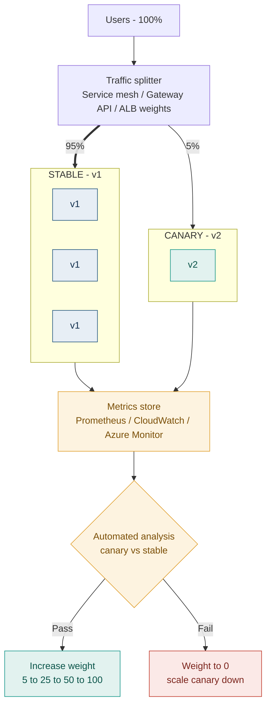

### 5.4 How it works

1. Deploy v2 alongside v1 — usually a single instance
2. Configure the traffic splitter to send a small weight (1–5%) to v2
3. Collect metrics from both versions over a bake window
4. **Compare canary against stable** — not against a fixed threshold
5. If healthy, increase weight and repeat; if not, drop weight to zero
6. On reaching 100%, retire v1

**Request flow:** the splitter assigns each request to a version by weight. Critically, **weight-based routing is per-request, not per-user** unless you add session affinity. A user can hit v2 then v1 on consecutive requests — the same problem Rolling has, unless you hash on a stable identifier.

> [!TIP]
> For anything user-facing, configure **consistent hashing on a stable key** (user ID, session cookie) rather than pure random weighting. Otherwise a user experiences the new version intermittently, which is worse than either version consistently. Istio does this with `consistentHash`; Argo Rollouts supports header- and cookie-based routing.

### 5.5 Deployment workflow

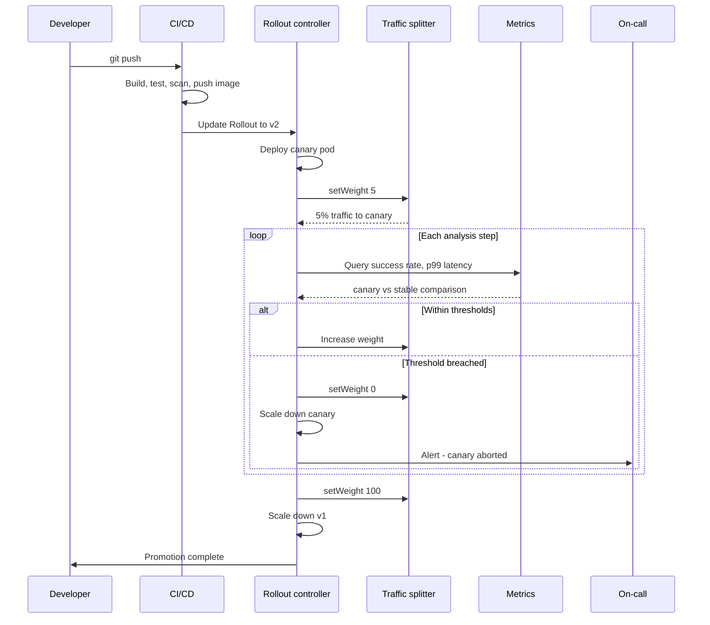

### 5.6 Step-by-step implementation

| Stage | Action |
|---|---|
| 1 | Ensure v2 is backward-compatible — both versions serve simultaneously |
| 2 | Deploy canary instance(s) alongside stable |
| 3 | Define analysis criteria numerically: success rate, p99 latency, plus **at least one business metric** |
| 4 | Set initial weight low — 1% for high traffic, 5–10% for moderate |
| 5 | Bake. Duration driven by traffic volume needed for significance, not by the clock |
| 6 | Compare canary metrics against stable metrics **over the same window** |
| 7 | Promote in steps: 5 → 25 → 50 → 100, with analysis at each |
| 8 | Optionally require manual approval before the final step |
| 9 | On success, scale down stable; on failure, weight to zero and alert |

**Typical Argo Rollouts canary specification:**

```yaml
apiVersion: argoproj.io/v1alpha1
kind: Rollout
metadata:
  name: payments-api
spec:
  replicas: 10
  strategy:
    canary:
      canaryService: payments-api-canary
      stableService: payments-api-stable
      trafficRouting:
        # Gateway API is the current recommendation; see the note on
        # ingress-nginx EOL in "What changed recently"
        plugins:
          argoproj-labs/gatewayAPI:
            httpRoute: payments-api-route
            namespace: payments
      analysis:
        templates:
          - templateName: success-rate-and-latency
        startingStep: 1          # begin analysis after the first setWeight
        args:
          - name: service-name
            value: payments-api-canary
      steps:
        - setWeight: 5
        - pause: { duration: 10m }
        - setWeight: 25
        - pause: { duration: 10m }
        - setWeight: 50
        - pause: { duration: 10m }
        - setWeight: 100
```

```yaml
apiVersion: argoproj.io/v1alpha1
kind: AnalysisTemplate
metadata:
  name: success-rate-and-latency
spec:
  args:
    - name: service-name
  metrics:
    - name: success-rate
      interval: 1m
      count: 10
      successCondition: result[0] >= 0.99
      failureLimit: 2            # tolerate transient blips, abort on sustained failure
      provider:
        prometheus:
          address: http://prometheus.monitoring:9090
          query: |
            sum(rate(http_requests_total{
              service="{{args.service-name}}", status!~"5.."}[2m]))
            /
            sum(rate(http_requests_total{
              service="{{args.service-name}}"}[2m]))
    - name: p99-latency
      interval: 1m
      count: 10
      successCondition: result[0] <= 500
      failureLimit: 2
      provider:
        prometheus:
          address: http://prometheus.monitoring:9090
          query: |
            histogram_quantile(0.99, sum(rate(
              http_request_duration_ms_bucket{
                service="{{args.service-name}}"}[2m])) by (le))
```

> [!IMPORTANT]
> Note `failureLimit: 2`. Without it, a single transient blip aborts the rollout and your team learns to distrust and bypass canary analysis. Tolerating a small number of failures while aborting on sustained breach is the difference between a canary system people use and one they route around.

### 5.7 Rollback mechanism

**How it works:** set canary weight to 0 and scale the canary down. Stable never stopped serving.

**Triggered by:** automated analysis failure, manual abort, or an external alert.

| Advantages | Limitations |
|---|---|
| **Smallest blast radius of any strategy** — 1% of users | Slowest deployment — a full canary can take hours |
| Real production traffic, real dependencies | Requires traffic-splitting infrastructure (mesh, Gateway API, weighted LB) |
| Automated metric-driven abort, no human required | Requires backward compatibility — both versions live |
| Rollback affects only the small exposed population | Needs sufficient traffic volume for statistical significance |
| Catches failures health checks cannot see | Analysis configuration is genuinely hard to get right |

### 5.8 Monitoring

This is the strategy where monitoring **is** the mechanism, not an afterthought.

| Layer | What to watch |
|---|---|
| **Health checks** | Necessary but not sufficient — a healthy canary can still be wrong |
| **Metrics** | Success rate, latency percentiles (p50/p95/p99), saturation, **and business metrics** — conversion, transaction success, add-to-cart rate |
| **Logs** | Version-labelled; error signatures compared between versions |
| **Traces** | Per-version latency breakdown by downstream dependency. This is how you find "v2 is slow only when it calls the pricing service." |
| **Alerts** | Automated abort wired directly to analysis failure — not a page to a human |

**The four golden signals, compared between versions:** latency, traffic, errors, saturation. Comparison is the operative word — absolute values are far less informative than the delta against the version running beside it.

> [!WARNING]
> **A canary that only checks error rate and latency will happily promote a release that breaks your business.** A pricing bug that returns HTTP 200 with a wrong number passes every technical check. Include at least one business metric in every analysis template.

### 5.9 Real-world example

**Netflix** pioneered automated canary analysis at scale and open-sourced **Kayenta**, the analysis engine that compares canary against baseline statistically rather than against thresholds. Their key insight was to run a *fresh baseline* alongside the canary — both newly deployed, differing only in version — so the comparison is not contaminated by the older instances' warm caches and long-lived connections.

**Intuit** publicly describes running Argo Rollouts with analysis templates comparing canary against baseline across dozens of metrics, requiring the canary to pass all checks across consecutive analysis windows before automatic promotion, and reports a substantial reduction in deployment-caused incidents.

**Why they use it:** at their scale, the cost of a bad release reaching all users vastly exceeds the cost of a slower rollout. Automation is essential because the deployment volume makes human review impossible.

### 5.10 Best practices

- **Compare canary against baseline, not against thresholds.** Ideally deploy a *fresh* baseline of the old version so both are equally cold.
- **Include business metrics.** Technical health is necessary, not sufficient.
- **Use `failureLimit`** to tolerate transient noise, or your team will bypass the system.
- **Consistent-hash routing on user ID** for user-facing services so users get a stable experience.
- **Start at 1% for high traffic**, higher for low traffic — the constraint is achieving statistical significance.
- **Automate the abort.** A human watching a dashboard is slower and less reliable than a query.
- **Verify canary and stable are on comparable infrastructure** — a canary on a fresh node with an empty cache will look slower regardless of code quality.
- **Keep the canary running long enough to see periodic effects** — a bug in an hourly batch job will not surface in a 10-minute bake.

### 5.11 Common mistakes

| Mistake | Consequence |
|---|---|
| Comparing canary against absolute thresholds | False alarms at peak, missed regressions at trough |
| No business metrics in analysis | Promotes releases that are technically healthy and commercially broken |
| Insufficient traffic for significance | Promotion decisions made on noise |
| No `failureLimit` | Transient blips abort rollouts; team loses trust and bypasses the gate |
| Random per-request weighting on user-facing services | Users see inconsistent behaviour across requests |
| Comparing warm stable against cold canary | Canary always looks slower; either false aborts or thresholds loosened until useless |
| Bake window shorter than the slowest periodic job | Bugs in scheduled work never surface during analysis |
| Forgetting backward compatibility | Both versions are live — same requirement as Rolling |

### 5.12 Interview questions

**Beginner — What is a canary deployment?**
Routing a small percentage of production traffic to a new version, monitoring it, and progressively increasing the percentage if metrics are healthy or reverting to zero if not.

**Intermediate — Canary or Blue-Green?**
They optimise different things. Blue-Green gives the fastest rollback (seconds, routing change) but exposes 100% of users at switch. Canary gives the smallest blast radius (1% of users) but slower rollout and slower full rollback. Choose Blue-Green when rollback speed dominates and you can afford double infrastructure; Canary when limiting user impact dominates and you have traffic-splitting infrastructure plus enough traffic to analyse.

**Advanced — Why deploy a fresh baseline alongside the canary rather than comparing against existing production instances?**
Because existing instances are not a fair control. They have warm caches, established connection pools, JIT-compiled hot paths, and possibly different node placement or noisy neighbours. Comparing a freshly-started canary against them systematically disadvantages the canary — it will look slower even when the code is identical. Deploying a fresh baseline of the *old* version means canary and baseline differ only in the variable you are testing. This is the core insight behind Netflix's Kayenta approach and it is what separates a rigorous canary system from one that has been progressively loosened until it no longer catches anything.

**Scenario — Canary shows p99 latency 15% higher than stable but error rate identical. Promote?**
Do not promote yet, but do not abort reflexively either. First check whether the comparison is fair — is the canary cold, is it on a different node type, is the baseline warm? If the comparison is fair, 15% at p99 with unchanged error rate suggests a specific slow path rather than a broad regression, so break the latency down by endpoint and by downstream dependency using traces. It may be a new database query without an index, or an added synchronous call. Whether to promote depends on your latency SLO headroom: if p99 is 200ms against a 500ms SLO, 15% is tolerable while you investigate; if you are at 450ms, it is not. I would hold the canary at current weight, investigate with traces, and make the call on evidence rather than promote and hope.

**Architect — A team wants canary for every service. Push back or endorse?**
Push back selectively. Canary has real costs: it needs traffic-splitting infrastructure, sufficient traffic volume for statistical significance, well-designed analysis templates, and it makes every deployment slower. For a low-traffic internal service, canary analysis is statistically meaningless — you are adding complexity and deployment latency for no safety. I would apply canary where blast radius is genuinely expensive: revenue paths, customer-facing APIs, anything with regulatory exposure. Everything else gets Rolling with good probes. The failure mode I would guard against is canary theatre — analysis templates that check only that the pod is up, which provide the illusion of safety while catching nothing.

### Summary

Canary is the strategy with the smallest blast radius and the most demanding prerequisites: traffic-splitting infrastructure, sufficient volume, and carefully designed analysis. Its value comes entirely from the quality of the comparison — canary against a fair baseline, including business metrics. A canary system that only checks technical health is theatre.

---

## 6. A/B Testing Deployment

### 6.1 Definition

Route users to different versions **based on user attributes** — geography, device, account tier, or random-but-sticky assignment — and compare **business outcomes** between the groups with statistical rigour.

### 6.2 Why it exists

It answers a fundamentally different question from every other strategy here.

| Strategy | Question |
|---|---|
| Canary | "Is this version **broken**?" |
| A/B Testing | "Is this version **better**?" |

Canary is a safety mechanism owned by engineering. A/B testing is a product experimentation mechanism owned by product, which happens to use similar routing infrastructure. Conflating them is one of the most common conceptual errors in this space.

### 6.3 Architecture

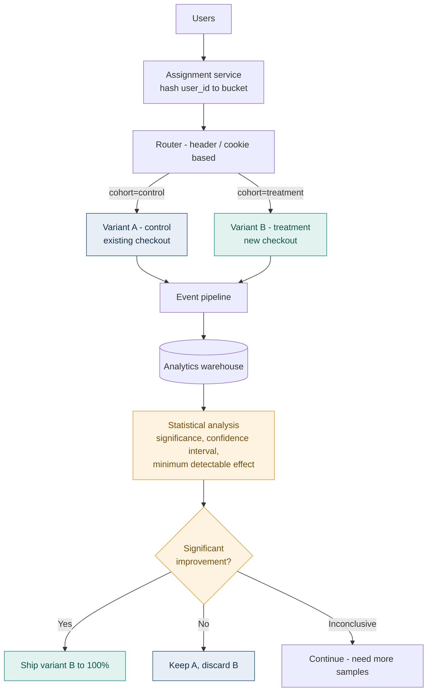

### 6.4 How it works

1. Define a **hypothesis** and a **primary metric** before writing any code
2. Compute required sample size from baseline rate, minimum detectable effect, and desired power
3. Assign users to cohorts by hashing a stable identifier — assignment must be **sticky**
4. Route by cohort, typically via a header or cookie set at the edge
5. Collect outcome events, not just technical metrics
6. Run until the pre-computed sample size is reached
7. Analyse for statistical significance
8. Ship, kill, or extend

**Request flow:** an assignment service (or edge function) hashes the user identifier, determines the cohort, and sets a header or cookie. The router dispatches on that value. The same user always lands in the same cohort — this is what distinguishes A/B from weighted canary.

### 6.5 Deployment workflow

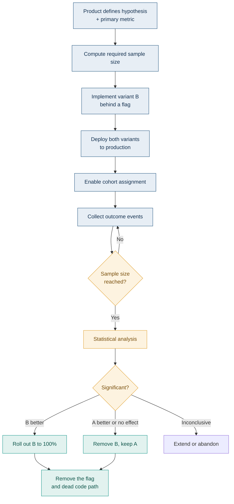

### 6.6 Step-by-step implementation

| Stage | Action | Why |
|---|---|---|
| 1 | State the hypothesis and **one** primary metric | Multiple primary metrics invite p-hacking |
| 2 | Compute sample size **before** starting | Determines how long the test must run |
| 3 | Implement both paths behind a flag | Deploy is decoupled from experiment start |
| 4 | Assign by hashing a stable user identifier | Sticky assignment is mandatory |
| 5 | Instrument outcome events, not just requests | You need conversions, not 200s |
| 6 | Run to the pre-computed sample size | **Do not peek and stop early** |
| 7 | Analyse once, at the end | |
| 8 | Ship or kill, then **delete the losing code path** | |

> [!WARNING]
> **Peeking is the most common and most damaging error in A/B testing.** Checking results repeatedly and stopping when you see significance inflates false-positive rates dramatically — you will "discover" improvements that do not exist. Either fix the sample size in advance and look once, or use a sequential testing method explicitly designed for continuous monitoring.

### 6.7 Rollback mechanism

**How it works:** set all users to the control cohort. Because A/B variants are almost always implemented behind feature flags, this is a flag change taking effect in seconds without a deployment.

**Triggered by:** a technical problem in the variant, or a decisive negative result.

| Advantages | Limitations |
|---|---|
| Instant, no deployment required | Requires substantial traffic for significance |
| Both paths already deployed and running | Long runtimes — weeks for low-conversion metrics |
| Kill switch is a flag, not a rollout | Statistically easy to get wrong |
| | Both code paths must be maintained during the test |
| | Cohort contamination across devices/sessions is hard to prevent |

### 6.8 Monitoring

| Layer | What to watch |
|---|---|
| **Health checks** | Both variants must be technically healthy — a variant that errors is not a valid experiment arm |
| **Metrics** | **Business outcomes** are primary: conversion, revenue per user, retention, task completion. Technical metrics are guardrails, not the result. |
| **Logs** | Cohort assignment logged per request for later attribution |
| **Traces** | Cohort as a span attribute |
| **Alerts** | **Guardrail metrics** — abort the experiment automatically if the variant degrades error rate or latency, regardless of the business result |

> [!TIP]
> Always run **guardrail metrics** alongside the primary metric. A variant that increases conversion 3% while increasing p99 latency 400% is not a win — it is a trade you should make deliberately, not discover six months later.

### 6.9 Real-world example

Consumer platforms with large user bases — streaming services, marketplaces, social networks — run continuous experimentation programmes where a substantial fraction of user-facing changes ship as experiments rather than releases. Recommendation ranking, thumbnail selection, search relevance, and pricing presentation are all typically decided by experiment rather than by judgement.

**Why:** at large scale, intuition about what users prefer is unreliable, and the cost of shipping a change that quietly reduces engagement is enormous and invisible without measurement.

### 6.10 Best practices

- One primary metric, defined before the test starts
- Compute sample size in advance; do not peek
- Sticky assignment by hashed stable identifier
- Guardrail metrics with automated abort
- Run for whole business cycles — at least one full week to cover weekday/weekend variation
- Run an A/A test occasionally to validate that your framework reports no difference when there is none
- Delete the losing branch promptly; abandoned experiment code is a major source of technical debt

### 6.11 Common mistakes

| Mistake | Consequence |
|---|---|
| Peeking and stopping early | Massively inflated false-positive rate |
| Multiple primary metrics | Something will look significant by chance |
| Non-sticky assignment | Users see both variants; results meaningless |
| Ignoring novelty effects | Short-term lift that decays; ship a regression |
| No guardrail metrics | Ship a conversion win that triples latency |
| Running too short | Underpowered test, inconclusive result, wasted cycle |
| Never removing losing variants | Code base accumulates dead branches indefinitely |
| Confusing A/B with canary | Product experiment used as a safety mechanism, or vice versa |

### 6.12 Interview questions

**Beginner — How does A/B testing differ from canary?**
Canary asks whether a release is broken and is a safety mechanism; A/B asks whether a change is better and is a product experiment. Canary routes by weight and is short-lived; A/B routes by sticky user attribute and runs until statistically significant.

**Intermediate — Why must cohort assignment be sticky?**
Because you are measuring a user's behavioural outcome, which requires a consistent experience. If a user sees variant A then B, their conversion cannot be attributed to either, and the comparison is contaminated. Hash a stable identifier so assignment is deterministic.

**Advanced — What is wrong with checking results daily and stopping when p < 0.05?**
It inflates the false-positive rate far above the nominal 5%, because each look is another chance to cross the threshold by noise. With enough looks you will find "significance" in a pure A/A test. The fixes are either to fix the sample size in advance and look once, or to use a method designed for continuous monitoring — sequential testing, always-valid p-values, or Bayesian approaches with explicit decision rules.

**Scenario — Variant B shows a 2% conversion lift, p = 0.04, after three days. Ship it?**
I would not, for several reasons. Three days does not cover a full weekly cycle, and weekday and weekend users behave differently. p = 0.04 is marginal, and if this is a mid-test peek rather than a pre-planned endpoint, the real false-positive rate is much higher than 4%. A 2% lift may also fall inside the novelty-effect window. I would want to know the pre-computed sample size and whether it has been reached, the guardrail metrics, and whether the lift is stable across segments or driven by one anomalous cohort. Run to the planned endpoint, then decide.

**Architect — How would you design experimentation infrastructure for a platform with 50 teams?**
Centralised assignment service so cohorts are consistent across services, and so overlapping experiments can be detected and either isolated or explicitly orthogonalised. A shared metrics definition layer so "conversion" means one thing everywhere. Sample-size calculation built into the experiment-creation flow so teams cannot start underpowered tests. Automated guardrails that abort on technical regression without human involvement. Mandatory expiry dates on experiments to force cleanup. And critically, an A/A testing capability so teams can validate the framework itself — without it, you have no way to know whether your platform reports spurious wins.

### Summary

A/B testing shares routing infrastructure with canary but answers a different question, is owned by a different function, and fails in statistical rather than operational ways. The hard parts are sample size, sticky assignment, and the discipline not to peek. Always pair the primary business metric with technical guardrails.

---

## 7. Shadow Deployment (Traffic Mirroring)

### 7.1 Definition

Duplicate live production traffic and send a copy to the new version **in parallel**. The shadow version processes the requests but its responses are **discarded** — users never see them and never wait for them.

### 7.2 Why it exists

Every other strategy tests the new version by exposing real users to it. Shadow is the only one that tests against **real production traffic with zero user risk**. That makes it uniquely suited to:

- Major rewrites and re-platforming, where you want confidence before any user is exposed
- Performance validation under genuine production load patterns, which synthetic load never reproduces faithfully
- Verifying that a new implementation produces *identical outputs* to the old one

### 7.3 Architecture

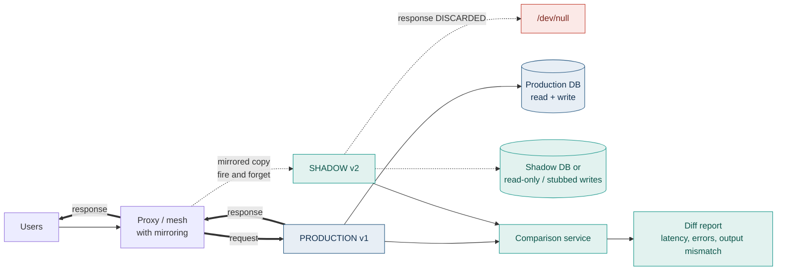

### 7.4 How it works

1. Proxy or mesh receives a request
2. Forwards it to production and returns production's response to the user — **the user path is unchanged**
3. Asynchronously sends a copy to the shadow service
4. Shadow processes it; the response is discarded
5. A comparison service optionally diffs shadow output against production output

**Request flow:** the mirrored request is fire-and-forget. The user never waits for shadow, and a shadow failure never affects the user. This is the defining property — and the reason mirroring must be implemented at the proxy, not in application code.

> [!CAUTION]
> **Side effects are the entire difficulty of shadow deployment.** If the shadow service writes to the production database, sends emails, charges cards, or publishes to a real Kafka topic, you have duplicated every side effect in production. Users get two confirmation emails and two charges. This must be solved before mirroring a single request.

### 7.5 Deployment workflow

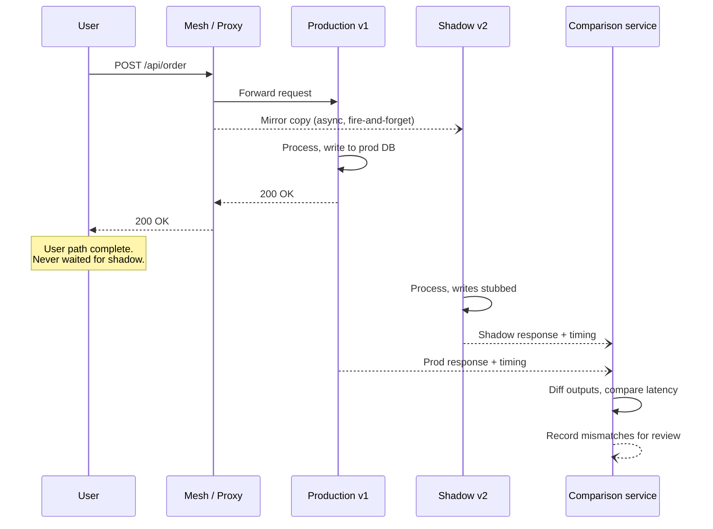

### 7.6 Step-by-step implementation

| Stage | Action | Notes |
|---|---|---|
| 1 | **Solve side effects first** | Read-only replica, stubbed writes, or a fully isolated shadow datastore |
| 2 | Configure mirroring at the proxy | Istio `mirror` + `mirrorPercentage`, NGINX `mirror`, Envoy request mirroring |
| 3 | Start at a low mirror percentage | Shadow doubles downstream load |
| 4 | Ensure shadow failures are isolated | Fire-and-forget, no shared circuit breakers or connection pools |
| 5 | Capture and compare responses | Otherwise you are only load-testing, not verifying correctness |
| 6 | Compare latency distributions, not means | |
| 7 | Investigate every diff | Diffs are the product of a shadow deployment |
| 8 | Increase mirror percentage as confidence grows | |
| 9 | Promote to a real strategy — canary or blue-green — once satisfied | Shadow is never the final step |

**Istio mirroring:**

```yaml
apiVersion: networking.istio.io/v1
kind: VirtualService
metadata:
  name: orders
spec:
  hosts:
    - orders
  http:
    - route:
        - destination:
            host: orders
            subset: v1
          weight: 100          # 100% of real traffic to v1
      mirror:
        host: orders
        subset: v2             # mirrored copy to v2
      mirrorPercentage:
        value: 10.0            # only 10% of traffic is mirrored
```

### 7.7 Rollback mechanism

**How it works:** stop mirroring. Remove the `mirror` block. There is nothing to roll back because nothing was ever user-facing.

**Triggered by:** shadow failures affecting shared dependencies, unacceptable downstream load, or cost.

| Advantages | Limitations |
|---|---|
| **Zero user risk** — the only strategy with this property | Side effects are genuinely hard to isolate |
| Real production traffic patterns, not synthetic | Roughly doubles compute and downstream load |
| Ideal for validating rewrites and re-platforming | Cannot validate anything user-visible (UI, response handling) |
| Output diffing catches correctness bugs no metric would | Adds meaningful infrastructure complexity |
| Can run for weeks without pressure | Not a deployment strategy on its own — always a precursor |

### 7.8 Monitoring

| Layer | What to watch |
|---|---|
| **Health checks** | Shadow health must **not** feed into production routing decisions |
| **Metrics** | Shadow error rate, latency distribution vs production, resource consumption, **and downstream dependency load** |
| **Logs** | Clearly tagged as shadow so on-call does not chase phantom errors at 3am |
| **Traces** | Mark mirrored spans distinctly; otherwise your trace data is polluted with duplicate transactions |
| **Alerts** | Shadow alerts route to the development team, **never to on-call production paging** |

**The comparison service is the point.** Without response diffing, shadow deployment is just an expensive load test. The value is in finding the 0.3% of requests where v2 returns something subtly different from v1.

### 7.9 Real-world example

**GitHub's Scientist library** is the canonical published example of this pattern implemented in-process: run both the old and new code path, return the old result to the user, and record any mismatch. GitHub used it to validate a rewrite of their permissions system — a change where a subtle behavioural difference would have been a serious security issue and where no amount of unit testing would have provided equivalent confidence.

Large-scale service rewrites at major platforms commonly use traffic mirroring for months before any user traffic is shifted, because the cost of a correctness regression in a core service is far higher than the cost of running a duplicate fleet.

### 7.10 Best practices

- **Solve side effects before mirroring anything.** Read replicas, stubbed writes, or an isolated datastore.
- **Never let shadow failures affect production** — separate connection pools, separate circuit breakers, hard timeouts
- **Sample rather than mirror everything** if downstream load is a concern
- **Build the comparison tooling first**; without diffing you learn very little
- **Scrub or tag shadow requests** so downstream systems and analytics can exclude them
- **Route shadow alerts away from production on-call**
- **Treat shadow as a phase, not a destination** — it always precedes canary or blue-green

### 7.11 Common mistakes

| Mistake | Consequence |
|---|---|
| Shadow writes to the production database | Duplicate orders, duplicate emails, duplicate charges |
| Synchronous mirroring | Shadow latency becomes user latency; a shadow outage becomes a production outage |
| Shared connection pools or circuit breakers | Shadow exhausts a pool and takes production down |
| Shadow alerts paging production on-call | Alert fatigue; real alerts ignored |
| Mirroring 100% without capacity planning | Downstream dependencies see double load and degrade |
| No response comparison | An expensive load test that proves nothing about correctness |
| Not tagging shadow traffic | Analytics and billing data corrupted by phantom transactions |

### 7.12 Interview questions

**Beginner — What is shadow deployment and what is its main advantage?**
Duplicating production traffic to a new version whose responses are discarded. The advantage is testing against real production traffic with zero user risk.

**Intermediate — What is the hardest problem in shadow deployment?**
Side effects. The shadow service processes real requests, so any write, email, payment or event publication is duplicated. You must isolate these — read-only replicas, stubbed write layers, or a separate datastore — before mirroring anything.

**Advanced — How do you prevent shadow traffic from affecting production reliability?**
Mirroring must be asynchronous and fire-and-forget at the proxy layer, so production never waits for or depends on the shadow response. Beyond that, isolate the resources: separate connection pools, separate circuit breakers, separate rate limits, and hard timeouts on shadow calls. Capacity-plan downstream dependencies for the extra load, or mirror only a sample. And keep shadow health out of any production routing or autoscaling decision.

**Scenario — Shadow shows identical outputs but 3× latency. What do you conclude?**
Not necessarily that v2 is slow. Check the confounders first: is the shadow fleet under-provisioned relative to production, is it cold, is it sharing a saturated dependency, and is it being starved by resource limits? Shadow environments are frequently deliberately smaller, which invalidates naive latency comparison. If the comparison is fair, then correctness is validated but performance is not, and I would profile with traces to find which code path or dependency call accounts for the difference before shifting any real traffic. The useful conclusion is that shadow has done its job — it caught a performance regression before any user experienced it.

**Architect — When is shadow deployment worth the cost?**
When the cost of a correctness regression is very high and the change is large enough that testing cannot give confidence. Rewrites of core services, migrations between database engines, replacing a rules engine, changing a pricing or permissions implementation. In those cases you need evidence that the new implementation produces the same outputs on real traffic, and only mirroring provides that. For routine feature work it is not worth roughly doubling infrastructure and adding significant complexity — canary is sufficient and far cheaper.

### Summary

Shadow is the only zero-user-risk strategy, and the only one that verifies output equivalence on real traffic. Its cost is duplicated compute and a genuinely hard side-effect isolation problem. It is a validation phase that precedes a real deployment strategy, never a strategy on its own.

---

## 8. Ring-Based Deployment

### 8.1 Definition

Roll out to concentric **populations** of increasing size and decreasing risk tolerance. Ring 0 is your own team, Ring 1 is internal staff, Ring 2 is opt-in early adopters, Ring 3 is a geography or segment, Ring 4 is everyone. Each ring must bake successfully before the next opens.

### 8.2 Why it exists

Canary picks its exposed population **randomly by weight**. Ring picks it **deliberately by who those people are**. That difference matters enormously:

- Ring 0 users can be told "you are testing a build" and will report bugs constructively
- Ring 1 gives you thousands of real users whose complaints cost you nothing commercially
- By the time a regression reaches paying customers, it has survived days of real use

Ring is how you get canary's blast-radius control when the signal you need is **human feedback** rather than metrics — for desktop applications, mobile apps, and anything where automated analysis cannot capture the failure.

### 8.3 Architecture

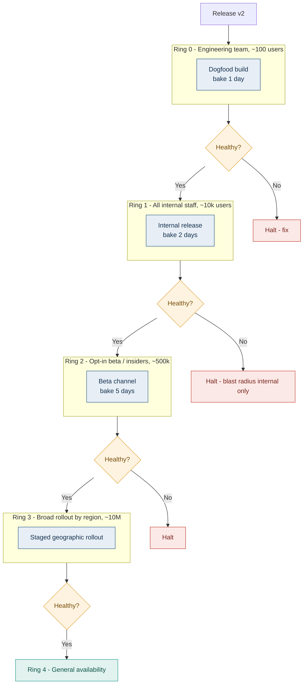

### 8.4 How it works

1. Define rings by **population membership**, stored as a user attribute or group
2. Deploy to Ring 0; only Ring 0 members are routed to the new version
3. Bake — days, not minutes. Rings are for slow-surfacing problems.
4. Gate on both metrics **and** qualitative feedback
5. Open the next ring
6. Continue until general availability

**Request flow:** a router or the client itself checks the user's ring membership and selects the version accordingly. For server-side systems this is typically a header set by an edge function after a membership lookup. For client applications it is an update-channel assignment.

### 8.5 Deployment workflow

```mermaid
flowchart LR
    CI["CI build"] --> ART["Signed artefact<br/>promoted, not rebuilt"]
    ART --> D0["Deploy Ring 0"]
    D0 --> B0["Bake 1 day<br/>metrics + team feedback"]
    B0 --> D1["Deploy Ring 1"]
    D1 --> B1["Bake 2 days<br/>metrics + support tickets"]
    B1 --> D2["Deploy Ring 2"]
    D2 --> B2["Bake 5 days<br/>metrics + beta forum"]
    B2 --> D3["Deploy Ring 3 by region"]
    D3 --> B3["Bake + regional monitoring"]
    B3 --> GA["General availability"]

    classDef step fill:#E7EEF5,stroke:#22557F,color:#12304F
    classDef ok fill:#E2F2EF,stroke:#17968A,color:#0A5449
    class CI,ART,D0,D1,D2,D3 step
    class B0,B1,B2,B3,GA ok
```

### 8.6 Step-by-step implementation

| Stage | Action |
|---|---|
| 1 | Define ring membership as a durable, queryable user attribute |
| 2 | Build **one** artefact and promote it through rings — never rebuild per ring |
| 3 | Configure routing or update channels by ring |
| 4 | Define per-ring exit criteria: metric thresholds **and** a feedback review |
| 5 | Deploy Ring 0, bake, gate |
| 6 | Repeat outward |
| 7 | Keep the ability to halt and roll back **any** ring independently |
| 8 | At GA, retain the ring infrastructure — you need it for the next release |

### 8.7 Rollback mechanism

**How it works:** revert the affected rings to the previous version. Outer rings were never exposed.

| Advantages | Limitations |
|---|---|
| Blast radius bounded by **known population**, not random chance | Very slow — full rollout takes weeks |
| Captures qualitative feedback metrics cannot | Requires durable population management infrastructure |
| Internal rings absorb risk at zero commercial cost | Multiple versions in the field simultaneously for extended periods |
| Excellent regulatory story — staged, documented exposure | Long-lived backward compatibility burden |
| Natural fit for client apps where you cannot control the client | Ring 0/1 users are not representative of real users |

> [!NOTE]
> Rings solve a problem canary cannot: **slow-surfacing failures**. A memory leak that takes 36 hours to manifest, a bug that only fires on month-end, a regression that only appears after a cache expires — none of these will be caught in a 10-minute canary bake. Rings bake for days precisely so these have time to appear.

### 8.8 Monitoring

| Layer | What to watch |
|---|---|
| **Health checks** | Standard, per ring |
| **Metrics** | Per-ring dashboards; **crash-free session rate** is the key metric for client apps |
| **Logs** | Ring identifier on every event |
| **Traces** | Ring as a span attribute |
| **Alerts** | Per-ring thresholds — an outer ring warrants tighter thresholds than Ring 0 |
| **Qualitative** | Support ticket volume by ring, beta forum sentiment, in-app feedback. **This is the differentiator** — it is the signal rings exist to capture. |

### 8.9 Real-world example

**Windows Insider Program** is the reference implementation: Canary and Dev channels for the most experimental builds, Beta for near-final, Release Preview for pre-GA, then general availability. **Microsoft 365 update channels** follow the same shape. Google Chrome's Canary → Dev → Beta → Stable channels are a direct parallel.

**Why:** you cannot canary a desktop operating system by traffic weight — there is no server-side router. The population *is* the routing mechanism. And OS regressions frequently take days to surface across diverse hardware, which a short bake would never catch.

### 8.10 Best practices

- Promote a **single signed artefact** through rings; rebuilding per ring means you shipped an untested binary
- Make ring membership self-service where possible — voluntary early adopters give better feedback
- Define exit criteria per ring in advance, including the qualitative review
- Bake long enough for slow failures; the whole point is time
- Retain rollback capability per ring independently
- Track crash-free rate and support ticket rate, not just server metrics
- Accept that Ring 0/1 are unrepresentative — engineers have fast machines and unusual configurations

### 8.11 Common mistakes

| Mistake | Consequence |
|---|---|
| Rebuilding the artefact per ring | The binary that reaches GA was never tested in Ring 0 |
| Bake periods too short | Defeats the entire purpose; slow failures reach GA |
| Ignoring qualitative feedback | You built rings and then used them as a slow canary |
| No ability to roll back an inner ring independently | A Ring 1 problem forces a full-fleet rollback |
| Treating internal users as representative | Ship a regression that only affects low-bandwidth or older devices |
| Letting rings drift many versions apart | Unbounded backward-compatibility burden |

### 8.12 Interview questions

**Beginner — What is ring-based deployment?**
Progressive rollout to concentric populations of increasing size — internal team, all staff, opt-in beta, then general availability — with a gate between each.

**Intermediate — Ring or canary?**
Canary when you can control server-side traffic weight and the signal is metrics. Ring when the population matters more than the percentage, when the signal is qualitative human feedback, or when you cannot control routing at all — client applications, mobile, desktop software.

**Advanced — Why do rings bake for days when canaries bake for minutes?**
Because they catch different failure classes. Canary catches immediate, high-frequency failures that show in metrics quickly. Rings catch slow-surfacing failures: memory leaks, resource exhaustion, bugs triggered by periodic jobs, regressions that only appear after a cache TTL expires or on a specific hardware configuration. Those need wall-clock time and population diversity, not traffic volume.

**Scenario — Ring 1 (internal, 10,000 users) reports no issues after two days. Ring 2 (beta, 500,000) immediately shows a 4% crash rate. What went wrong?**
Ring 1 was not representative. Internal users typically have newer hardware, corporate network configuration, managed OS versions, and often a different locale and language setup. A crash concentrated in Ring 2 points to something absent internally — older devices, low memory, a specific OS version, a locale-dependent code path, or a network condition like high latency or captive portals. I would segment the Ring 2 crash data by device, OS version, locale and connection type to find the discriminator. The process lesson is that Ring 1 should be deliberately diversified, or an additional small external ring inserted between them.

**Architect — Design a ring strategy for a mobile app with 50 million users.**
Rings map onto store release tracks. Ring 0 is internal distribution via TestFlight or Play internal testing, a few hundred users, one day. Ring 1 is all employees, a few thousand, two days. Ring 2 is opt-in public beta via TestFlight or Play open testing, tens of thousands, five days. Ring 3 uses the store's own staged rollout — Play supports percentage rollout natively, App Store phased release ramps over seven days — starting at 1% and increasing daily. Ring 4 is full availability. The critical additions are a **server-side kill switch** for every new feature, because store rollback is slow and users may not update, and **crash-free session rate** as the primary gate metric with automated halt on regression. I would also enforce minimum version support so that the backward-compatibility burden from users stuck on old rings stays bounded.

### Summary

Rings trade rollout speed for the ability to catch slow-surfacing failures and gather qualitative feedback from known populations. They are the default for client-side software where server-side traffic control does not exist, and the right choice server-side when who is exposed matters more than how many.

---

## 9. Feature Toggle Deployment (Feature Flags)

### 9.1 Definition

Ship code to production with new behaviour **disabled by a runtime configuration flag**. The code is deployed but inert. Enabling it is a configuration change, not a deployment.

### 9.2 Why it exists

It **decouples deploy from release** — the single most important idea in modern delivery.

Every other strategy ties "code reaches production" to "users experience the change." Feature flags break that link. Consequences:

- Deploy continuously; release when the business is ready
- Turn a feature off in seconds without a rollback
- Merge to trunk daily even for work spanning weeks, avoiding long-lived branches
- Enable a feature for specific users, tiers, or regions independently of deployment

> [!TIP]
> **This is the axis point of the whole topic.** Every other strategy answers "which build is running?" Feature flags answer "which code path executes inside the build?" That is why they compose with all of them — you can run a canary of a build that contains flagged features, and control the two independently.

### 9.3 Architecture

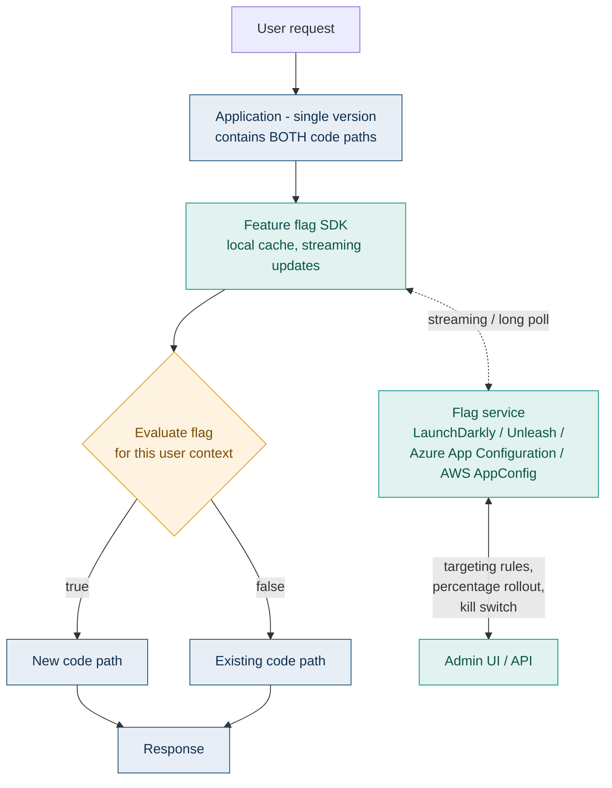

### 9.4 How it works

1. Developer wraps new behaviour in a flag check
2. Code deploys to production with the flag **off** — zero user impact
3. Flag is enabled for a targeted set: internal users first, then a percentage, then everyone
4. If anything breaks, the flag is turned off — **seconds, no deployment**
5. Once the feature is stable and permanent, the flag and the old code path are deleted

**Request flow:** the SDK evaluates the flag **locally**, against a cached rule set streamed from the flag service. This is essential — a network call to a flag service on every request would add latency and create a hard dependency on an external service in your request path.

> [!WARNING]
> **Your flag SDK must fail safe.** If the flag service is unreachable, the SDK must serve last-known-good cached values, and if it has no cache, a hardcoded default. A flag system that fails closed and disables everything, or fails open and enables everything, turns your feature flag platform into a single point of failure for your entire application.

### 9.5 Deployment workflow

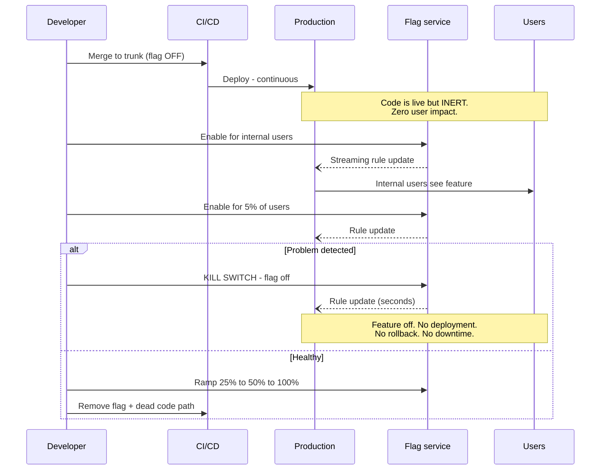

### 9.6 Step-by-step implementation

| Stage | Action |
|---|---|
| 1 | Choose a flag platform, or build on a config service (AWS AppConfig, Azure App Configuration) |
| 2 | Adopt **OpenFeature** as the SDK abstraction so you are not locked to one vendor |
| 3 | Wrap the new path in a flag check with an explicit, safe default |
| 4 | Deploy with the flag off; verify zero behaviour change |
| 5 | Enable for internal users, then ramp by percentage with sticky assignment |
| 6 | Monitor with flag state as a dimension on your metrics |
| 7 | On problems, kill the flag |
| 8 | **Delete the flag and the dead path** once the feature is permanent |

```java
// Spring Boot, using the OpenFeature SDK abstraction
@Service
public class PricingService {

    private final Client flags;          // OpenFeature client
    private final LegacyPricingEngine legacy;
    private final NewPricingEngine modern;

    public Price calculate(Order order, User user) {
        EvaluationContext ctx = new MutableContext(user.getId())
                .add("tier", user.getTier())
                .add("region", user.getRegion());

        // Default is FALSE - the safe, existing behaviour.
        // If the flag service is unreachable, we fall back to legacy.
        boolean useNewEngine = flags.getBooleanValue("new-pricing-engine", false, ctx);

        return useNewEngine ? modern.price(order) : legacy.price(order);
    }
}
```

### 9.7 Rollback mechanism

**How it works:** set the flag to off. Propagates in seconds via the SDK's streaming connection. No deployment, no restart, no downtime.

**This is the fastest rollback available in any strategy** — faster than Blue-Green, because there is no routing change and no environment to switch.

| Advantages | Limitations |
|---|---|
| **Fastest possible rollback — seconds, config-only** | Both code paths must be maintained until cleanup |
| Deploy and release fully decoupled | **Flag debt** accumulates rapidly and is genuinely dangerous |
| Per-user, per-tier, per-region targeting | Combinatorial testing explosion — N flags means 2^N states |
| Enables trunk-based development | Flag service becomes a critical dependency |
| Composes with every other strategy | Flags in hot paths add evaluation overhead |
| No infrastructure duplication | Business logic leaks into flag configuration |

### 9.8 Monitoring

| Layer | What to watch |
|---|---|
| **Health checks** | Flag SDK connectivity and cache freshness as a reported health dimension |
| **Metrics** | Every metric dimensioned by **flag state** — otherwise you cannot tell whether the flagged path caused a regression |
| **Logs** | Flag evaluation results logged for the request |
| **Traces** | Flag state as a span attribute |
| **Alerts** | Error rate delta between flag-on and flag-off populations; alert on stale flag cache |
| **Flag hygiene** | **Age of oldest flag** and total flag count as tracked operational metrics |

### 9.9 Real-world example

Large-scale continuous-deployment organisations use flags pervasively — it is what makes deploying to production many times a day compatible with releasing features on a business schedule. Public engineering writing from companies practising trunk-based development consistently describes the same pattern: every non-trivial change ships behind a flag, features are enabled progressively, and a kill switch exists for anything customer-facing.

**Why:** without flags, continuous deployment forces every merged change to be immediately user-visible, which makes teams batch changes and deploy less often — precisely the opposite of the intended outcome.

### 9.10 Best practices

- **Every flag needs an owner and an expiry date** recorded at creation
- **Delete flags aggressively.** A flag that has been at 100% for a month is technical debt.
- **Default to the safe existing behaviour**, always
- **Fail safe on flag service unavailability** — cached values, then hardcoded defaults
- **Evaluate locally**, never with a network call in the request path
- **Distinguish flag types explicitly** — they have very different lifecycles:

| Flag type | Lifespan | Example |
|---|---|---|
| **Release flag** | Days to weeks — delete after rollout | New checkout flow |
| **Experiment flag** | Duration of the A/B test | Pricing variant |
| **Ops flag / kill switch** | Permanent | Disable recommendations under load |
| **Permission flag** | Permanent | Enterprise-tier features |

- Use **OpenFeature** to avoid vendor lock-in
- Track flag count and oldest-flag-age as operational metrics with thresholds

### 9.11 Common mistakes

| Mistake | Consequence |
|---|---|
| Never removing flags | Hundreds of flags; nobody knows which are live; every code path is conditional |
| Defaulting to the new behaviour | Flag service outage enables untested code for everyone |
| Network call per evaluation | Latency added to every request; flag service becomes a hard dependency |
| Nested and interdependent flags | Combinatorial state space nobody can test or reason about |
| Business logic encoded in flag rules | Critical logic lives in a UI outside version control and code review |
| No sticky assignment on percentage rollouts | Users flip between behaviours between requests |
| Metrics not dimensioned by flag state | Cannot attribute a regression to the flagged path |

> [!CAUTION]
> **Flag debt is the defining failure mode of this strategy** and it compounds silently. A codebase with 400 undeleted flags has 2^400 nominal states, no meaningful test coverage of the combinations, and a change-failure rate that nobody can explain. Treat flag removal as part of the definition of done, not as cleanup to do later.

### 9.12 Interview questions

**Beginner — What problem do feature flags solve?**
They decouple deployment from release. Code can reach production while remaining inert, so you can deploy continuously and release when the business is ready, and disable a feature in seconds without a rollback.

**Intermediate — How do feature flags relate to canary deployment?**
They operate on different axes and compose. Canary controls which *build* receives traffic; flags control which *code path* executes within a build. You can canary a build that contains flagged features and vary them independently. Percentage-based flag rollout also achieves canary-like gradual exposure without any traffic-splitting infrastructure — useful when you do not have a mesh.

**Advanced — What is flag debt and why is it dangerous?**
Flags that outlive their purpose and are never removed. It is dangerous for three reasons. First, combinatorial explosion — N boolean flags define 2^N possible states, of which you test a handful. Second, it makes reasoning about behaviour impossible, because the code that runs depends on runtime configuration nobody has fully catalogued. Third, stale flags become accidental load-bearing configuration: someone eventually flips one and discovers it was holding up production behaviour nobody remembered. The mitigations are mandatory owners and expiry dates, tracked flag age, and treating removal as part of the definition of done.

**Scenario — The flag service is unreachable during an outage. What should your application do?**
Serve last-known-good values from the SDK's local cache, which is why local evaluation matters. If there is no cache — a cold start during the outage — fall back to hardcoded defaults compiled into the application, and those defaults must be the safe existing behaviour, never the new path. The application must continue serving traffic normally; a flag service outage must not become an application outage. I would also alert on cache staleness so the team knows evaluation is running on old rules.

**Architect — A team has 400 flags and cannot ship confidently any more. How do you fix it?**
First, stop the bleeding: no new flag without a recorded owner and expiry date, enforced in the creation flow. Second, inventory and classify — release flags, experiment flags, ops flags, permission flags — because only the first two should be removed and the last two are legitimately permanent. Third, find the dead ones: instrument evaluation so you can see which flags have not been evaluated in 30 days, and which have returned a constant value for 30 days. Those are removable immediately, in bulk. Fourth, work through the remainder oldest-first with a standing allocation of team capacity — this cannot be a side project. Finally, add flag count and oldest-flag-age to the team's operational dashboard with thresholds, so it is visible and does not regrow. The cultural point is that flag creation is currently free and removal is unowned; the fix is making removal part of the definition of done.

### Summary

Feature flags decouple deploy from release, giving the fastest rollback of any approach and composing with every other strategy. Their cost is flag debt, which compounds silently and is the dominant failure mode. Owners, expiry dates, safe defaults, local evaluation, and disciplined removal are what separate a healthy flag practice from an unmanageable one.

---

## 10. Immutable Deployment

### 10.1 Definition

Never modify a running server. To change anything — code, configuration, OS patches — build a **new image** and replace the instance entirely. Servers are disposable and identical; nothing is ever patched in place.

### 10.2 Why it exists

It eliminates **configuration drift** — the slow divergence of supposedly identical servers caused by manual fixes, partial patch runs, and failed configuration-management convergence. Drift is what makes one server in a fleet of fifty behave differently, and it is the root cause of a large class of "works on the other instances" incidents.

Immutability makes environments **reproducible by construction**: the image is the artefact, the image is versioned, and rebuilding it produces the same result.

### 10.3 Architecture

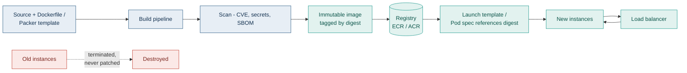

### 10.4 How it works

1. Any change — code, config, OS patch — triggers an image build
2. The image is scanned, signed, and pushed with an immutable tag (preferably a content digest, not a mutable tag like `latest`)
3. Launch templates or pod specs are updated to reference the new digest
4. New instances launch from the new image
5. Old instances are **terminated, never modified**
6. Rollback means pointing back at the previous digest

**Request flow:** unchanged — immutability is orthogonal to routing. It composes with Rolling, Blue-Green, or Canary, all of which describe *how* the replacement happens.

> [!NOTE]
> Immutable Deployment is not a peer of Blue-Green or Canary — it is a **property of your artefacts**, not a traffic strategy. Interviewers ask about it as if it were a strategy; the strong answer notes that it is orthogonal and composes with all of them. Containers make it the default, which is why it feels invisible in Kubernetes and very visible in VM-based estates.

### 10.5 Deployment workflow

```mermaid
flowchart TD
    C["Code or config change"] --> B["Build immutable image"]
    B --> S["Scan - CVE, secrets, SBOM"]
    S --> Q1{"Scan clean?"}
    Q1 -->|"No"| FAIL["Fail the build"]
    Q1 -->|"Yes"| SIGN["Sign image - cosign"]
    SIGN --> PUSH["Push to registry by digest"]
    PUSH --> TEST["Deploy to staging<br/>same image, different config"]
    TEST --> Q2{"Tests pass?"}
    Q2 -->|"No"| FAIL
    Q2 -->|"Yes"| PROM["Promote SAME digest<br/>to production"]
    PROM --> REPLACE["Replace instances<br/>rolling / blue-green / canary"]
    REPLACE --> VERIFY["Verify"]
    VERIFY --> Q3{"Healthy?"}
    Q3 -->|"No"| RB["Point back to<br/>previous digest"]
    Q3 -->|"Yes"| TERM["Terminate old instances"]

    classDef build fill:#E7EEF5,stroke:#22557F,color:#12304F
    classDef gate fill:#FDF3E0,stroke:#E0A030,color:#7A4E06
    classDef ok fill:#E2F2EF,stroke:#17968A,color:#0A5449
    classDef bad fill:#FBE9E7,stroke:#C0392B,color:#7B241C
    class C,B,S,SIGN,PUSH,TEST build
    class Q1,Q2,Q3 gate
    class PROM,REPLACE,VERIFY,TERM ok
    class FAIL,RB bad
```

### 10.6 Step-by-step implementation

| Stage | Action | Notes |
|---|---|---|
| 1 | Define the image declaratively — Dockerfile or Packer template | The template is the source of truth, in version control |
| 2 | Build once per change | |
| 3 | Scan for CVEs, leaked secrets, and generate an SBOM | |
| 4 | Sign the image | cosign / Notation — establishes provenance |
| 5 | Tag by **content digest**, not a mutable tag | `sha256:abc…` not `:latest`. A mutable tag defeats immutability entirely. |
| 6 | Externalise all configuration | Same image must run in every environment |
| 7 | **Promote the identical digest** through environments | Rebuilding per environment means production runs an untested binary |
| 8 | Replace instances using your chosen traffic strategy | |
| 9 | Never SSH in to fix anything | If you patch a running instance, you have abandoned immutability |

> [!WARNING]
> **`:latest` and immutability are incompatible.** A mutable tag means two pods with the identical spec can be running different code, and a rollback to "the previous tag" may not retrieve the previous image. Always pin by digest in production.

### 10.7 Rollback mechanism

**How it works:** update the launch template or pod spec to the previous image digest and replace instances. The previous image still exists in the registry and is byte-identical to what was running.

| Advantages | Limitations |
|---|---|
| **Zero configuration drift** — guaranteed, not hoped for | Every change requires a full image build |
| Perfectly reproducible environments | Slower iteration for tiny config changes |
| Rollback is deterministic — the exact prior artefact | Registry storage costs grow |
| Strong supply-chain security story — signed, scanned, SBOM | Stateful workloads need externalised state |
| Simplifies debugging enormously — instances are identical | Culture shift: no SSH-and-fix |
| Trivially horizontally scalable | Build pipeline becomes a critical path dependency |

### 10.8 Monitoring

| Layer | What to watch |
|---|---|
| **Health checks** | Standard — but startup probes matter more, since every change is a full replacement |
| **Metrics** | Image build duration and success rate, deployment frequency, **image age in production** |
| **Logs** | Must ship off-instance — instances are destroyed and take local logs with them |
| **Traces** | Image digest as a resource attribute |
| **Alerts** | Drift detection: alert if any running instance's digest does not match the declared spec — that means someone patched in place |
| **Security** | Continuous CVE rescanning of images **already running**, not just at build time |

> [!TIP]
> A CVE published after your image was built does not retroactively fail the build. Continuously rescan images that are currently deployed, and treat a new critical CVE as a trigger to rebuild and redeploy. This is where immutability pays off — the response to a vulnerability is a rebuild, not a fleet-wide patch run of uncertain coverage.

### 10.9 Real-world example

**Netflix's Aminator and the "immutable server" model** popularised this approach: every deployment bakes a new AMI and launches new instances, with no in-place modification. It was a direct response to configuration drift making fleet behaviour unpredictable at scale.

Container-based platforms make immutability the default — a container image is immutable by construction, which is why teams moving to Kubernetes often adopt the pattern without consciously choosing it.

### 10.10 Best practices

- Pin by digest in production; never deploy a mutable tag
- Build once, promote the same artefact through every environment
- Externalise **all** configuration — same image, different config per environment
- Ship logs and metrics off-instance immediately
- Sign images and verify signatures at admission (Sigstore/cosign, Kyverno or Gatekeeper policy)
- Generate and retain an SBOM per image
- Rescan running images continuously, not just at build time
- Set registry lifecycle policies — retain enough history to roll back, expire the rest
- Enforce "no SSH" technically, not just by policy

### 10.11 Common mistakes

| Mistake | Consequence |
|---|---|
| Using `:latest` in production | Identical specs run different code; rollback is unreliable |
| Rebuilding per environment | Production runs a binary that was never tested |
| SSHing in to apply a hotfix | Drift reintroduced; the instance is now unique and unreproducible |
| Configuration baked into the image | Need a separate image per environment; promotion becomes meaningless |
| Local log storage | Logs destroyed with the instance, exactly when you need them |
| No registry lifecycle policy | Storage costs grow without bound |
| Scanning only at build time | Images running in production accumulate unpatched CVEs silently |

### 10.12 Interview questions

**Beginner — What is immutable infrastructure?**
Servers are never modified after deployment. Any change means building a new image and replacing the instance. This eliminates configuration drift.

**Intermediate — Why is `:latest` incompatible with immutable deployment?**
Because the tag is mutable. Two pods with identical specs can pull different images depending on when they started, so instances are no longer guaranteed identical — which is the entire property you were trying to establish. Rollback also becomes unreliable because "the previous `:latest`" may no longer be retrievable. Pin by content digest.

**Advanced — Is immutable deployment a peer of blue-green and canary?**
No, and this is worth being precise about. Blue-green and canary describe how *traffic* moves between versions. Immutability describes how *artefacts* are produced and replaced. They are orthogonal and compose: you can do an immutable blue-green deployment or an immutable canary. Immutability is a property of your build and replacement discipline, not a routing strategy.

**Scenario — Production incident at 3am. The fix is a one-line config change. Under immutable deployment, what do you do?**
Push back on the framing first: configuration should be externalised, so a config change should not require an image rebuild at all. If it genuinely does, then the honest answer is to run the build pipeline — which is why build speed is a reliability concern, not just a developer-experience one. If the pipeline is too slow to meet the incident's urgency, the correct escape hatch is a pre-existing kill switch or feature flag, not an SSH session. SSHing in to patch works once and then leaves you with an instance that differs from every other, which will produce a stranger incident later. The real remediation after the incident is to move that configuration out of the image and to make the build fast enough to be an incident-response tool.

**Architect — How does immutable deployment improve your security posture?**
Several ways. Drift elimination means the fleet's actual state matches its declared state, so vulnerability scanning of the image tells you the truth about what is running. Signed images with verified provenance and admission control prevent unauthorised artefacts from running at all. SBOMs make it possible to answer "are we affected by this CVE?" in minutes across the estate. Disabling SSH removes an entire attack surface and a whole class of audit findings. And the response to a newly-published vulnerability becomes a rebuild-and-redeploy, which is deterministic and verifiable, rather than a patch run whose coverage you can never fully confirm.

### Summary

Immutable deployment eliminates configuration drift by replacing rather than modifying instances. It is a property of artefacts, orthogonal to traffic strategy, and it composes with all of them. Its requirements are digest pinning, externalised configuration, off-instance logging, and the cultural discipline to never patch in place.

---

# Part 2 — Composite Patterns and Deployment Contexts

The nine strategies above are the primitives. What follows are **compositions of them** and **contexts they operate in**. Treating these as separate strategies is the most common conceptual error in this topic — an interviewer who asks "how does progressive delivery differ from canary?" is testing whether you know that one contains the other.

---

## 11. Progressive Delivery

**What it actually is:** an **umbrella term**, not a strategy. Progressive delivery = gradual exposure + automated metric analysis + automated rollback. In practice it means canary or ring, driven by machine analysis rather than human judgement, usually combined with feature flags.

```mermaid
flowchart TD
    PD["Progressive Delivery<br/>(umbrella)"] --> C["Canary<br/>gradual traffic exposure"]
    PD --> R["Ring<br/>gradual population exposure"]
    PD --> F["Feature Flags<br/>gradual feature exposure"]
    PD --> A["Automated Analysis<br/>the defining ingredient"]
    A --> A1["Metric queries<br/>Prometheus, Datadog, CloudWatch"]
    A --> A2["Automated promote or abort"]
    A --> A3["No human in the loop"]

    classDef root fill:#12304F,stroke:#12304F,color:#fff
    classDef sub fill:#E7EEF5,stroke:#22557F,color:#12304F
    classDef key fill:#E2F2EF,stroke:#17968A,color:#0A5449
    class PD root
    class C,R,F sub
    class A,A1,A2,A3 key
```

| Aspect | Detail |
|---|---|
| **Defining ingredient** | Automated analysis. Canary with a human watching a dashboard is *not* progressive delivery. |
| **Tools** | Argo Rollouts (Argo CD ecosystem), Flagger (Flux ecosystem) — both production-grade and actively maintained as of 2026 |
| **Rollback** | Automatic, on metric threshold breach |
| **Key practice** | Decouple deploy from release; let metrics decide promotion, not humans |
| **Common mistake** | Analysis templates that only check pod liveness — the appearance of safety with none of the substance |

**Argo Rollouts vs Flagger** — the choice is ecosystem-driven, not maturity-driven:

| | Argo Rollouts | Flagger |
|---|---|---|
| Ecosystem | Argo CD | Flux CD (works with Argo CD too) |
| Resource model | Replaces `Deployment` with a `Rollout` CRD — larger migration | Works **alongside** existing `Deployment`s — no manifest changes |
| Control style | Explicit step-based, supports manual approval gates | Fully automated, metric-driven promotion |
| UI | Dedicated dashboard + Argo CD extension | No first-party UI |
| Blue-green | Yes, same tool | Yes |
| Best when | You want explicit control, approval gates for compliance, and a UI | You want zero-touch automation and minimal manifest change |

**Interview question — "Is canary the same as progressive delivery?"**
No. Canary is one mechanism; progressive delivery is the practice of gradual exposure with *automated* analysis and rollback. A canary promoted by a human reviewing Grafana is canary but not progressive delivery. The distinction matters because the automation is what makes it scale — you cannot have humans gate thousands of deployments a week.

---

## 12. Dark Launch

**What it actually is:** shipping a feature to production **invisibly** to validate it under real load before exposing it. In practice this is **Shadow + Feature Flags** combined.

| Variant | Mechanism | Example |
|---|---|---|
| **Backend dark launch** | New code path executes, result discarded | Run a new search ranker alongside the old one, log its results, serve the old one |
| **Frontend dark launch** | UI element rendered but hidden, or requests fired without display | Load the new recommendation widget's data but do not render it — validates the API under real load |
| **Data dark launch** | New pipeline processes real data in parallel, output unused | Validate a new ETL against production volume |

**Why it exists:** to answer "can this handle production load and produce correct output?" before any user depends on it. It de-risks the *launch event* — the moment a feature goes public and traffic spikes.

**Dark Launch vs Feature Flags:** dark launch is a *use* of feature flags. Flags are the mechanism; dark launch is one thing you do with them (execute code without exposing results). Other flag uses — kill switches, entitlements, experiments — are not dark launches.

**Common mistake:** dark-launching code with side effects. Same problem as shadow deployment: if the invisible path writes to the database or sends messages, it is not invisible.

---

## 13. Big Bang Deployment

**What it actually is:** Recreate, at organisational scale — replacing an entire system in one cutover event, usually with a migration from a legacy platform.

| Aspect | Detail |
|---|---|
| **When it is genuinely unavoidable** | Legacy system decommission with a hard contractual date; regulatory cutover; core banking or ERP replacement where parallel running is impossible |
| **Risk profile** | The highest of any approach. No incremental validation, no partial rollback. |
| **Rollback** | Restore from backup and revert to the legacy system — hours to days, and often not genuinely possible once data has diverged |
| **Mitigations** | Extended parallel running beforehand; a full dress rehearsal on production-scale data; a written, tested rollback plan with a named decision-maker and a hard go/no-go time |
| **Modern alternative** | **Strangler Fig** — route traffic feature-by-feature from legacy to new, decommissioning the legacy system incrementally. Almost always preferable. |

> [!WARNING]
> Big Bang is the strategy most likely to appear in a post-incident review. If someone proposes it, the correct first question is whether a Strangler Fig migration is genuinely impossible or merely harder to plan.

---

## 14. Zero Downtime Deployment

**What it actually is:** a **property**, not a strategy. Rolling, Blue-Green, Canary and Feature Flags all achieve it; Recreate and Big Bang do not.

Achieving it genuinely requires **all** of the following, and teams usually miss the last two:

| Requirement | Why |
|---|---|
| Two versions can run simultaneously | Otherwise you need a gap |
| **Backward-compatible database schema** | The usual blocker — see 2.7 below |
| Graceful shutdown with connection draining | Otherwise in-flight requests die |
| Correct readiness probes | Otherwise traffic reaches instances that cannot serve |
| **Backward-compatible API contracts** | Old clients must keep working |
| **Externalised session state** | Otherwise instance replacement logs users out |
| Idempotent operations | Retries during transitions must not double-apply |

**Interview trap:** "How do you achieve zero downtime deployment?" The weak answer names a strategy. The strong answer says zero downtime is a property that depends far more on **backward compatibility of schema, API and session state** than on the deployment mechanism — you can achieve it with plain Rolling if compatibility is right, and fail to achieve it with Blue-Green if it is not.

---

## 15. Multi-Region Deployment

**What it actually is:** a **deployment context**. Within each region you still use one of the nine strategies; multi-region adds the question of *ordering across regions*.

```mermaid
flowchart TD
    REL["Release v2"] --> R1["Region 1 - lowest traffic<br/>full canary within region"]
    R1 --> G1{"Healthy after<br/>full bake?"}
    G1 -->|"No"| STOP["Halt - other regions untouched"]
    G1 -->|"Yes"| R2["Region 2 - medium traffic"]
    R2 --> G2{"Healthy?"}
    G2 -->|"Yes"| R3["Region 3 - primary / highest traffic"]
    G2 -->|"No"| STOP
    R3 --> DONE["Global rollout complete"]

    classDef step fill:#E7EEF5,stroke:#22557F,color:#12304F
    classDef gate fill:#FDF3E0,stroke:#E0A030,color:#7A4E06
    classDef bad fill:#FBE9E7,stroke:#C0392B,color:#7B241C
    classDef ok fill:#E2F2EF,stroke:#17968A,color:#0A5449
    class REL,R1,R2,R3 step
    class G1,G2 gate
    class STOP bad
    class DONE ok
```

| Practice | Rationale |
|---|---|
| **Deploy region by region, never globally at once** | The whole point is that a bad release cannot take out every region |
| Start with the lowest-traffic region | Smallest blast radius, real traffic |
| Complete a full canary **within** each region before moving on | Region ordering and in-region strategy are separate decisions |
| Never deploy to two regions simultaneously | Removes your ability to fail over to a known-good region |
| Watch **cross-region replication lag** during rollout | A schema change can stall replication |
| Ensure the previous version is still running somewhere | That is your escape hatch |

**Traffic management:** Route 53 latency/geolocation routing or AWS Global Accelerator; Azure Front Door or Traffic Manager. Global Accelerator and Front Door use anycast, so failover is seconds and does not depend on DNS TTL — meaningfully better than DNS-based failover.

**Interview question — "Why not deploy to all regions simultaneously?"** Because you would lose the property that makes multi-region worth its cost: at any moment during a rollout, at least one region must be running a known-good version so you can fail traffic to it.

---

## 16. Multi-Cloud Deployment

**What it actually is:** running the same workload across two or more cloud providers. It is far more often proposed than justified.

| Honest reason | Assessment |
|---|---|
| Regulatory requirement for provider diversity | **Legitimate** — some jurisdictions and sectors mandate it |
| Acquisition left you with two estates | **Legitimate** — but the goal should be consolidation |
| Genuine provider-specific capability in each | **Legitimate but rare** |
| "Avoid vendor lock-in" | **Usually not justified** — see below |
| "Higher availability" | **Usually wrong** — see below |

**The lock-in argument, examined honestly.** Running multi-cloud means restricting yourself to the lowest common denominator of both providers, which means giving up the managed services that make cloud worth using. You trade lock-in to a provider for lock-in to your own abstraction layer, which nobody else maintains. For most organisations the cost exceeds the benefit, and the pragmatic middle ground — portable primitives (containers, Postgres, S3-compatible storage) with provider-managed services where they add real value — captures most of the flexibility at a fraction of the cost.

**The availability argument, examined honestly.** Multi-cloud active-active adds a very large amount of complexity, and complexity causes outages. Most organisations attempting it achieve *lower* availability than a well-run multi-region single-cloud deployment, because the failure modes of their cross-cloud synchronisation layer are novel, poorly understood, and untested.

**If you must:** Kubernetes as the compute abstraction, Terraform or Crossplane for infrastructure, a GitOps controller per cluster, provider-agnostic observability (OpenTelemetry), and a genuinely honest assessment of data gravity and egress costs, which are usually the thing that kills the project.

---

## 17. Database Deployment Strategies

> [!IMPORTANT]
> **This is the section that matters most and gets studied least.** Every strategy above assumes two application versions can coexist. **The database is what makes that true or false.** Almost every "we cannot do zero-downtime deployment" claim traces back to a schema change nobody made backward-compatible.

### Expand and Contract (Parallel Change)

The pattern that unlocks every other strategy. Never change a schema in one step — split it into three deployments.

```mermaid
flowchart LR
    S0["v1 code<br/>old schema"] --> E["EXPAND<br/>Add new structure<br/>nullable / additive only"]
    E --> M["MIGRATE<br/>Dual-write both<br/>Backfill in batches<br/>Read from old"]
    M --> SW["SWITCH<br/>Read from new<br/>still dual-writing"]
    SW --> C["CONTRACT<br/>Stop writing old<br/>Drop old structure"]
    C --> S1["v2 code<br/>new schema"]

    classDef step fill:#E7EEF5,stroke:#22557F,color:#12304F
    classDef key fill:#E2F2EF,stroke:#17968A,color:#0A5449
    class S0,S1 step
    class E,M,SW,C key
```

**Worked example — renaming `user_name` to `full_name`:**

| Deploy | Schema change | Code change | Both versions safe? |
|---|---|---|---|
| **1 — Expand** | `ADD COLUMN full_name` (nullable) | Write to **both** columns, read from `user_name` | Yes — v1 ignores the new column |
| **2 — Backfill** | None (batched `UPDATE` outside the deploy) | Unchanged | Yes |
| **3 — Switch** | None | Write both, **read from `full_name`** | Yes — both columns are populated |
| **4 — Contract** | `DROP COLUMN user_name` | Write and read `full_name` only | Yes — nothing references the old column |

Four deployments to rename a column. That is the actual cost of zero-downtime schema change, and teams that skip it are the teams that need maintenance windows.

### Rules

| Rule | Reason |
|---|---|
| **Additive changes only** in the same deploy as code | Adding a nullable column is safe; dropping or renaming is not |
| **Never** `NOT NULL` without a default on a populated table | Locks the table; blocks writes; on large tables this is an outage |
| **Backfill in batches**, outside the deployment path | A single large `UPDATE` holds locks and can block for minutes |
| **Add indexes concurrently** | `CREATE INDEX CONCURRENTLY` in PostgreSQL; online DDL in MySQL 8 |
| **Separate migration from deployment** | Run migrations as a distinct, gated pipeline step, not on application startup |
| **Never migrate on application startup** | With N replicas you get N concurrent migration attempts; with rolling deploys you get partial application |
| **Test migrations against production-volume data** | The single most common surprise — 2 seconds in staging, 40 minutes in production |
| **Every migration needs a tested down-path** | Or an explicit, documented decision that it is forward-only |

### Tools

| Concern | Tool |
|---|---|
| Versioned migrations (JVM) | Flyway, Liquibase |
| Online schema change (MySQL) | gh-ost, pt-online-schema-change |
| Online schema change (PostgreSQL) | pg-osc, or native concurrent DDL where sufficient |
| Kubernetes ordering | Init containers or a Helm pre-upgrade hook Job |
| Managed | AWS DMS for migrations; Azure Database Migration Service |

**Interview question — "Your service needs a column renamed with zero downtime. Walk me through it."** The answer is expand-and-contract in four deployments, as above. Candidates who answer "run the rename in a migration during the rolling deploy" have identified the exact cause of a very common production incident: during the rollout, v1 pods query a column that no longer exists.

---

## 18. Serverless Deployment

**What it actually is:** the same strategies, implemented by the platform through **version aliases and weighted routing** rather than by you managing instances.

| Concept | AWS Lambda | Azure Functions |
|---|---|---|
| Immutable version | Published version (`:1`, `:2`) | Deployment slot |
| Pointer | Alias (`prod`) | Slot binding |
| Traffic split | Alias **weighted routing** | Slot **traffic percentage** |
| Canary | `CodeDeploy` `Canary10Percent5Minutes` | Slot with routing percentage |
| Blue-green | `AllAtOnce` alias shift | **Slot swap** |
| Rollback | Point the alias back — instant | Swap back — instant |
| Automated abort | CloudWatch alarms in the CodeDeploy deployment group | Azure Monitor alerts + pipeline gate |

```mermaid
flowchart LR
    API["API Gateway"] --> AL["Alias: prod"]
    AL ==>|"90%"| V1["Version 7<br/>stable"]
    AL -->|"10%"| V2["Version 8<br/>canary"]
    V1 --> CW["CloudWatch alarms"]
    V2 --> CW
    CW --> D{"Alarm state"}
    D -->|"OK"| SHIFT["CodeDeploy shifts<br/>weight upward"]
    D -->|"ALARM"| RB["Auto-rollback<br/>alias to Version 7"]

    classDef stable fill:#E7EEF5,stroke:#22557F,color:#12304F
    classDef canary fill:#E2F2EF,stroke:#17968A,color:#0A5449
    classDef gate fill:#FDF3E0,stroke:#E0A030,color:#7A4E06
    classDef bad fill:#FBE9E7,stroke:#C0392B,color:#7B241C
    class V1 stable
    class V2,SHIFT canary
    class D,CW gate
    class RB bad
```

**Serverless-specific concerns:**

| Concern | Detail |
|---|---|
| **Cold starts** | A canary on a low-traffic function is measuring cold-start latency, not your code. Use provisioned concurrency for meaningful comparison. |
| **Concurrency limits** | Account-level limits are shared; a runaway canary can starve other functions |
| **Event-source versioning** | Queue and stream triggers bind to a specific version or alias — check which |
| **Cost model** | Canary costs almost nothing extra (pay per invocation), unlike blue-green on VMs. Serverless makes canary *cheaper* than the alternatives. |
| **Statefulness** | Externalise everything; instances are ephemeral by construction |

---

## 19. Edge Deployment

**What it actually is:** deploying code to hundreds of points of presence globally. The distinguishing constraint is that **you cannot roll back everywhere instantly** — propagation takes time.

| Platform | Notes |
|---|---|
| CloudFront Functions | Very lightweight, viewer request/response only, sub-millisecond |
| Lambda@Edge | Fuller runtime, higher latency, longer propagation |
| Azure Front Door Rules Engine | Declarative rules rather than arbitrary code |
| Cloudflare Workers | V8 isolates, fast global propagation |

| Concern | Implication |
|---|---|
| **Propagation delay** | Minutes globally. Rollback is not instant — plan for a mixed-version window measured in minutes. |
| **Percentage rollout by PoP** | Deploy to a subset of locations first where the platform supports it |
| **Very limited observability** | Edge logging is constrained; instrument deliberately and accept less detail |
| **Tiny execution limits** | CPU, memory and duration limits are severe; a heavy function fails at the edge in ways it would not at origin |
| **Feature flags are essential** | Because rollback is slow, a runtime kill switch evaluated at the edge is your real safety mechanism |

> [!TIP]
> At the edge, **feature flags matter more than deployment strategy**, precisely because propagation makes rollback slow. Ship the code, keep it behind a flag, and control behaviour through configuration that propagates faster than code.

---

# Part 3 — Kubernetes Implementation

> [!WARNING]
> **ingress-nginx reached end-of-life in March 2026** — no further releases, bug fixes, or security patches. Roughly half of all clusters used it. Annotation-based canary (`nginx.ingress.kubernetes.io/canary`) is now legacy. **Gateway API is the official successor** (GA; v1.6.0 as of June 2026). New work should target Gateway API; existing ingress-nginx should be migrated as a priority, since it is an internet-exposed component receiving no security patches.

## 3.1 Rolling update — the default

```yaml
apiVersion: apps/v1
kind: Deployment
metadata:
  name: payments-api
spec:
  replicas: 6
  revisionHistoryLimit: 10          # keep history so `rollout undo` works
  progressDeadlineSeconds: 600      # fail loudly instead of hanging forever
  strategy:
    type: RollingUpdate
    rollingUpdate:
      maxSurge: 25%                 # 25% extra capacity during rollout
      maxUnavailable: 0             # never dip below full capacity
  selector:
    matchLabels:
      app: payments-api
  template:
    metadata:
      labels:
        app: payments-api
        version: v2                 # ESSENTIAL for metric attribution
    spec:
      terminationGracePeriodSeconds: 60   # must exceed longest request
      containers:
        - name: api
          # Pin by digest, not by tag - see Immutable Deployment
          image: registry.example.com/payments-api@sha256:a1b2c3...
          ports:
            - containerPort: 8080

          # THREE probes answering THREE different questions
          startupProbe:               # "is it still booting?"
            httpGet: { path: /health/startup, port: 8080 }
            failureThreshold: 30      # allows 150s for slow JVM start
            periodSeconds: 5

          readinessProbe:             # "can it serve traffic RIGHT NOW?"
            httpGet: { path: /health/ready, port: 8080 }
            periodSeconds: 5
            failureThreshold: 3

          livenessProbe:              # "is it wedged and needs killing?"
            httpGet: { path: /health/live, port: 8080 }
            periodSeconds: 10
            failureThreshold: 3
            # Deliberately less aggressive than readiness:
            # a slow pod should be removed from service, not killed.

          lifecycle:
            preStop:
              exec:
                # Closes the endpoint-removal race. Without this you drop
                # requests on EVERY pod replacement.
                command: ["/bin/sh", "-c", "sleep 10"]

          resources:
            requests: { cpu: 250m, memory: 512Mi }
            limits:   { memory: 1Gi }   # note: no CPU limit - avoids throttling
```

```yaml
---
apiVersion: policy/v1
kind: PodDisruptionBudget
metadata:
  name: payments-api-pdb
spec:
  minAvailable: 4                   # node drains cannot take us below 4
  selector:
    matchLabels:
      app: payments-api
---
apiVersion: autoscaling/v2
kind: HorizontalPodAutoscaler
metadata:
  name: payments-api-hpa
spec:
  scaleTargetRef:
    apiVersion: apps/v1
    kind: Deployment
    name: payments-api
  minReplicas: 6
  maxReplicas: 40
  metrics:
    - type: Resource
      resource:
        name: cpu
        target: { type: Utilization, averageUtilization: 70 }
  behavior:
    scaleDown:
      stabilizationWindowSeconds: 300   # avoid flapping
```

**Essential commands:**

```bash
kubectl rollout status deployment/payments-api --timeout=10m
kubectl rollout history deployment/payments-api
kubectl rollout undo deployment/payments-api                # previous revision
kubectl rollout undo deployment/payments-api --to-revision=3
kubectl rollout pause deployment/payments-api               # halt mid-rollout
kubectl rollout resume deployment/payments-api
kubectl rollout restart deployment/payments-api             # re-pull, same spec
```

> [!TIP]
> **Set memory limits but not CPU limits.** A CPU limit causes CFS throttling, which produces latency spikes that look exactly like application problems and are very hard to diagnose. Memory limits are different — without one, a leaking pod takes down the node. Set `requests` for both so the scheduler places pods correctly.

## 3.2 Blue-Green on Kubernetes

The simplest implementation is a Service selector switch — no extra tooling:

```yaml
apiVersion: v1
kind: Service
metadata:
  name: payments-api        # stable name clients use
spec:
  selector:
    app: payments-api
    version: v1             # <-- flip this to v2 to switch. Atomic.
  ports:
    - port: 80
      targetPort: 8080
```

```bash
# Deploy green (v2) alongside blue (v1), verify via a separate preview Service,
# then switch atomically:
kubectl patch service payments-api \
  -p '{"spec":{"selector":{"version":"v2"}}}'

# Rollback - seconds
kubectl patch service payments-api \
  -p '{"spec":{"selector":{"version":"v1"}}}'
```

With Argo Rollouts, which adds preview services and automated analysis:

```yaml
apiVersion: argoproj.io/v1alpha1
kind: Rollout
metadata:
  name: payments-api
spec:
  replicas: 6
  strategy:
    blueGreen:
      activeService: payments-api-active
      previewService: payments-api-preview   # test green here before switching
      autoPromotionEnabled: false            # require explicit promotion
      scaleDownDelaySeconds: 3600            # KEEP BLUE FOR 1 HOUR = rollback window
      prePromotionAnalysis:
        templates:
          - templateName: smoke-tests
      postPromotionAnalysis:
        templates:
          - templateName: success-rate-and-latency
```

```bash
kubectl argo rollouts get rollout payments-api --watch
kubectl argo rollouts promote payments-api      # switch active to green
kubectl argo rollouts undo payments-api         # switch back
```

## 3.3 Canary with Gateway API (current recommendation)

```yaml
apiVersion: gateway.networking.k8s.io/v1
kind: HTTPRoute
metadata:
  name: payments-api-route
  namespace: payments
spec:
  parentRefs:
    - name: prod-gateway
  hostnames:
    - api.example.com
  rules:
    - matches:
        - path: { type: PathPrefix, value: /payments }
      backendRefs:
        - name: payments-api-stable
          port: 80
          weight: 95            # Argo Rollouts mutates these weights
        - name: payments-api-canary
          port: 80
          weight: 5
```

Header-based canary (route internal testers to the canary deterministically):

```yaml
  rules:
    - matches:
        - headers:
            - name: x-canary
              value: "true"
      backendRefs:
        - name: payments-api-canary
          port: 80
    - matches:
        - path: { type: PathPrefix, value: / }
      backendRefs:
        - name: payments-api-stable
          port: 80
```

## 3.4 Canary with Istio

```yaml
apiVersion: networking.istio.io/v1
kind: VirtualService
metadata:
  name: payments-api
spec:
  hosts: [payments-api]
  http:
    # Internal testers pinned to canary regardless of weight
    - match:
        - headers:
            x-canary: { exact: "true" }
      route:
        - destination: { host: payments-api, subset: canary }
    # Everyone else split by weight
    - route:
        - destination: { host: payments-api, subset: stable }
          weight: 95
        - destination: { host: payments-api, subset: canary }
          weight: 5
---
apiVersion: networking.istio.io/v1
kind: DestinationRule
metadata:
  name: payments-api
spec:
  host: payments-api
  trafficPolicy:
    loadBalancer:
      consistentHash:
        httpCookie:                 # STICKY - a user stays on one version
          name: session-id
          ttl: 3600s
  subsets:
    - name: stable
      labels: { version: v1 }
    - name: canary
      labels: { version: v2 }
```

## 3.5 Legacy — ingress-nginx canary

> [!CAUTION]
> Included for recognition only. **ingress-nginx is end-of-life as of March 2026.** Do not build new systems on this.

```yaml
apiVersion: networking.k8s.io/v1
kind: Ingress
metadata:
  name: payments-api-canary
  annotations:
    nginx.ingress.kubernetes.io/canary: "true"
    nginx.ingress.kubernetes.io/canary-weight: "5"
    # also supported: canary-by-header, canary-by-cookie
spec:
  ingressClassName: nginx
  rules:
    - host: api.example.com
      http:
        paths:
          - path: /payments
            pathType: Prefix
            backend:
              service:
                name: payments-api-canary
                port: { number: 80 }
```

**Migration path:** the `ingress2gateway` tool converts existing Ingress resources to Gateway API equivalents. Gateway API-conformant controllers include Envoy Gateway, kgateway, Istio, Traefik, Cilium, and the AWS Load Balancer Controller.

## 3.6 Blue-Green and Canary via Argo CD (GitOps)

```yaml
apiVersion: argoproj.io/v1alpha1
kind: Application
metadata:
  name: payments-api
  namespace: argocd
spec:
  project: production
  source:
    repoURL: https://git.example.com/platform/manifests
    targetRevision: main
    path: apps/payments-api/overlays/prod
  destination:
    server: https://kubernetes.default.svc
    namespace: payments
  syncPolicy:
    automated:
      prune: true
      selfHeal: true          # reverts manual drift automatically
    syncOptions:
      - CreateNamespace=true
    retry:
      limit: 3
      backoff: { duration: 10s, factor: 2, maxDuration: 3m }
```

**The GitOps rollback model:** `git revert` the commit. The controller reconciles the cluster back to the previous state. Rollback is a reviewable, audited, atomic Git operation — which is a materially better story for regulated environments than someone running `kubectl` from a laptop.

## 3.7 ConfigMaps, Secrets and the restart problem

```yaml
apiVersion: v1
kind: ConfigMap
metadata:
  name: payments-config
data:
  LOG_LEVEL: "INFO"
  FEATURE_NEW_PRICING: "false"
```

> [!WARNING]
> **Updating a ConfigMap does not restart pods.** Mounted-volume ConfigMaps update in place after a delay (and only if the app watches the file); environment-variable ConfigMaps never update in a running pod. Teams change a ConfigMap, see no effect, and conclude Kubernetes is broken.

Two correct approaches:

```yaml
# 1. Checksum annotation - changing the ConfigMap changes the pod template hash,
#    which triggers a rolling update automatically
spec:
  template:
    metadata:
      annotations:
        checksum/config: "{{ include (print $.Template.BasePath \"/configmap.yaml\") . | sha256sum }}"
```

```bash
# 2. Explicit restart after a config change
kubectl rollout restart deployment/payments-api
```

For secrets, prefer the **External Secrets Operator** or **Secrets Store CSI Driver** pulling from AWS Secrets Manager or Azure Key Vault, so secrets are never committed to Git — which matters enormously in a GitOps model.

---

# Part 4 — AWS Implementation

> [!NOTE]
> **CodeCommit status corrected.** AWS closed CodeCommit to new customers in July 2024, then **returned it to full General Availability on 24 November 2025** after customer pushback, with Git LFS and regional expansion planned. Study material written in 2024–25 saying "CodeCommit is dead" is out of date. GitHub remains the industry default source stage, but CodeCommit is a valid choice again. Separately, **Amazon CodeCatalyst moved to maintenance mode and AWS Proton is sunsetting** — do not architect new pipelines on either.

## 4.1 Service map

| Concern | Service | Notes |
|---|---|---|
| Source | CodeCommit, GitHub via CodeStar Connections, GitLab | GitHub App integration is the common default |
| Build | **CodeBuild** | buildspec.yml; supports ARM/Graviton runners |
| Deploy | **CodeDeploy** | The strategy engine — EC2, ECS, Lambda, on-prem |
| Orchestrate | **CodePipeline** | V2 pipelines add triggers and variables |
| Containers | **ECS** (Fargate/EC2), **EKS** | |
| Serverless | **Lambda** + aliases | |
| Traffic | **ALB**, **NLB**, **Route 53**, **CloudFront**, **Global Accelerator** | |
| Config / flags | **AppConfig** | Native feature flags with validators and gradual rollout |
| Secrets | **Secrets Manager**, **Systems Manager Parameter Store** | |
| IaC | **CloudFormation**, **CDK** | |
| Observability | **CloudWatch**, **X-Ray** | Alarms drive automated rollback |
| VM fleets | **Auto Scaling Groups**, **Launch Templates**, **Target Groups** | Instance refresh with checkpoints |
| PaaS | **Elastic Beanstalk** | Legacy but has built-in strategies |

## 4.2 Strategy-by-service matrix

| Strategy | AWS implementation | Rollback | Cost delta |
|---|---|---|---|
| Recreate | Beanstalk "All at once"; ASG with `MinHealthyPercentage: 0` | Redeploy | None |
| Rolling | ECS rolling update (`minimumHealthyPercent` / `maximumPercent`); ASG instance refresh; Beanstalk "Rolling" | Redeploy previous task definition | None |
| Rolling with batch | ASG instance refresh with **checkpoints** + CloudWatch alarm gate; Beanstalk "Rolling with additional batch" | Roll back deployed batches | Small — one extra batch |
| Blue-Green | **CodeDeploy** `ECSBlueGreen` with two ALB target groups; Lambda alias `AllAtOnce`; Beanstalk swap-CNAME | ALB listener re-point — seconds | ~2× during overlap |
| Canary | CodeDeploy `Canary10Percent5Minutes` (Lambda/ECS); ALB **weighted target groups**; App Mesh; EKS + Argo Rollouts | Alias/weight shift — seconds | Minimal |
| A/B | ALB rules on header/cookie; CloudFront Functions for edge assignment; **CloudWatch Evidently** | Flag/rule change | Minimal |
| Shadow | ALB does **not** mirror natively — use App Mesh, Envoy sidecar, or an EKS service mesh | Stop mirroring | ~2× compute |
| Ring | Route 53 geolocation/weighted; separate target groups per ring; AppConfig segments | Per-ring revert | Minimal |
| Feature toggle | **AWS AppConfig** feature flags with gradual rollout + CloudWatch alarm rollback | Flag off — seconds | Negligible |
| Immutable | Packer AMIs / ECR images; launch templates pinned by digest; Beanstalk "Immutable" | New launch template version | Registry storage |

## 4.3 CodeDeploy — the strategy engine

CodeDeploy is where AWS actually implements deployment strategies, and it is the service most worth knowing in depth.

**Built-in Lambda and ECS configurations:**

| Configuration | Behaviour |
|---|---|
| `AllAtOnce` | Blue-green, instant cutover |
| `Canary10Percent5Minutes` | 10% for 5 min, then 100% |
| `Canary10Percent30Minutes` | 10% for 30 min, then 100% |
| `Linear10PercentEvery1Minute` | +10% each minute |
| `Linear10PercentEvery10Minutes` | +10% each 10 minutes |

**ECS Blue-Green with automated rollback:**

```yaml
# appspec.yaml
version: 0.0
Resources:
  - TargetService:
      Type: AWS::ECS::Service
      Properties:
        TaskDefinition: "arn:aws:ecs:ap-south-1:123456789012:task-definition/payments:42"
        LoadBalancerInfo:
          ContainerName: "payments-api"
          ContainerPort: 8080
        PlatformVersion: "1.4.0"
Hooks:
  # Runs against the GREEN target group before any production traffic shifts
  - BeforeAllowTraffic: "arn:aws:lambda:ap-south-1:123456789012:function:smoke-tests"
  - AfterAllowTraffic:  "arn:aws:lambda:ap-south-1:123456789012:function:verify-metrics"
```

```json
{
  "deploymentGroupName": "payments-prod",
  "deploymentStyle": {
    "deploymentType": "BLUE_GREEN",
    "deploymentOption": "WITH_TRAFFIC_CONTROL"
  },
  "blueGreenDeploymentConfiguration": {
    "terminateBlueInstancesOnDeploymentSuccess": {
      "action": "TERMINATE",
      "terminationWaitTimeInMinutes": 60
    }
  },
  "autoRollbackConfiguration": {
    "enabled": true,
    "events": ["DEPLOYMENT_FAILURE", "DEPLOYMENT_STOP_ON_ALARM"]
  },
  "alarmConfiguration": {
    "enabled": true,
    "alarms": [
      { "name": "payments-5xx-rate" },
      { "name": "payments-p99-latency" }
    ]
  }
}
```

> [!TIP]
> `terminationWaitTimeInMinutes: 60` is the blue-green hold window — blue stays alive for an hour as your rollback target. Setting it to 0 to save money removes your rollback capability at exactly the moment you might need it.

**Lambda canary with auto-rollback (SAM):**

```yaml
Resources:
  PaymentsFunction:
    Type: AWS::Serverless::Function
    Properties:
      Handler: index.handler
      Runtime: java21
      AutoPublishAlias: prod
      DeploymentPreference:
        Type: Canary10Percent5Minutes
        Alarms:
          - !Ref ErrorRateAlarm
          - !Ref LatencyAlarm
        Hooks:
          PreTraffic:  !Ref SmokeTestFunction
          PostTraffic: !Ref VerifyFunction
```

## 4.4 ALB weighted target groups — canary without a mesh

```json
{
  "Type": "forward",
  "ForwardConfig": {
    "TargetGroups": [
      { "TargetGroupArn": "arn:...:targetgroup/payments-stable/abc", "Weight": 95 },
      { "TargetGroupArn": "arn:...:targetgroup/payments-canary/def", "Weight": 5 }
    ],
    "TargetGroupStickinessConfig": {
      "Enabled": true,
      "DurationSeconds": 3600
    }
  }
}
```

> [!IMPORTANT]
> `TargetGroupStickinessConfig` is what makes ALB weighted routing usable for user-facing canaries. Without it, weighting is per-request and a user bounces between versions. This is the single most commonly missed ALB setting in canary configurations.

## 4.5 AWS AppConfig — feature flags natively

AppConfig is underrated. It provides feature flags with schema validation, gradual rollout, and — critically — **automatic rollback tied to CloudWatch alarms**, which most third-party flag platforms do not offer.

```json
{
  "DeploymentStrategy": {
    "Name": "Gradual-20-Percent-Every-5-Minutes",
    "DeploymentDurationInMinutes": 25,
    "GrowthType": "LINEAR",
    "GrowthFactor": 20,
    "FinalBakeTimeInMinutes": 10
  },
  "Monitors": [
    { "AlarmArn": "arn:aws:cloudwatch:...:alarm/payments-error-rate" }
  ]
}
```

If the alarm fires at any point during the rollout or the final bake, AppConfig automatically reverts the configuration.

## 4.6 ASG instance refresh with checkpoints — batched rolling on VMs

```json
{
  "AutoScalingGroupName": "payments-asg",
  "Strategy": "Rolling",
  "Preferences": {
    "MinHealthyPercentage": 90,
    "InstanceWarmup": 300,
    "CheckpointPercentages": [10, 30, 60, 100],
    "CheckpointDelay": 900,
    "AutoRollback": true,
    "AlarmSpecification": {
      "Alarms": ["payments-5xx-rate"]
    }
  }
}
```

`CheckpointPercentages` with `CheckpointDelay` is exactly the batched-rolling pattern: replace 10%, wait 15 minutes, evaluate, continue.

## 4.7 Cost, limitations and best practices

| Strategy | Cost consideration | Key limitation |
|---|---|---|
| Blue-Green (ECS/EC2) | ~2× compute during overlap; keep the hold window as short as your RTO allows | Shared RDS — data changes not rolled back |
| Blue-Green (Lambda) | **Negligible** — you pay per invocation, not for idle versions | Concurrency limits are account-shared |
| Canary (ALB weights) | Minimal — a few extra tasks | No native output diffing; sticky config required |
| Shadow | ~2× compute **plus** doubled downstream load | ALB cannot mirror; needs App Mesh or Envoy |
| Multi-region | Cross-region data transfer is the usual surprise | Quotas are per-region and default low |

**AWS best practices:**

- Wire **CloudWatch alarms into CodeDeploy auto-rollback** — this is the highest-value single configuration in the whole AWS deployment stack
- Use **CodeDeploy lifecycle hooks** (`BeforeAllowTraffic`) to run smoke tests against green before any user traffic reaches it
- Set ECS `minimumHealthyPercent: 100` and `maximumPercent: 200` for zero-capacity-dip rolling
- Pin container images **by digest** in task definitions
- Enable ALB **target group stickiness** for any user-facing weighted routing
- Raise **service quotas in your DR region proactively** — they are per-region and default low
- Use CDK or CloudFormation; a hand-built environment drifts and fails when you need it

---

# Part 5 — Azure Implementation

## 5.1 Service map

| Concern | Service | Notes |
|---|---|---|
| Source | Azure Repos, GitHub | GitHub is Microsoft's strategic direction |
| CI/CD | **Azure Pipelines**, GitHub Actions | YAML pipelines with environments and approvals |
| Containers | **AKS**, **Container Apps** | Container Apps has built-in revision-based traffic splitting |
| PaaS | **App Service** + **deployment slots** | Slots are blue-green productised |
| Serverless | **Azure Functions** + slots | |
| Registry | **Azure Container Registry** | |
| Global traffic | **Azure Front Door** | CDN + global LB + WAF in one resource |
| Regional L7 | **Application Gateway** (WAF v2) | |
| L4 | **Azure Load Balancer** | |
| DNS routing | **Traffic Manager** | DNS-based — slower failover than Front Door |
| API | **Azure API Management** | Rich policy engine; revisions and versions |
| Config / flags | **Azure App Configuration** | Native feature management with targeting filters |
| Secrets | **Azure Key Vault** | |
| IaC | **Bicep**, ARM, Terraform | |
| Observability | **Azure Monitor**, **Application Insights**, **Log Analytics** | Application Insights is notably strong for tracing |

## 5.2 Strategy-by-service matrix

| Strategy | Azure implementation | Rollback |
|---|---|---|
| Recreate | App Service direct deploy; AKS `Recreate` strategy | Redeploy |
| Rolling | AKS rolling update; VMSS rolling upgrade policy | Redeploy previous |
| Rolling with batch | VMSS `maxBatchInstancePercent` + `pauseTimeBetweenBatches` | Roll back batches |
| **Blue-Green** | **App Service slot swap** — the reference implementation | **Swap back** — seconds |
| Canary | **Container Apps revision traffic weights**; Front Door weighted origins; AKS + Argo Rollouts; APIM revisions | Weight to 0 |
| A/B | App Configuration targeting filters; Front Door rules; APIM policy | Filter change |
| Shadow | AKS + Istio/Linkerd mirroring; APIM policy-based duplication | Stop mirroring |
| Ring | App Configuration targeting by group; Traffic Manager by geography | Per-ring revert |
| Feature toggle | **Azure App Configuration** feature manager + `Microsoft.FeatureManagement` SDK | Flag off |
| Immutable | ACR images pinned by digest; VMSS with custom images | Previous image version |

## 5.3 App Service deployment slots — blue-green done properly

This is the cleanest blue-green implementation on any cloud, because the platform **warms the target before switching**.

```bash
# Create a staging slot
az webapp deployment slot create \
  --name payments-api --resource-group prod-rg --slot staging

# Deploy v2 to staging - production traffic unaffected
az webapp deploy --name payments-api --resource-group prod-rg \
  --slot staging --src-path ./payments-api.jar --type jar

# Verify against the staging hostname
curl https://payments-api-staging.azurewebsites.net/health/ready

# SWAP - Azure warms staging, then switches routing atomically
az webapp deployment slot swap \
  --name payments-api --resource-group prod-rg \
  --slot staging --target-slot production

# ROLLBACK - swap back. Seconds.
az webapp deployment slot swap \
  --name payments-api --resource-group prod-rg \
  --slot production --target-slot staging
```

**Slot-specific ("sticky") settings** stay with the slot rather than moving with the code — essential for connection strings and environment identifiers:

```bash
az webapp config appsettings set \
  --name payments-api --resource-group prod-rg --slot staging \
  --slot-settings ENVIRONMENT=staging DB_CONNECTION="..."
```

**Canary via slot traffic percentage** — App Service can split traffic across slots without a full swap:

```bash
az webapp traffic-routing set \
  --name payments-api --resource-group prod-rg \
  --distribution staging=10        # 10% of traffic to staging slot
```

> [!TIP]
> **Warm-up is the reason slot swap works so well.** Azure sends requests to the staging slot's warm-up path and waits for it to respond healthily *before* completing the swap. Configure `WEBSITE_SWAP_WARMUP_PING_PATH` and `WEBSITE_SWAP_WARMUP_PING_STATUSES`. This is exactly the cold-start problem that breaks naive blue-green on other platforms, solved by the platform.

## 5.4 Container Apps — revision-based traffic splitting

Container Apps has canary built in as a first-class concept, with no mesh required:

```yaml
# Bicep
resource paymentsApp 'Microsoft.App/containerApps@2024-03-01' = {
  name: 'payments-api'
  properties: {
    configuration: {
      activeRevisionsMode: 'Multiple'      // required for traffic splitting
      ingress: {
        external: true
        targetPort: 8080
        traffic: [
          { revisionName: 'payments-api--v1', weight: 95 }
          { revisionName: 'payments-api--v2', weight: 5, label: 'canary' }
        ]
      }
    }
  }
}
```

```bash
# Shift weight
az containerapp ingress traffic set \
  --name payments-api --resource-group prod-rg \
  --revision-weight payments-api--v1=75 payments-api--v2=25

# Instant rollback
az containerapp ingress traffic set \
  --name payments-api --resource-group prod-rg \
  --revision-weight payments-api--v1=100 payments-api--v2=0
```

The `label` gives the canary revision its own stable hostname for direct testing — a genuinely useful feature that AWS has no direct equivalent for.

## 5.5 Azure App Configuration — feature flags with targeting

```json
{
  "id": "new-pricing-engine",
  "enabled": true,
  "conditions": {
    "client_filters": [
      {
        "name": "Microsoft.Targeting",
        "parameters": {
          "Audience": {
            "Users": ["qa-lead@example.com"],
            "Groups": [
              { "Name": "internal-staff", "RolloutPercentage": 100 },
              { "Name": "beta-users",     "RolloutPercentage": 50  }
            ],
            "DefaultRolloutPercentage": 5
          }
        }
      }
    ]
  }
}
```

This single configuration expresses ring-based rollout *and* percentage canary simultaneously — internal staff at 100%, beta users at 50%, everyone else at 5%.

## 5.6 Azure Pipelines with environments and gates

```yaml
trigger:
  branches: { include: [main] }

stages:
  - stage: Build
    jobs:
      - job: BuildAndScan
        steps:
          - task: Maven@4
            inputs: { goals: 'clean verify' }
          - task: Docker@2
            inputs:
              command: buildAndPush
              repository: payments-api
              containerRegistry: prod-acr
              tags: $(Build.BuildId)

  - stage: DeployStaging
    dependsOn: Build
    jobs:
      - deployment: Staging
        environment: staging          # approvals + checks configured on the environment
        strategy:
          runOnce:
            deploy:
              steps:
                - task: AzureWebAppContainer@1
                  inputs:
                    appName: payments-api
                    slotName: staging
                    deployToSlotOrASE: true

  - stage: DeployProduction
    dependsOn: DeployStaging
    jobs:
      - deployment: Production
        environment: production       # manual approval + Azure Monitor gate
        strategy:
          canary:                     # native canary strategy in Azure Pipelines
            increments: [10, 25, 50]
            preDeploy:
              steps: [ { script: echo "pre-deploy checks" } ]
            deploy:
              steps:
                - task: AzureAppServiceManage@0
                  inputs:
                    action: 'Start Swap With Preview'
                    webAppName: payments-api
                    sourceSlot: staging
            postRouteTraffic:
              steps:
                - task: AzureMonitor@1   # query alerts before proceeding
            on:
              failure:
                steps:
                  - task: AzureAppServiceManage@0
                    inputs: { action: 'Cancel Swap' }
```

## 5.7 Azure-specific notes

| Point | Detail |
|---|---|
| **Front Door does more than CloudFront** | Combines CDN, global anycast load balancing, WAF and origin failover in one resource. On AWS you compose CloudFront + Global Accelerator + WAF. |
| **Traffic Manager is DNS-based** | Failover is bound by DNS TTL. Use Front Door instead when failover speed matters. |
| **Slot swap warms the target** | The single best feature in Azure's deployment tooling; solves cold-start blue-green failures |
| **Container Apps canary needs no mesh** | `activeRevisionsMode: Multiple` gives weighted routing natively |
| **APIM revisions vs versions** | *Revisions* are non-breaking changes you can test then make current; *versions* are breaking changes exposed simultaneously. Interviewers ask this. |
| **Entra External ID replaced Azure AD B2C** | For new tenants; older documentation still says B2C |

---

# Part 6 — CI/CD Platform Integration

| Platform | Native strategy support | Best fit | Notes |
|---|---|---|---|
| **GitHub Actions** | Environments with protection rules and required reviewers; no native canary | Most teams; deep GitHub integration | Combine with Argo Rollouts or cloud-native strategy engines |
| **GitLab CI** | Built-in **canary and incremental rollout** for Kubernetes; environments and approvals | GitLab-centric orgs | `Deploy-Canary.gitlab-ci.yml` templates |
| **Jenkins** | Nothing native — everything via plugins | Legacy estates, complex custom workflows | Powerful but high maintenance; declining for new work |
| **Azure Pipelines** | **Native `canary` and `rolling` deployment strategies**; environments with gates | Azure and enterprise .NET | Best native strategy support of any general-purpose CI |
| **AWS CodePipeline** | Delegates to **CodeDeploy**, which has rich strategies | AWS-native | V2 pipelines add triggers and variables |
| **Argo CD** | GitOps sync; blue-green and canary via **Argo Rollouts** | Kubernetes, pull-based GitOps | Rollback = `git revert`; strong audit story |
| **Flux CD** | GitOps sync; progressive delivery via **Flagger** | Kubernetes, lightweight GitOps | Flagger needs no manifest changes |
| **Spinnaker** | Deepest multi-cloud deployment strategy support, automated canary analysis via Kayenta | Large multi-cloud estates | Heavy to operate; losing ground to Argo for Kubernetes-only |
| **Tekton** | Kubernetes-native pipeline primitives | Platform teams building their own CD | Low-level; you compose the strategy |
| **Harness** | Commercial; automated canary analysis and ML-driven verification | Enterprises wanting it turnkey | Reduces the analysis-design burden significantly |
| **Octopus Deploy** | Strong environment/release modelling, manual gates | .NET and Windows-heavy estates | Excellent at complex release orchestration |

**Push vs pull — the distinction worth knowing:**

```mermaid
flowchart LR
    subgraph PUSH["PUSH model - Jenkins, GH Actions, CodePipeline"]
        P1["CI system"] -->|"kubectl apply<br/>credentials OUTBOUND"| P2["Cluster"]
    end
    subgraph PULL["PULL model - Argo CD, Flux"]
        L1["Git repo"] -.->|"controller polls"| L2["Controller IN cluster"]
        L2 -->|"applies locally"| L3["Cluster"]
    end

    classDef push fill:#FDF3E0,stroke:#E0A030,color:#7A4E06
    classDef pull fill:#E2F2EF,stroke:#17968A,color:#0A5449
    class P1,P2 push
    class L1,L2,L3 pull
```

The pull model's security advantage is real: the cluster needs no inbound access and the CI system never holds cluster credentials. It also gives continuous drift correction — if someone changes something with `kubectl`, the controller reverts it. That combination is why GitOps has become the default for Kubernetes.

---

# Part 7 — Comparison Tables

## 7.1 Master comparison

| Dimension | Recreate | Rolling | Blue-Green | Canary | A/B | Shadow | Ring | Feature Flag |
|---|---|---|---|---|---|---|---|---|
| **Purpose** | Simplicity, single version | Default no-downtime | Fast rollback | Minimise blast radius | Measure which is better | Validate with zero risk | Staged population exposure | Decouple deploy from release |
| **Downtime** | Yes | No | No | No | No | No | No | No |
| **Traffic switching** | n/a | Implicit, random | Atomic | Weighted | By user attribute | Mirrored | By population | By flag rule |
| **Rollback speed** | Slow (redeploy) | Slow (redeploy) | **Seconds** | Seconds (weight to 0) | Seconds (flag) | n/a | Per-ring | **Seconds (fastest)** |
| **Blast radius** | 100% | Random subset | 100% at switch | **1–5%** | Test cohort | **0%** | Known population | Configurable |
| **Infra cost** | Baseline | Baseline | **~2×** | +1 instance | +1 version | **~2× + downstream** | Baseline | Baseline |
| **Risk** | Highest | Medium | Medium-low | **Lowest** | Low | **None** | Low | Low |
| **Deploy speed** | Fast | Medium | Fast | **Slow** | Very slow (weeks) | n/a | **Very slow (weeks)** | Instant |
| **Testing capability** | None in prod | None | Pre-switch full env | Live comparison | Statistical outcome | Output diffing | Human feedback | Targeted |
| **Complexity** | **Lowest** | Low | Medium | High | High | **Highest** | Medium-high | Medium (+ debt) |
| **Prod safety** | Low | Medium | High | **Very high** | High | **Highest** | High | High |
| **Needs traffic splitting** | No | No | No (LB switch) | **Yes** | **Yes** | **Yes (mirroring)** | Yes or client channels | No |
| **K8s support** | Native | **Native** | Argo Rollouts / selector | Argo Rollouts / Flagger | Istio / Gateway API | Istio / Envoy | Custom | SDK |
| **Best for** | Non-compatible migrations | Stateless services (default) | Tight RTO, monoliths | Revenue paths, high traffic | Product decisions | Rewrites, re-platforming | Client apps, OS | Everything (composes) |
| **Worst for** | Anything with an availability SLO | Tight RTO requirements | Cost-sensitive | Low-traffic services | Engineering safety | Routine features | Fast iteration | Teams without cleanup discipline |

## 7.2 Head-to-head

### Blue-Green vs Canary — the one you will be asked

| | Blue-Green | Canary |
|---|---|---|
| Exposure at first user contact | **100%** | **1–5%** |
| Rollback speed | **Seconds** (routing) | Seconds (weight), but rollout already partly done |
| Infra cost | ~2× | +1 instance |
| Detection before impact | Pre-switch testing only | **Live comparison against baseline** |
| Deployment duration | Minutes | Hours |
| Requires traffic splitting | No | **Yes** |
| Verdict | Choose when **rollback speed** dominates and you can afford 2× | Choose when **blast radius** dominates and you have traffic + splitting |

**The one-sentence answer:** Blue-Green gives fast rollback with full blast radius; Canary gives small blast radius with slower rollout. Pick based on which of those two costs is higher for your service.

### Rolling vs Blue-Green

| | Rolling | Blue-Green |
|---|---|---|
| Extra infrastructure | **None** | ~2× |
| Rollback | Minutes (full redeploy) | **Seconds** |
| Mixed-version state | **Yes — unavoidable** | Only in-flight at switch |
| Backward compatibility | **Mandatory** | Strongly recommended |
| Verdict | Default for stateless services | When RTO is tight or mixed-version is unsafe |

### Canary vs A/B Testing

| | Canary | A/B Testing |
|---|---|---|
| Question | "Is it **broken**?" | "Is it **better**?" |
| Owner | Engineering | Product |
| Routing | Weight (random) | User attribute (sticky) |
| Duration | Minutes to hours | Days to weeks |
| Success metric | Error rate, latency | Conversion, revenue, retention |
| Decision | Automated threshold | Statistical significance |
| Verdict | Safety mechanism | Product experiment |

### Shadow vs Canary

| | Shadow | Canary |
|---|---|---|
| User risk | **Zero** | Small but real |
| Validates | Correctness and performance | Real user impact |
| Side-effect handling | **The hard problem** | Not an issue |
| Cost | ~2× compute + downstream | +1 instance |
| Can it be the final step? | **No** — always a precursor | Yes |

### Feature Flags vs Canary

| | Feature Flags | Canary |
|---|---|---|
| Controls | **Which code path** in a build | **Which build** gets traffic |
| Infrastructure needed | Flag SDK | Traffic splitting |
| Rollback | Config change, seconds | Weight change, seconds |
| Granularity | Per user, per tier, per region | Percentage of requests |
| Relationship | **Orthogonal — they compose** | |

### Progressive Delivery vs Canary

Progressive delivery **contains** canary. The distinguishing ingredient is automated analysis and automated promotion/abort. Canary with a human approving each step is canary but not progressive delivery.

### Dark Launch vs Feature Flags

Dark launch is a *use* of feature flags — executing new code without exposing its results. Flags have other uses (kill switches, entitlements, experiments) that are not dark launches.

### Recreate vs Rolling

| | Recreate | Rolling |
|---|---|---|
| Downtime | **Yes** | No |
| Mixed versions | **Never** | Yes |
| Backward compat needed | No | **Yes** |
| Verdict | Only when mixed-version is genuinely unsafe | Everywhere else |

### Immutable vs Blue-Green

Not comparable — they are orthogonal. Immutable describes how artefacts are produced; blue-green describes how traffic moves. You can and usually should do both.

---

# Part 8 — Decision Matrix

## 8.1 By application characteristic

| If your application is… | Recommended | Why |
|---|---|---|
| **High traffic** (>10k rps) | **Canary** + progressive delivery | Enough volume for statistically meaningful analysis; blast radius matters most |
| **Low traffic** (<100 rpm) | **Rolling** or **Blue-Green** | Canary analysis is statistically meaningless at this volume |
| **Critical banking / payments** | **Blue-Green** + feature flags + strict expand-contract | Fast rollback is the binding requirement; regulators want a documented switch point |
| **Healthcare** | **Ring** + **Blue-Green** | Staged, documented, auditable exposure; strong rollback |
| **Retail / e-commerce** | **Canary** + **A/B** + kill switches | Blast radius on revenue paths; product experimentation is core |
| **Internal tool** | **Rolling** | Sophistication is not justified; simplicity wins |
| **Startup, small team** | **Rolling** + **feature flags** | Maximum capability for minimum operational burden |
| **Large enterprise** | **Ring** + **Blue-Green** + governance gates | Approval workflows and audit trails matter as much as mechanics |
| **Microservices** | **Canary** per service (mesh) + flags | Independent deployability is the whole point |
| **Monolith** | **Blue-Green** | Cannot canary a monolith meaningfully; you need the fast full rollback |
| **Serverless** | **Canary** via alias weights | Nearly free — no idle cost for the second version |
| **Kubernetes** | **Rolling** default, **Argo Rollouts canary** for critical services | Native support; do not over-engineer every service |
| **Multi-region** | Region-by-region, **canary within each** | Never deploy globally at once |
| **Global SaaS** | **Ring by region** + **canary within region** + flags | Composes all three axes |
| **Mobile / desktop client** | **Ring** + store staged rollout + **server-side kill switches** | You cannot roll back a client; flags are your real safety net |
| **Stateful / database-coupled** | **Recreate** or expand-contract + Rolling | The database decides, not the application |

## 8.2 Decision tree

```mermaid
flowchart TD
    S["Choosing a deployment strategy"] --> Q1{"Can two versions run<br/>simultaneously?<br/>(usually a DB question)"}
    Q1 -->|"No"| REC["RECREATE<br/>then fix the DB with<br/>expand-and-contract"]
    Q1 -->|"Yes"| Q2{"Is rollback speed<br/>critical? (tight RTO)"}
    Q2 -->|"Yes"| Q3{"Can you afford<br/>2x infrastructure?"}
    Q3 -->|"Yes"| BG["BLUE-GREEN"]
    Q3 -->|"No"| FF1["ROLLING<br/>+ FEATURE FLAGS<br/>flags give fast rollback cheaply"]
    Q2 -->|"No"| Q4{"Is blast radius<br/>expensive?"}
    Q4 -->|"No"| ROLL["ROLLING<br/>the correct default"]
    Q4 -->|"Yes"| Q5{"Enough traffic for<br/>statistical analysis?"}
    Q5 -->|"No"| Q6{"Can you identify<br/>low-risk populations?"}
    Q6 -->|"Yes"| RING["RING-BASED"]
    Q6 -->|"No"| BG2["BLUE-GREEN"]
    Q5 -->|"Yes"| Q7{"Do you have traffic<br/>splitting infrastructure?"}
    Q7 -->|"No"| BATCH["BATCHED ROLLING<br/>or add Gateway API"]
    Q7 -->|"Yes"| Q8{"Is it a risky rewrite?"}
    Q8 -->|"Yes"| SHAD["SHADOW first,<br/>then CANARY"]
    Q8 -->|"No"| CAN["CANARY<br/>+ automated analysis"]

    classDef q fill:#FDF3E0,stroke:#E0A030,color:#7A4E06
    classDef a fill:#E2F2EF,stroke:#17968A,color:#0A5449
    classDef warn fill:#FBE9E7,stroke:#C0392B,color:#7B241C
    class Q1,Q2,Q3,Q4,Q5,Q6,Q7,Q8 q
    class BG,ROLL,CAN,RING,BG2,BATCH,SHAD,FF1 a
    class REC warn
```

> [!TIP]
> **Feature flags belong in every branch of this tree.** They are not an alternative to the others — they compose with all of them and give you the fastest rollback available regardless of which strategy you pick.

---

# Part 9 — AWS vs Azure Comparison

| Concern | AWS | Azure | Assessment |
|---|---|---|---|
| **Strategy engine** | CodeDeploy — rich built-in configs for ECS/Lambda/EC2 | Azure Pipelines native `canary`/`rolling` strategies | AWS has the deeper deployment engine; Azure has better CI-level integration |
| **Blue-green PaaS** | Beanstalk swap-CNAME (DNS-based, slow) | **App Service slot swap — warms target, atomic** | **Azure wins clearly.** Warm-up before swap solves the cold-start problem AWS leaves to you. |
| **Canary without a mesh** | ALB weighted target groups (**enable stickiness**) | **Container Apps revision weights**, Front Door weighted origins | Azure's Container Apps is more ergonomic; ALB is more universally applicable |
| **Serverless canary** | Lambda alias weights + CodeDeploy + CloudWatch auto-rollback | Functions slots + traffic percentage | **AWS wins** — auto-rollback on alarms is built in |
| **Feature flags** | **AppConfig** — gradual rollout + CloudWatch auto-rollback | **App Configuration** — richer targeting filters (users, groups, percentages) | Azure has better targeting; AWS has better automated rollback |
| **Edge / global** | CloudFront + Global Accelerator + WAF (three services) | **Front Door** (one service: CDN + LB + WAF) | **Azure simpler**; AWS more granular |
| **Global failover** | Route 53 (DNS, TTL-bound) or Global Accelerator (anycast, seconds) | Traffic Manager (DNS) or Front Door (anycast) | Equivalent — use the anycast option on both |
| **Service mesh** | App Mesh, or Istio on EKS | Istio/Linkerd on AKS; Container Apps has built-in Dapr | Both rely on OSS in practice |
| **GitOps** | EKS + Argo CD/Flux (self-managed) | AKS **GitOps extension** (managed Flux) | **Azure wins** — managed Flux is a real convenience |
| **Monitoring for canary analysis** | CloudWatch (+ Managed Prometheus) | **Application Insights** — strong distributed tracing | Azure's tracing is generally considered stronger out of the box |
| **Pricing model** | Per-resource; blue-green on EC2/ECS costs ~2× | Similar; slots included in App Service plan | **Azure App Service slots are effectively free** — a genuine cost advantage for blue-green |
| **Automation / IaC** | CloudFormation, CDK | Bicep, ARM | CDK is more expressive; Bicep is simpler than ARM and easier to learn |
| **Operational complexity** | More services to compose | More batteries-included | Azure lower for PaaS; comparable at Kubernetes level |
| **Scalability ceiling** | Very high | Very high | Not a differentiator at realistic scale |

**Honest summary:** for PaaS-style workloads Azure's slot model makes blue-green dramatically easier and cheaper. For serverless, AWS's CodeDeploy integration with automatic alarm-driven rollback is better. At the Kubernetes layer both converge on the same OSS tooling — Argo Rollouts or Flagger — and the cloud choice barely matters. In practice existing team skills and enterprise agreements decide this far more than technical merit.

---

# Part 10 — Advantages & Disadvantages Reference

Rated 1 (low) to 5 (high) for quick scanning.

| Strategy | Complexity | Infra cost | Deploy speed | Rollback speed | Ops overhead | Risk | Prod safety |
|---|---|---|---|---|---|---|---|
| Recreate | 1 | 1 | 4 | 1 | 1 | 5 | 1 |
| Rolling | 2 | 1 | 3 | 2 | 2 | 3 | 3 |
| Rolling w/ batch | 3 | 2 | 2 | 3 | 3 | 2 | 4 |
| Blue-Green | 3 | **5** | 4 | **5** | 3 | 2 | 4 |
| Canary | 4 | 2 | 1 | 4 | 4 | **1** | **5** |
| A/B Testing | 5 | 2 | 1 | 5 | 5 | 2 | 4 |
| Shadow | **5** | **5** | n/a | n/a | 5 | **1** | **5** |
| Ring | 4 | 2 | 1 | 3 | 4 | 2 | **5** |
| Feature Flag | 3 | 1 | **5** | **5** | 3 (debt) | 2 | 4 |
| Immutable | 3 | 2 | 2 | 4 | 2 | 2 | 4 |

**Ideal use / not recommended for:**

| Strategy | Ideal for | Not recommended for |
|---|---|---|
| Recreate | Non-backward-compatible migrations; singleton jobs; batch systems with agreed windows | Anything with a meaningful availability SLO |
| Rolling | Stateless services — the default | Tight RTO; incompatible adjacent versions |
| Rolling w/ batch | VM fleets without a mesh; regulated environments needing gates | Low-traffic services (no signal in the bake window) |
| Blue-Green | Monoliths; tight RTO; regulated cutover with a documented switch point | Cost-sensitive workloads; very large fleets |
| Canary | Revenue paths; high-traffic APIs; microservices | Low-traffic services; teams without traffic-splitting infrastructure |
| A/B Testing | Product decisions on user-facing behaviour | Engineering safety (use canary); low-traffic products |
| Shadow | Rewrites; re-platforming; engine replacement | Routine feature work; anything with unavoidable side effects |
| Ring | Client apps; OS and desktop software; slow-surfacing failures | Fast-iteration server-side services |
| Feature Flag | Everything — composes with all strategies | Teams with no discipline around flag removal |
| Immutable | Everything — should be the default artefact discipline | Genuinely nothing; the cost is build-time only |

---

# Part 11 — Production Case Studies

> [!NOTE]
> These describe practices publicly discussed in engineering blogs, conference talks and open-source projects. They illustrate *why* organisations chose particular approaches. Specific details may have changed since publication — treat them as illustrative patterns rather than current internal fact.

## Netflix — automated canary analysis

**Strategy:** Canary with automated statistical analysis; immutable infrastructure.

**What they built:** **Kayenta**, an open-source automated canary analysis engine, and **Spinnaker** as the deployment platform. **Aminator** popularised the immutable-server model of baking a new AMI per deployment.

**The key insight** — and the one worth repeating in an interview — is deploying a **fresh baseline** of the *old* version alongside the canary, rather than comparing against existing production instances. Existing instances have warm caches, established connection pools, and JIT-compiled hot paths; a freshly-started canary compared against them will look slower regardless of code quality. Comparing two equally-cold deployments isolates the variable you actually care about.

**Trade-off accepted:** substantial platform investment and slower individual deployments, in exchange for catching regressions before they reach a meaningful fraction of a very large user base.

## Amazon — ring-like staged deployment at extreme frequency

**Strategy:** heavily automated pipelines with staged, region-by-region rollout and automatic rollback on alarm.

**Publicly discussed characteristics:** extremely high deployment frequency across thousands of independent services, with each service deploying through a pipeline that promotes region by region, waits in each, and rolls back automatically on CloudWatch alarms. The "one-way door vs two-way door" decision framing is well documented in Amazon's public writing and applies directly here — a deployment that can be reversed cheaply warrants far less ceremony than one that cannot.

**Trade-off accepted:** heavy investment in pipeline automation and alarm quality; in exchange, human approval is removed from the routine path entirely.

## Microsoft — the Windows Insider ring model

**Strategy:** Ring-based deployment, the reference implementation for client software.

**Structure:** Canary and Dev channels for the most experimental builds, Beta for near-final, Release Preview for pre-GA, then general availability. Microsoft 365 uses parallel update channels.

**Why rings rather than canary:** there is no server-side router in front of a desktop operating system. The population *is* the routing mechanism. And OS regressions frequently take days to surface across diverse hardware, which no short bake window would catch.

**Trade-off accepted:** rollout measured in weeks, and a long-lived multi-version support burden, in exchange for catching hardware- and configuration-specific failures that no lab could reproduce.

## GitHub — Scientist and shadow validation

**Strategy:** Shadow deployment implemented in-process via the open-source **Scientist** library.

**How it works:** run both the old and new code path, return the *old* result to the user, and record any mismatch for review. GitHub publicly documented using it to validate a rewrite of their permissions system — a change where a subtle behavioural difference would have been a security incident and where unit testing could not provide equivalent confidence.

**Why this is the instructive example:** it shows shadow deployment does not require a service mesh. The pattern is about running both paths and discarding one result; the mesh is just one way to implement it.

## Intuit — progressive delivery at scale with Argo Rollouts

**Strategy:** Argo Rollouts with analysis templates comparing canary against baseline across a large number of metrics — error rates, latency percentiles, resource usage, and business metrics such as transaction success rate — requiring the canary to pass across multiple consecutive analysis windows before automatic promotion.

**Publicly reported outcome:** a substantial reduction in production incidents caused by new deployments in the first year of adoption.

**The transferable lesson:** the value is in the *breadth* of the analysis, particularly including business metrics. A canary checking only error rate and latency will promote a release that returns HTTP 200 with wrong numbers.

## Uber, Spotify, LinkedIn, Airbnb, Meta — the common pattern

Across published engineering writing from large consumer platforms, the same combination recurs:

| Element | Consistent pattern |
|---|---|
| Base strategy | Rolling or canary per service |
| Feature control | Pervasive feature flags — most changes ship behind one |
| Experimentation | Large-scale A/B platforms with centralised assignment |
| Client apps | Ring/staged store rollout + server-side kill switches |
| Rollback | Flag flip first, deployment rollback second |
| Analysis | Automated, metric-driven, human out of the routine loop |

**The pattern worth extracting:** at scale, **feature flags become the primary release mechanism and deployment strategy becomes secondary.** Code reaches production continuously and safely; what users see is controlled by configuration. Teams that reach this state deploy far more often *and* have lower change-failure rates, because the two mechanisms are decoupled.

---

# Part 12 — Quick Revision

## One-page cheat sheet

| Strategy | One line | Rollback | Cost | Pick it when |
|---|---|---|---|---|
| **Recreate** | Stop all, start all | Redeploy | 1× | Two versions cannot coexist |
| **Rolling** | Replace a few at a time | Redeploy | 1× | Default for stateless services |
| **Rolling+batch** | Rolling with gates | Roll back batches | 1× | VM fleets needing checkpoints |
| **Blue-Green** | Two full envs, flip router | **Seconds** | **2×** | Rollback speed is critical |
| **Canary** | Small % of traffic, compare | Weight to 0 | 1× + 1 | Blast radius is expensive |
| **A/B** | Cohorts, measure outcomes | Flag off | 1× + 1 | Deciding which is *better* |
| **Shadow** | Mirror traffic, discard response | Stop mirroring | **2×** | Validating a rewrite |
| **Ring** | Concentric populations | Per-ring | 1× | Client apps, slow failures |
| **Feature flag** | Code inert until enabled | **Seconds** | 1× | Always — composes with all |
| **Immutable** | Replace, never patch | Previous digest | 1× | Always — artefact discipline |

**The five things to remember:**

1. **Feature flags are on a different axis.** They control code paths, not builds, which is why they compose with everything and give the fastest rollback.
2. **Blue-Green = fast rollback, full blast radius. Canary = small blast radius, slower rollback.** That single trade-off answers most comparison questions.
3. **The database decides what is possible.** Expand-and-contract is what unlocks every zero-downtime strategy.
4. **Canary without business metrics is theatre.** A release can be technically healthy and commercially broken.
5. **Compare against a baseline, not a threshold.** Otherwise you get false alarms at peak and miss regressions at trough.

## Common production issues & troubleshooting

| Symptom | Likely cause | Fix |
|---|---|---|
| Requests dropped on every deploy | Endpoint-removal race — traffic still arriving after SIGTERM | `preStop` sleep 5–10s; `terminationGracePeriodSeconds` > longest request |
| Rollout stuck at 50% | New pods failing readiness; no progress deadline | `kubectl describe pod`; check probes, image pull, resources, missing config. Set `progressDeadlineSeconds`. |
| Latency spike immediately after blue-green switch | Cold target — empty caches, no warm pools, un-JIT'd code | Warm green with synthetic traffic before switching; use App Service slot swap which warms automatically |
| Canary always looks slower | Comparing cold canary against warm stable | Deploy a fresh baseline of the old version for a fair comparison |
| Users see inconsistent behaviour during canary | Per-request weighting without stickiness | Enable ALB target-group stickiness / Istio `consistentHash` / cookie-based routing |
| Rollback did not fix the data problem | v2 wrote incompatible data; routing rollback does not undo writes | Expand-and-contract; prepare data remediation before deploying |
| Everything broke when the flag service went down | SDK failing closed, or no cached defaults | Local evaluation + cached values + hardcoded safe defaults |
| Canary aborts constantly on noise | No `failureLimit`; thresholds too tight | Add `failureLimit: 2–3`; use baseline comparison |
| Config change had no effect | ConfigMap updated but pods not restarted | Checksum annotation on pod template, or `kubectl rollout restart` |
| Migration took 40 min in prod, 2s in staging | Staging has no production-volume data | Test against production-sized data; batch backfills; `CREATE INDEX CONCURRENTLY` |
| Intermittent latency spikes, no code change | CPU limits causing CFS throttling | Remove CPU limits, keep requests; keep memory limits |
| Deploy succeeded but users report errors | Health checks pass, business logic broken | Add business metrics to canary analysis and post-deploy alerts |
| Shadow caused a production outage | Shared connection pools / synchronous mirroring | Isolate resources; fire-and-forget only |
| Cannot tell which version caused the error | Metrics not labelled by version | Version label on every metric, log and trace — non-negotiable |

## Architect-level scenarios

**1. A team deploys weekly with a 2-hour maintenance window. Leadership wants daily deploys with zero downtime. Where do you start?**
Not with the deployment strategy — with the reason the window exists. It is almost always non-backward-compatible schema changes. I would audit recent migrations, introduce expand-and-contract as a mandatory pattern, and add a CI check that flags destructive DDL. Only once two versions can genuinely coexist does Rolling or Blue-Green become available. Adopting a fancy strategy before fixing the database constraint produces outages, not progress.

**2. You inherit a platform with 60 microservices, all using rolling deployments, and a change-failure rate of 25%. What do you do?**
Diagnose before prescribing. A 25% change-failure rate is not fixed by changing deployment strategy — it means problems are reaching production, which points at testing, review, or observability. I would first find out *how* failures are detected: if it is customer reports, the gap is monitoring; if it is alerts, the gap is pre-production testing. Then I would add canary with automated analysis to the highest-blast-radius services only, introduce feature flags so rollback is a config change rather than a redeploy, and make version labelling universal so failures can be attributed. Rolling out canary to all 60 services first would add complexity to 60 places without addressing the cause.

**3. Justify deployment platform investment to a CFO.**
Use DORA metrics translated to money. Change failure rate × deployment frequency × mean time to restore × revenue per minute gives an annual cost of deployment-caused incidents. Against that, the platform investment is engineering time plus modest infrastructure. The secondary argument is opportunity cost: teams that deploy fortnightly batch changes, and batched changes fail more often and are harder to diagnose — so slow deployment is itself a driver of the failure rate. I would present a phased plan with the highest-blast-radius services first, so value appears before the full investment lands.

**4. Design the deployment strategy for a payments platform processing 50,000 transactions per minute.**
Layered. Immutable artefacts pinned by digest, signed and admission-verified. Expand-and-contract mandatory for every schema change, enforced by CI. Feature flags on every new behaviour with a kill switch — this is the fastest rollback and it is what I would reach for first in an incident. Canary with automated analysis for the transaction path, including business metrics — authorisation success rate, settlement latency — not just HTTP status. Deployment region by region, never globally, with a full canary within each region and at least one region always on the known-good version. Shadow deployment for any change to the core ledger or pricing engine before it takes a single real request. Deployment freeze during peak windows. And rehearsed rollback, including the data remediation path, because routing rollback does not undo writes.

**5. Your organisation wants a single mandated deployment strategy across all teams. Advise.**
I would resist a single mandate and propose a tiered standard instead. Mandating canary everywhere burdens low-traffic internal services with analysis that is statistically meaningless. Mandating rolling everywhere leaves revenue-critical paths under-protected. What should be universal are the *practices* that make every strategy work: immutable artefacts, version-labelled telemetry, backward-compatible schema changes, correct probes, and feature flags. Then define tiers by blast radius — tier 1 revenue paths get canary with automated analysis, tier 2 gets rolling with strong probes, tier 3 internal tools get whatever is simplest — and let teams choose within the tier. That gives consistency where it matters and autonomy where it does not.

## Key takeaways

1. **Learn the four primitives, not the twenty names.** How many versions run, who routes, is the response used, what promotes — every strategy derives from these.
2. **Feature flags are the highest-leverage practice in this entire topic.** They decouple deploy from release, give the fastest rollback available, and compose with every other strategy.
3. **The database is the real constraint.** Expand-and-contract is what makes zero downtime possible; nothing else does.
4. **Blast radius and rollback speed are the two axes.** Blue-Green optimises one, Canary the other. Almost every comparison question reduces to this.
5. **Automated analysis is what makes progressive delivery scale.** Humans cannot gate thousands of deployments.
6. **Include business metrics.** Technical health is necessary and not sufficient.
7. **Compare against a baseline, not a threshold.** And make the baseline fair — equally cold, equally provisioned.
8. **Version-label everything.** Without it you cannot attribute a failure to a version, and every sophisticated strategy becomes guesswork.
9. **Immutability is orthogonal and should be universal.** Pin by digest, promote one artefact, never patch in place.
10. **Sophistication has a cost.** Rolling with good probes and feature flags beats a badly-configured canary. Add complexity only where blast radius justifies it.

---

*End of notes. Verify service names, versions, quotas and pricing against current vendor documentation before relying on them in a design review.*
