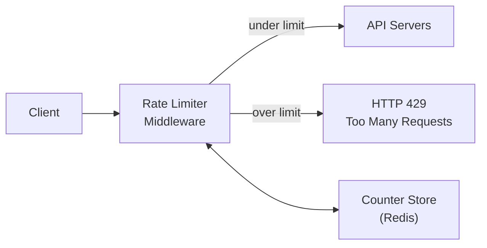
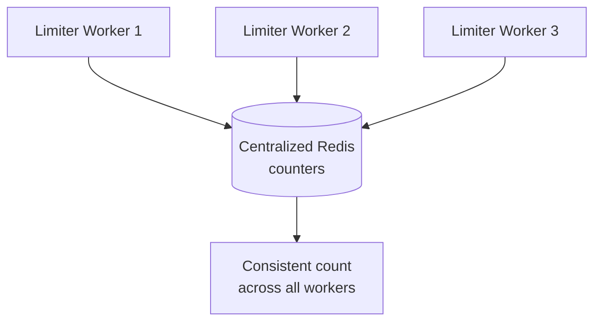
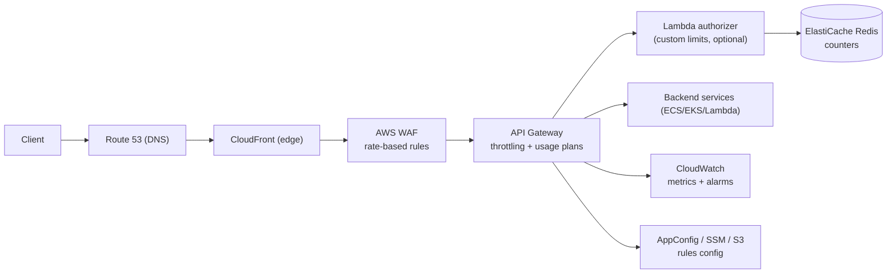

# Design a Rate Limiter — A Candidate's Step-by-Step Walkthrough (with AWS)

> **Format:** A worked "model answer" following the 4-step framework from `README.md` (Understand → High-Level → Deep Dive → Wrap Up).
> **Voice:** Written as the **candidate** would narrate it in the room, with the clarifying Q&A, diagrams, and trade-offs.
> ☁️ **AWS focus:** every step highlights how this maps to real AWS services (called out in 🟠 **AWS** blocks), with a consolidated AWS section at the end.
> 🏷️ Tags: `#SystemDesign` `#RateLimiter` `#AWS` `#Scalability` `#Interview`

> 💡 **Labeling:** 🟠 **AWS** = cloud mapping · ⭐ = must-remember · ⚠️ = trade-off/gotcha · 🟡 = interview favorite.

---

# Table of Contents

- [Why a Rate Limiter?](#why-a-rate-limiter)
- [Step 1 — Understand the Problem & Scope](#step-1--understand-the-problem--establish-scope)
- [Step 2 — High-Level Design & Buy-In](#step-2--high-level-design--get-buy-in)
  - [Where does the limiter live?](#where-does-the-limiter-live)
  - [Algorithms](#the-algorithms)
  - [Where to store counters](#where-to-store-the-counters)
- [Step 3 — Design Deep Dive](#step-3--design-deep-dive)
  - [Rules & configuration](#rules--configuration)
  - [Response when throttled (HTTP 429)](#response-when-throttled)
  - [Distributed challenges: race conditions & sync](#distributed-challenges)
  - [Performance & monitoring](#performance--monitoring)
- [Step 4 — Wrap Up](#step-4--wrap-up)
- [☁️ AWS Reference Architecture](#-aws-reference-architecture-consolidated)
- [Algorithm Comparison Table](#algorithm-comparison-table)
- [Interview Q&A](#interview-qa)
- [Cheat Sheet](#-cheat-sheet)
- [Flashcards](#flashcards)
- [Confidence Checklist](#confidence-checklist)

---

## Why a Rate Limiter?

A rate limiter caps how many requests a client can make in a window. It exists to:

- 🛡️ **Prevent abuse / DoS** — malicious or runaway clients.
- 💰 **Control cost** — every request downstream (compute, third-party APIs) costs money.
- ⚖️ **Enforce fairness & tiers** — free vs paid quotas.
- 🧯 **Protect backends** from overload (a form of backpressure).

Standard signal when a client is throttled: **HTTP 429 Too Many Requests**.

---

## Step 1 — Understand the Problem & Establish Scope

⭐ **Framework rule: don't be Jimmy — clarify before designing.** My opening questions and the assumed answers:

| I ask | Interviewer | My assumption |
|---|---|---|
| Client-side or server-side limiter? | Server-side | Client-side is easily bypassed; we build **server-side** |
| Throttle by what — IP, user ID, API key? | Should be **flexible** | Support **configurable rules** on different properties |
| Scale / traffic? | Large; must handle heavy load | Design for **low latency, low memory, distributed** |
| Distributed environment (many servers)? | Yes | Counters must be **shared/centralized**, not per-server |
| Separate service or in-app? | Your call | Build as **middleware** (or API-gateway feature) |
| Tell users they're throttled? | Yes | Return **429 + informative headers** |
| Hard or soft limit? | Discuss it | Support both (see wrap-up) |

**Requirements I write on the board:**

- ✅ Accurately limit excessive requests
- ✅ **Low latency** — must not slow down normal requests
- ✅ **Low memory** footprint
- ✅ **Distributed** rate limiting — shared across servers
- ✅ Clear exception handling (429 + headers)
- ✅ **High fault tolerance** — if the limiter's store dies, the system shouldn't fall over

🟠 **AWS framing:** In an AWS microservices setup, this often *isn't* something you hand-build — it's a **managed edge concern**. I'll flag where **API Gateway**, **AWS WAF**, and **ElastiCache** replace custom components, and note the build-vs-buy trade-off (an EM-level signal).

---

## Step 2 — Propose High-Level Design & Get Buy-In

### Where does the limiter live?

Three options — I'd talk through the trade-offs and land on middleware:



| Placement | Pros | Cons |
|---|---|---|
| **Client-side** | Cheap | ⚠️ Untrusted, easily bypassed |
| **Server-side (in app)** | Full control | Couples limiter to app; repeated per service |
| **Middleware / API Gateway** ⭐ | Centralized, language-agnostic, reusable | Extra hop |

**Decision:** a **rate-limiter middleware** in front of the API servers. In a cloud/microservices world this naturally becomes an **API Gateway** responsibility.

> 🟠 **AWS:** **Amazon API Gateway** has throttling **built in** (uses a **token bucket** internally). **AWS WAF** offers **rate-based rules** at the edge (CloudFront/ALB/API Gateway). So the "middleware" box is often literally an AWS-managed service — no custom code.

### The Algorithms

I'd present the main options and pick based on requirements:

**1. Token Bucket** ⭐ (most common; used by Stripe, and by **AWS API Gateway**)
- A bucket holds up to *N* tokens; refilled at a fixed rate. Each request consumes a token; empty bucket → reject.
- **Params:** bucket size (burst) + refill rate (steady state).
- 🟢 Allows **bursts**, memory-efficient. ⚠️ Tuning two params.

```text
        refill rate (r/sec)
              │
              ▼
     ┌──────────────────┐
     │  ● ● ● ○ ○  (bucket, size N)
     └──────────────────┘
              │ take 1 token per request
              ▼
   token available? ── yes ─► allow
        │ no
        └─► reject (429)
```

**2. Leaking Bucket** (FIFO queue, fixed outflow; used by Shopify)
- Requests enter a queue; processed at a constant rate; full queue → drop.
- 🟢 Smooth, stable outflow. ⚠️ Bursts get delayed; recent requests may be dropped if queue fills.

**3. Fixed Window Counter**
- Count per fixed window (e.g., per minute); reset each window.
- 🟢 Simple. ⚠️ **Edge burst problem** — 2× limit possible across a window boundary.

**4. Sliding Window Log**
- Store a timestamp per request (sorted set); drop timestamps outside the window; count the rest.
- 🟢 **Very accurate**. ⚠️ **Memory-heavy** (stores every request, even rejected ones).

**5. Sliding Window Counter** ⭐ (hybrid)
- Weighted blend of current + previous fixed windows. Smooths edges without storing every timestamp.
- 🟢 Good accuracy **and** efficiency — a strong default.

**My pick:** **Token bucket** for burst-friendly API throttling (and because it matches AWS API Gateway), or **sliding window counter** when smoothing edge bursts matters.

### Where to store the counters

⚠️ **Not a relational DB** — disk I/O is too slow for per-request checks.

⭐ Use an **in-memory store: Redis**. Two key commands:
- `INCR` — atomically increment the counter.
- `EXPIRE` — set a TTL so the window auto-resets.

> 🟠 **AWS:** **Amazon ElastiCache for Redis** is the managed counter store — same `INCR`/`EXPIRE` semantics, plus replication and Multi-AZ failover for fault tolerance. **DynamoDB** with atomic counters is a possible alternative, but Redis wins on **latency**.

---

## Step 3 — Design Deep Dive

### Rules & configuration

Rules define *what* to limit and *how much*, e.g.:

```yaml
- domain: auth
  descriptors:
    - key: login
      rate_limit:
        unit: minute
        requests_per_unit: 5
```

- Rules live in **config files** cached on the workers (not fetched per request).
- 🟠 **AWS:** store rules in **S3**, **AWS AppConfig**, or **SSM Parameter Store**; workers pull + cache and refresh periodically. AppConfig adds safe, gradual rollout of rule changes.

### Response when throttled

- Return **HTTP 429 Too Many Requests**.
- ⭐ Include headers so well-behaved clients can self-regulate:

| Header | Meaning |
|---|---|
| `X-Ratelimit-Limit` | Max requests allowed in the window |
| `X-Ratelimit-Remaining` | Requests left in the current window |
| `X-Ratelimit-Retry-After` | Seconds to wait before retrying |

- ⚠️ **Optionally enqueue** rejected requests (e.g., to process later) instead of dropping — depends on the use case.

### Distributed challenges

Two hard problems appear once you have many limiter workers sharing Redis:

**1. Race condition** ⚠️ (read-increment-write is not atomic under concurrency)
- Two workers read count=4, both allow, both write 5 → limit of 5 breached.
- **Fixes:** ⭐ **Lua scripts** (atomic on Redis), or Redis **sorted sets** for sliding-window logs. Avoid distributed **locks** — they add latency and defeat the point.

**2. Synchronization**
- Don't pin a client to one worker (**sticky sessions** don't scale/rebalance well).
- ⭐ Use a **shared, centralized store** (Redis) so any worker sees the same counts.



> 🟠 **AWS:** a single **ElastiCache for Redis** cluster (with replicas across AZs) is the shared store all workers hit. For multi-Region, accept **eventual consistency** at the edge (below).

### Performance & monitoring

- ⚡ **Latency:** run limiters at the **edge**, close to users, so throttling happens before the long-haul hop.
- 🌍 **Multi-data-center / multi-Region:** use edge limiting and **eventual consistency** — perfect global accuracy isn't worth the latency.
- 📊 **Monitoring:** watch whether the **algorithm and rules are effective** — are legit users being throttled? Are limits too loose under attack? Tune accordingly.

> 🟠 **AWS:**
> - **CloudFront + AWS WAF rate-based rules** = edge rate limiting per IP (evaluated over a rolling ~5-min window) before traffic reaches your origin.
> - **Amazon CloudWatch** for metrics/alarms (throttled request count, 429 rate); **WAF** publishes sampled requests and metrics too.

---

## Step 4 — Wrap Up

⭐ **Framework rule: never say the design is perfect.** Points I'd raise to show critical thinking:

- **Hard vs soft limits:**
  - *Hard* — requests over the threshold are strictly rejected.
  - *Soft* — brief bursts above the threshold are tolerated.
- **Rate limiting at different layers:** application layer (**L7**, e.g., by API key/user) vs network layer (**L3/L4**, e.g., by IP). ⚠️ IP-based limiting hits users behind shared NAT/proxies.
- **Client-side best practices:** cache responses, respect `Retry-After`, use **exponential backoff + jitter**, don't hammer on 429.
- **Bottlenecks & failure modes:**
  - ⚠️ If Redis is down → **fail open** (allow traffic) or **fail closed** (reject)? A **fault-tolerance decision** — usually fail *open* to preserve availability, with alarms.
  - Redis hot key → shard counters or use local token buckets with periodic sync.
- **Next scale curve:** more Regions → edge limiting + eventual consistency; add a message queue if you enqueue rather than drop.

---

## ☁️ AWS Reference Architecture (consolidated)



**Service-by-service mapping:**

| Generic component | AWS service | Notes |
|---|---|---|
| Edge rate limiting | **AWS WAF** (rate-based rules) on **CloudFront** | Per-IP, rolling ~5-min window; blocks before origin |
| Gateway throttling | **Amazon API Gateway** | Built-in **token bucket**; steady rate + burst; per-method throttling |
| Per-client quotas | **API Gateway Usage Plans + API Keys** | Tiered quotas (free/paid), daily/weekly/monthly caps |
| Custom limit logic | **Lambda authorizer** | For rules beyond built-in throttling |
| Counter store | **ElastiCache for Redis** | `INCR`/`EXPIRE`, Multi-AZ, Lua for atomicity |
| Rules config | **S3 / AppConfig / SSM Parameter Store** | Cached by workers; AppConfig for safe rollout |
| DNS | **Route 53** | Entry point |
| Monitoring | **CloudWatch** (+ WAF metrics) | 429 rate, throttled counts, alarms |
| Alt counter store | **DynamoDB** atomic counters | Possible, but higher latency than Redis |

> 🟡 **Interview favorite:** "Would you build this yourself on AWS?" ⭐ **Strong answer:** For standard API throttling, **don't** — lean on **API Gateway throttling + WAF rate-based rules** (managed, edge-native, less to operate). **Build custom** (WAF + Lambda + ElastiCache) only when you need **business-specific rules** the managed features can't express — and be explicit about that trade-off. This directly counters the framework's **over-engineering red flag**.

---

## Algorithm Comparison Table

| Algorithm | Bursts | Accuracy | Memory | Complexity | Note |
|---|---|---|---|---|---|
| **Token bucket** | 🟢 Allows | Good | 🟢 Low | Low | AWS API Gateway uses this |
| **Leaking bucket** | 🔴 Smooths/delays | Good | 🟢 Low | Low | Stable outflow (Shopify) |
| **Fixed window** | 🔴 Edge burst (2×) | ⚠️ Rough | 🟢 Low | 🟢 Lowest | Simple but leaky at edges |
| **Sliding window log** | 🟢 Precise | 🟢 High | 🔴 High | Medium | Stores every timestamp |
| **Sliding window counter** | 🟢 Smoothed | 🟢 High | 🟢 Low | Medium | Best all-rounder |

---

## Interview Q&A

**Q. Client-side vs server-side rate limiting?** ⭐
- ✅ Server-side — client-side is untrusted and trivially bypassed.

**Q. Why Redis and not a database?**
- ✅ Per-request checks need in-memory speed; `INCR`/`EXPIRE` are atomic and cheap. A disk-backed DB adds unacceptable latency.

**Q. How do you handle the race condition in a distributed limiter?** 🟡
- ✅ Atomic **Lua scripts** on Redis (or sorted sets); avoid distributed locks (too slow).

**Q. Fixed window's flaw?**
- ✅ Boundary bursts — up to **2× the limit** across a window edge. Fix with sliding window counter.

**Q. Redis (ElastiCache) goes down — what happens?** 🟡
- ✅ A **fail-open vs fail-closed** decision. Usually fail **open** to keep the service available, with alarms + a fallback local limiter. Don't let the limiter become a single point of failure.

**Q. How would you do this on AWS with minimal custom code?** ⭐
- ✅ **WAF rate-based rules** at CloudFront for coarse per-IP limits + **API Gateway throttling & usage plans** for per-key quotas. Add **Lambda + ElastiCache** only for custom logic.

**Q. IP-based limiting downside?**
- ✅ Users behind shared NAT/proxy get lumped together; prefer API-key/user-ID limiting at L7 where possible.

---

## 🧾 Cheat Sheet

```text
RATE LIMITER — 4 STEPS
 1. SCOPE:  server-side, flexible rules, distributed, low-latency, 429+headers, fault-tolerant
 2. HIGH-LEVEL: middleware/gateway -> Redis counters
      algos: token bucket (bursts, AWS APIGW) | leaking bucket | fixed window (edge burst!)
             | sliding log (accurate, heavy) | sliding counter (best all-round)
 3. DEEP DIVE: rules in config cache | 429 + X-Ratelimit-* headers
      race condition -> Lua/atomic; sync -> centralized Redis; edge + eventual consistency
 4. WRAP: hard vs soft | L7 vs L3 | client backoff+jitter | fail-open vs closed | next scale

AWS MAP
  WAF rate-based (edge/IP) + API Gateway throttling (token bucket) + Usage Plans (quotas)
  ElastiCache Redis (counters) | AppConfig/SSM/S3 (rules) | CloudWatch (monitor) | Lambda (custom)
  Build-vs-buy: prefer managed; custom only for business-specific rules (avoid over-engineering)
```

---

## Flashcards

| # | Q | A |
|---|---|---|
| 1 | Throttled HTTP status? | 429 Too Many Requests |
| 2 | Default algorithm choice? | Token bucket (bursts) / sliding window counter |
| 3 | Which algo does AWS API Gateway use? | Token bucket |
| 4 | Counter store? | Redis (AWS: ElastiCache) via INCR/EXPIRE |
| 5 | Fixed window flaw? | Boundary burst up to 2× |
| 6 | Most accurate, most memory? | Sliding window log |
| 7 | Race-condition fix? | Atomic Lua script / sorted set |
| 8 | Sync across workers? | Centralized store, not sticky sessions |
| 9 | 3 rate-limit headers? | Limit, Remaining, Retry-After |
| 10 | AWS edge per-IP limiting? | WAF rate-based rules on CloudFront |
| 11 | AWS per-client quotas? | API Gateway Usage Plans + API Keys |
| 12 | Redis-down decision? | Fail open vs fail closed |
| 13 | IP-limiting downside? | Shared NAT/proxy users lumped together |
| 14 | Over-engineering counter? | Prefer managed AWS features over custom |

---

## Confidence Checklist

- [ ] I open with clarifying questions (server-side? by what key? scale? distributed?).
- [ ] I place the limiter as middleware / API Gateway and justify it.
- [ ] I can compare all five algorithms and defend a pick.
- [ ] I use Redis with atomic ops and explain the race condition + fix.
- [ ] I return 429 with the three rate-limit headers.
- [ ] I address fault tolerance (fail open/closed) and never claim perfection.
- [ ] I map every component to an AWS service and reason build-vs-buy.

**Interview Difficulty:** 🟡 Medium — algorithms are standard; the signal is in **distributed correctness (race conditions), fault tolerance, and build-vs-buy judgment**.

---

🏷️ `#SystemDesign` `#RateLimiter` `#AWS` `#Scalability` `#Interview` `#EngineeringLeadership`

> Related: `README.md` (the 4-step framework this follows).
