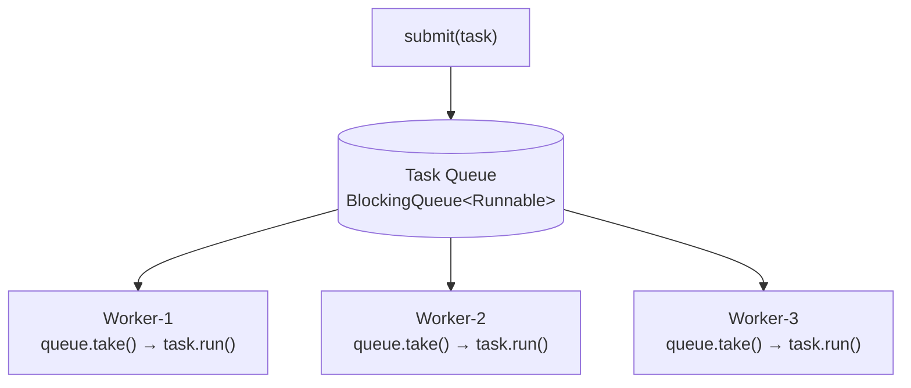
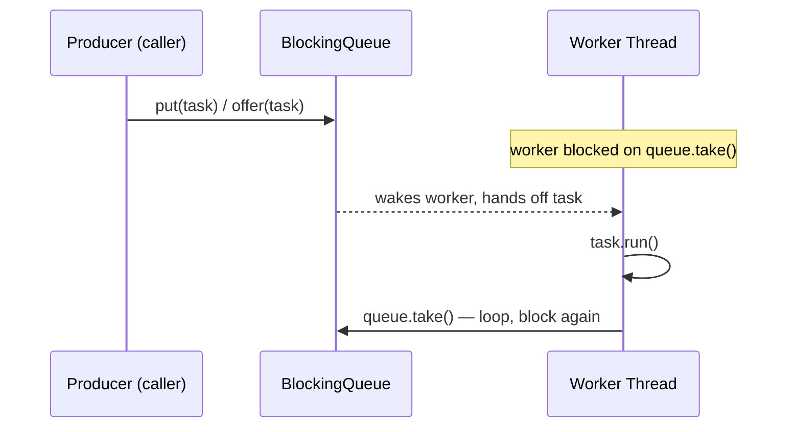

# 01 – Implementing a Thread Pool in Java

## Executive Summary

This is a very common Staff/Principal Engineer interview question, and
the interviewer is usually not asking you to recite `ThreadPoolExecutor`
API surface — they want to see you **design one from scratch**: which
data structures you'd use, why a blocking queue beats a plain one, how
workers avoid busy-waiting, and how the design handles saturation and
shutdown. This chapter builds that design piece by piece, then maps it
onto how `java.util.concurrent.ThreadPoolExecutor` actually works
internally.

## Learning Objectives

- The producer-consumer architecture underneath every thread pool
- Which concrete data structure to reach for, and why, at each point
- Why `BlockingQueue` specifically — not `LinkedList`, not
  `ConcurrentLinkedQueue`
- The full lifecycle: submission, execution, saturation, shutdown
- How real `ThreadPoolExecutor` differs from the from-scratch version
- Production concerns beyond "it executes tasks": backpressure, sizing,
  monitoring, workload isolation

## Interview Question

> **How would you implement a thread pool in Java? Which data structures
> would you use?**

A strong answer covers: worker threads, the task queue, synchronization,
thread lifecycle, rejected-task handling, shutdown, and scalability —
each covered as its own section below.

## Diagram — High-Level Architecture

See [`diagrams/thread-pool-architecture.mmd`](diagrams/thread-pool-architecture.mmd).



## Core Components

### 1. Task Queue

This is where submitted tasks wait until a worker thread picks them up.

**Best data structure: `BlockingQueue<Runnable>`**

| Implementation | Shape |
|---|---|
| `LinkedBlockingQueue` | Optionally bounded, linked-node backed — the general-purpose default |
| `ArrayBlockingQueue` | Fixed-capacity, array-backed — predictable memory footprint |
| `PriorityBlockingQueue` | Unbounded, orders tasks by priority instead of FIFO |
| `DelayQueue` | Tasks become available only after their delay expires |
| `SynchronousQueue` | Zero capacity — a producer's `put()` doesn't return until a consumer's `take()` is ready to receive it, a direct hand-off |

**Why a `BlockingQueue` specifically:**
- Thread-safe — producers (submitters) and consumers (workers) can add
  and remove concurrently without external locking.
- Supports **blocking** operations (`take()`, `put()`) — a worker with
  nothing to do simply sleeps until a task arrives, instead of spinning.
- Supports bounded capacity, which is what makes a **backpressure**
  policy possible at all (see Rejected Tasks, below).

### 2. Worker Threads

A collection of long-lived threads, each running the same loop:

```java
class Worker implements Runnable {
    private final BlockingQueue<Runnable> taskQueue;
    private volatile boolean running = true;

    public void run() {
        while (running) {
            try {
                Runnable task = taskQueue.take(); // blocks — no busy waiting
                task.run();
            } catch (InterruptedException e) {
                Thread.currentThread().interrupt();
                break;
            }
        }
    }
}
```

Held in a simple collection — `List<Thread>` or `Set<Thread>` — since the
pool only needs to iterate them for shutdown/interrupt, not look them up
by key.

### 3. Runnable / Callable Tasks

Every submitted job is represented as `Runnable` (fire-and-forget) or
`Callable<T>` (returns a result, typically wrapped in a `Future<T>`). The
pool itself should have **zero knowledge of what the work actually is**
— it only knows how to queue and execute a unit of work. This
separation is what makes the same pool implementation reusable for
literally any kind of task.

## Core Data Structures — Summary Table

| Purpose | Data structure |
|---|---|
| Waiting tasks | `BlockingQueue<Runnable>` |
| Worker threads | `List<Thread>` |
| Running/shutdown state | `AtomicBoolean` |
| Pool size / active count | `AtomicInteger` |
| Rejected tasks | A secondary queue, or a `RejectedExecutionHandler`-style callback |
| Completed-task statistics | `LongAdder` (lower contention than `AtomicLong` under high concurrency) |

## Why `BlockingQueue`, Concretely — Busy Waiting vs. Blocking

**The naive, wrong version** — an ordinary (non-blocking) queue:

```java
Queue<Runnable> queue = new LinkedList<>();
// worker:
while (true) {
    if (queue.isEmpty()) {
        continue; // busy waiting — spins the CPU at 100% for nothing
    }
    Runnable task = queue.poll();
    task.run();
}
```

This burns a full CPU core per idle worker doing nothing useful — the
thread is technically "running" the entire time it has no work.

**The correct version**, with a `BlockingQueue`:

```java
Runnable task = taskQueue.take(); // if empty, the thread SLEEPS here
task.run();
```

`take()` parks the worker thread (no CPU consumed) until a task becomes
available, then wakes it — the JVM/OS scheduler handles the wake-up, not
a hand-rolled spin loop. This single substitution is the most important
design decision in the whole exercise, and the detail interviewers
listen for first.

## Submission Flow

```
submit(task)
     │
     ▼
queue.put(task)     ← blocks if the queue is bounded and full
     │
     ▼
a parked worker wakes up
     │
     ▼
queue.take() returns the task
     │
     ▼
task.run()
```

## Diagram — Submission Sequence

See [`diagrams/thread-pool-submission-flow.mmd`](diagrams/thread-pool-submission-flow.mmd).



## Thread Pool Lifecycle

**Step 1 — create the pool.** Pool size = 5 → create Thread-1 through
Thread-5. Every worker immediately enters its loop and blocks on
`queue.take()`, waiting.

**Step 2 — submit a task.** Task A goes onto the queue; whichever worker
is next to wake (e.g., Worker-2) picks it up via `take()`.

**Step 3 — submit more tasks.** Tasks B, C, D arrive; the other idle
workers wake and pick them up in turn — this is what gives the pool its
parallelism.

**Step 4 — the queue fills up.** This is where the interview usually
pivots to the harder question: **what happens when the queue is full
and every worker is already busy?**

## Rejected Tasks — Saturation Policy

When the queue is bounded and full, and the pool is already at max
worker capacity, a new submission has to be handled somehow. Standard
strategies (Java's `RejectedExecutionHandler` names these exact four):

| Strategy | Behavior |
|---|---|
| **Reject** | Throw immediately (`AbortPolicy`) — caller must handle the failure |
| **Block the caller** | The submitting thread blocks until space frees up (achieved by using a blocking `put()` instead of `offer()`) |
| **Run in the caller's thread** | `CallerRunsPolicy` — the submitting thread executes the task itself, which naturally throttles the producer since it can't submit again until this one finishes |
| **Grow the pool (up to a max)** | Spin up an additional worker beyond the core size, up to a configured maximum, then fall back to one of the above once even that's exhausted |

## Synchronization

**The instinct to resist**: reaching for `synchronized` everywhere.
Prefer concurrent primitives that are already designed for exactly this
producer-consumer shape, since they avoid coarse locking and the
contention/deadlock risk that comes with hand-rolled `synchronized`
blocks:

- `BlockingQueue` — handles producer/consumer coordination internally.
- `AtomicInteger` / `AtomicBoolean` — lock-free counters and flags
  (pool size, running state).
- `CountDownLatch` — waiting for a batch of tasks to complete.
- `Semaphore` — bounding concurrent access to a limited resource.
- `ReentrantLock` — reach for this only when you need something a
  concurrent collection doesn't give you (e.g., a condition variable
  with fairness guarantees) — not as a default.

## What Happens If All Workers Are Busy?

```
Pool size = 5, all 5 busy.

New task arrives
      │
      ▼
Task waits inside the BlockingQueue
      │
      ▼
...until a worker finishes its current task and calls take() again
```

This is the queue doing exactly the job it exists for — absorbing a
burst without needing to reject or spin up unbounded new threads.

## Thread Pool Variants and Their Queues

| Executor | Backing queue | Behavior |
|---|---|---|
| `newFixedThreadPool(n)` | `LinkedBlockingQueue` (unbounded) | Fixed worker count; unbounded queue means **no rejection ever fires — but also no backpressure**, which is a common production gotcha (see Principal Engineer Insight below) |
| `newCachedThreadPool()` | `SynchronousQueue` | No storage at all — a task must be handed directly to an available or newly-created thread; grows unbounded under sustained load since there's no queue to absorb a burst |
| `newScheduledThreadPool(n)` | `DelayQueue` | Tasks become eligible only once their scheduled delay has elapsed |
| Priority-based pool | `PriorityBlockingQueue` | The highest-priority queued task always runs next, regardless of submission order |
| `newSingleThreadExecutor()` | `LinkedBlockingQueue`, pool size 1 | Guarantees strict sequential execution of submitted tasks |

**`SynchronousQueue`, specifically**: it has zero internal capacity — a
`put()` doesn't complete until some thread is actively waiting to
`take()` at that exact moment. `CachedThreadPool` pairs this with an
unbounded max pool size, so instead of queuing a burst of tasks, it just
keeps creating new threads to hand them to directly — fine for many
short-lived tasks, dangerous under a sustained spike (unbounded thread
creation).

## Complexity

| Operation | Typical cost |
|---|---|
| `offer()` / `put()` (submit) | O(1) |
| `take()` (a worker picking up a task) | O(1) |
| Task execution itself | Depends entirely on the task — outside the pool's control |

## From-Scratch Minimal Implementation

Putting the pieces together — deliberately minimal, to make the
producer-consumer shape explicit:

```java
class SimpleThreadPool {
    private final BlockingQueue<Runnable> taskQueue;
    private final List<Thread> workers = new ArrayList<>();
    private final AtomicBoolean running = new AtomicBoolean(true);

    SimpleThreadPool(int poolSize, int queueCapacity) {
        this.taskQueue = new LinkedBlockingQueue<>(queueCapacity);
        for (int i = 0; i < poolSize; i++) {
            Thread worker = new Thread(this::workerLoop, "pool-worker-" + i);
            workers.add(worker);
            worker.start();
        }
    }

    void submit(Runnable task) {
        if (!running.get()) {
            throw new RejectedExecutionException("Pool is shutting down");
        }
        try {
            taskQueue.put(task); // blocks if the bounded queue is full
        } catch (InterruptedException e) {
            Thread.currentThread().interrupt();
            throw new RejectedExecutionException(e);
        }
    }

    private void workerLoop() {
        while (running.get() || !taskQueue.isEmpty()) {
            try {
                Runnable task = taskQueue.poll(1, TimeUnit.SECONDS);
                if (task != null) task.run();
            } catch (InterruptedException e) {
                Thread.currentThread().interrupt();
            }
        }
    }

    void shutdown() {
        running.set(false); // stop accepting new work; workers drain the queue then exit
    }

    void shutdownNow() {
        running.set(false);
        workers.forEach(Thread::interrupt); // abandon queued and in-flight work immediately
    }
}
```

This mirrors the graceful-vs-immediate distinction `ExecutorService`
exposes as `shutdown()` (finish queued work, then stop) vs.
`shutdownNow()` (interrupt everything immediately and return whatever
was still queued).

## Real `ThreadPoolExecutor` Internals

Java's actual `ThreadPoolExecutor` is more sophisticated than the
from-scratch version above, but built on the exact same primitives:

- A `BlockingQueue<Runnable>` for queued tasks — same role as above.
- A pool of worker threads, wrapped internally as `Worker` objects.
- A single packed `AtomicInteger` called `ctl` that encodes **both** the
  run state (running/shutdown/stop/terminated) **and** the worker count
  in one field — a deliberate micro-optimization so both can be read and
  updated together, atomically, without a separate lock.
- A `ReentrantLock` (`mainLock`) protecting the worker set itself and
  lifecycle transitions — a case where a real lock genuinely earns its
  place, coordinating structural changes to the pool.
- A `RejectedExecutionHandler` implementing exactly the four saturation
  strategies described above (`AbortPolicy`, `CallerRunsPolicy`,
  `DiscardPolicy`, `DiscardOldestPolicy`).
- `keepAliveTime` — how long an idle thread beyond `corePoolSize` waits
  before terminating itself, reclaiming resources under low load.
- `corePoolSize` and `maximumPoolSize` — the pool grows from core toward
  max only once the queue is also full, which is a frequently-missed
  detail: **a bounded queue delays pool growth**, it doesn't prevent it.

## Common Interview Questions (Difficult Follow-Ups)

**Q1: Why not use `LinkedList` as the task queue?**
A: `LinkedList` isn't thread-safe. Multiple producer threads submitting
concurrently, and multiple worker threads consuming concurrently, can
corrupt its internal node links without external synchronization —
you'd have to wrap every access in your own locking, which is exactly
the coordination a `BlockingQueue` implementation already provides,
correctly, out of the box.

**Q2: Why `BlockingQueue` instead of `ConcurrentLinkedQueue`?**
A: `ConcurrentLinkedQueue` is thread-safe but **non-blocking** — a
worker calling `poll()` on an empty queue gets `null` immediately and
would have to loop and re-poll (busy waiting again) or add its own
parking logic. `BlockingQueue.take()` gives you the park/wake-up
behavior natively. `ConcurrentLinkedQueue` is the right tool for
non-blocking, high-throughput scenarios where a consumer has other work
to do instead of waiting — not for a worker whose entire job is to wait
for the next task.

**Q3: Why represent tasks as `Runnable` (or `Callable`)?**
A: It encapsulates a unit of work behind a single, uniform interface —
the pool's job is scheduling and executing work, not understanding what
the work is. This is the same separation-of-concerns argument as any
other plugin/strategy interface: the pool depends on an abstraction, not
on every concrete kind of task that might ever be submitted.

**Q4: Why `AtomicInteger` for something like `activeThreadCount`?**
A: With, say, 10 worker threads all incrementing/decrementing a shared
counter as they start and finish tasks, a plain `int++` is not atomic —
it's a read-modify-write sequence that can interleave between threads
and lose updates (a classic race condition). `AtomicInteger` performs
the update as a single atomic CAS (compare-and-swap) operation, giving
correct counts under concurrent access without needing a `synchronized`
block around every increment.

**Q5: Can multiple producers submit simultaneously?**
A: Yes — this is exactly the scenario `BlockingQueue` is designed for.
It supports multiple concurrent producers and multiple concurrent
consumers safely, which is precisely why it's the right choice over a
queue that only guarantees safety for a single producer or single
consumer.

## Interview Answer (2 Minutes)

> "I would implement a thread pool using a producer-consumer pattern.
> Submitted tasks would be represented as `Runnable` or `Callable`
> objects and stored in a thread-safe `BlockingQueue`. A fixed number of
> worker threads would continuously call `take()` on the queue, blocking
> when no tasks are available and executing tasks as they arrive. The
> pool would use concurrent primitives such as `AtomicBoolean` for
> shutdown state and `AtomicInteger` for counters, avoiding unnecessary
> synchronization. I'd also support bounded queues, configurable
> rejection policies, graceful shutdown, and monitoring metrics. This
> design is scalable, efficient, and closely aligns with how Java's
> `ThreadPoolExecutor` is implemented internally."

## Principal Engineer Insight

A strong thread pool implementation isn't just "it executes tasks
concurrently" — in production, the design decisions that actually matter
are the ones around what happens under load:

- **Backpressure**: what happens when producers submit faster than
  workers can consume? An **unbounded** queue (the default behind
  `newFixedThreadPool`) means submissions never get rejected — but it
  also means an unbounded queue can grow without limit under sustained
  overload, trading an explicit rejection for a slow, silent march
  toward an `OutOfMemoryError`. A **bounded** queue makes this failure
  mode explicit and requires you to pick a rejection strategy — which is
  the more honest design, even though it means handling failure earlier.
- **Queue and pool sizing**: for CPU-bound work, a common starting
  heuristic is pool size ≈ number of available cores (`Runtime.getRuntime().availableProcessors()`),
  since more threads than cores just adds context-switching overhead
  with no throughput gain. For I/O-bound work, the classic *Java
  Concurrency in Practice* formula is a better starting point:
  `threads = Ncpu × Ucpu × (1 + W/C)`, where `Ucpu` is target CPU
  utilization, and `W/C` is the ratio of wait time to compute time per
  task — the more time each task spends blocked on I/O, the more threads
  you need to keep the CPU busy. Always validate with load testing, not
  just the formula.
- **Monitoring**: track queue length, active thread count, completed
  task count, and per-task latency as first-class metrics — a pool that
  looks "fine" by CPU usage alone can still be silently building an
  ever-growing backlog that only shows up as queue-length growth.
- **Workload separation**: use separate pools for CPU-bound and
  I/O-bound work. Mixing them in one pool means a burst of slow I/O-bound
  tasks can occupy every worker thread and starve fast CPU-bound tasks
  that are ready to run immediately — the same "noisy neighbor" problem
  covered in this handbook's Multi-Tenancy chapter, just at the
  thread-pool level instead of the tenant level.
- **Graceful shutdown**: `shutdown()` should stop accepting new
  submissions but let already-queued and in-flight work finish;
  `shutdownNow()` should interrupt in-flight work and return whatever
  was still queued, for callers that need an immediate stop. Losing
  accepted-but-not-yet-run work silently on shutdown is a correctness
  bug, not just an inconvenience — production shutdown paths (a
  container SIGTERM, a rolling deploy) should call `shutdown()` with a
  bounded `awaitTermination()` timeout, falling back to `shutdownNow()`
  only if that timeout is exceeded.

### A note on Virtual Threads (Java 21+)

Worth raising if the conversation goes there: virtual threads change the
*cost* side of this trade-off, not the underlying pattern. Because
virtual threads are cheap (JVM-scheduled, not OS-scheduled, with a much
smaller footprint), the traditional motivation for pooling — reusing a
small number of expensive OS threads — weakens for I/O-bound workloads;
a common modern pattern is `Executors.newVirtualThreadPerTaskExecutor()`,
which creates a **new virtual thread per task** instead of reusing a
fixed pool. The queue-based producer-consumer design in this chapter
still fully applies to **platform-thread** pools (CPU-bound work,
constrained-resource pools, anything needing precise concurrency
control) — virtual threads don't replace the pattern, they just remove
the need for pooling in the specific case where thread creation cost was
the only reason to pool in the first place.

## Principal Engineer Notes

The detail that most reliably signals real hands-on experience with this
question isn't naming `ThreadPoolExecutor`'s constructor parameters —
it's leading with **why blocking beats busy-waiting**, and then
volunteering the backpressure/sizing/monitoring concerns before being
asked. Those are the parts of this design that only show up once you've
actually run a thread pool in production and watched it either gracefully
absorb a load spike or silently fall over.
