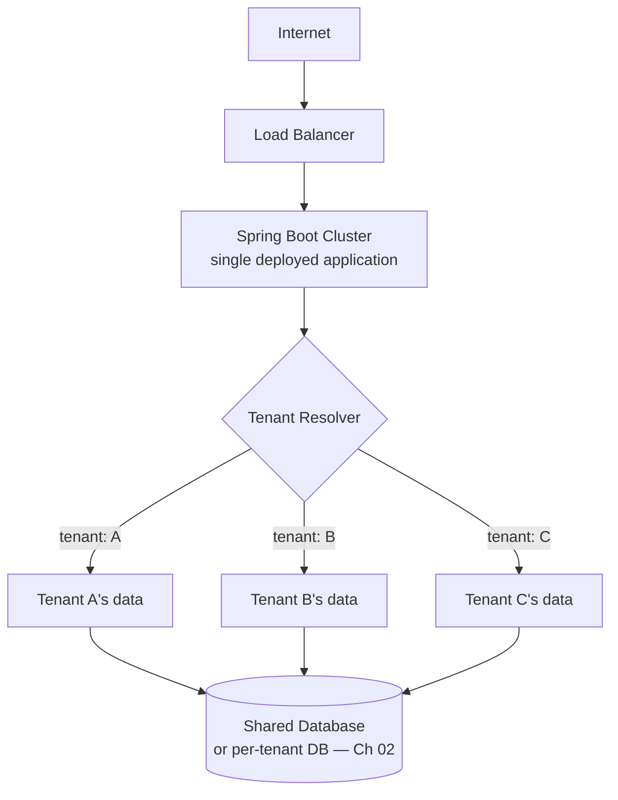

# 01 – Introduction

## Executive Summary

A multi-tenant architecture is a software architecture where a single
application instance serves multiple customers (tenants), while ensuring
each tenant's data stays isolated and secure. It's the economic engine
behind SaaS: one codebase, one deployment, one operational surface,
serving thousands of customers who each experience the system as if it
were built just for them.

## Learning Objectives

- What a tenant is, and what "multi-tenant" actually means operationally
- Why SaaS companies build this way instead of one deployment per customer
- The shared-resources-but-private-data mental model
- How this chapter's content connects to database design (Ch 03), Spring
  Boot implementation (Ch 04), and tenant isolation across every layer of
  the stack (Ch 05–07)

## Diagram

See [`diagrams/multi-tenant-overview.mmd`](diagrams/multi-tenant-overview.mmd).



## What Is Multi-Tenant Architecture?

A multi-tenant architecture is a software architecture where **a single
application instance serves multiple customers (tenants)** while
ensuring each tenant's data is isolated and secure. Salesforce is the
textbook example: one application serves hundreds of thousands of
companies, and each company sees only its own data — despite all of them
running on the same underlying software.

## The Apartment Building Analogy

This is the mental model to reach for first, because it makes the
"shared infrastructure, private data" split concrete before any code or
database schema enters the picture:

```
                    Apartment Building
        ┌─────────────────────────────────────┐
        │  Flat 101  →  Family A               │
        │  Flat 102  →  Family B               │
        │  Flat 103  →  Family C               │
        └─────────────────────────────────────┘

  Everyone shares:              Each family has:
  ─────────────────             ──────────────────
  • The building                • A separate home
  • The lift                    • Separate belongings
  • Parking                     • Separate privacy
  • Security
  • Water supply
```

Families A, B, and C never see inside each other's flats, never touch
each other's belongings, and would be alarmed if they could — but they
all ride the same lift, use the same water supply, and are protected by
the same building security. That's exactly the trade-off a multi-tenant
system is built around: **maximize shared infrastructure, guarantee
private data.** Every pattern in Chapter 02 is really just a different
answer to "how private does the flat need to be, and how much of the
building can still be shared?"

## What Is a Tenant?

A tenant is whatever unit of customer the system needs to keep isolated
from every other unit. Depending on the product, that could be:

- A **company** (Salesforce → each customer company is a tenant)
- A **customer/individual account** (a consumer SaaS product)
- An **organization or business unit** within a larger company
- A **school**, a **hospital**, a **government department**

**Example — Microsoft Teams:**

```
Same software, different tenants:

  Tenant A → Google
  Tenant B → Amazon
  Tenant C → Walmart
```

All three run on identical infrastructure and identical application
code. What makes them separate tenants isn't a separate deployment —
it's that the system enforces, at every layer, that Google's data,
Amazon's data, and Walmart's data never mix.

## High-Level Architecture

```
                          Internet
                             │
                       Load Balancer
                             │
                    Spring Boot Cluster
                             │
              ┌──────────────┼──────────────┐
              │              │               │
          Tenant A       Tenant B        Tenant C
              │              │               │
              └──────────────┴───────────────┘
                             │
                      Shared Database
```

One application. Many tenants. The interesting engineering decisions —
covered across the rest of this chapter — are all about what happens at
and below that "Shared Database" box: how tenant identity flows through
every request (Ch 04), how the data itself gets isolated (Ch 02–03), and
how that isolation is enforced consistently across the database, cache,
message bus, and even the vector search index (Ch 05–07).

## Why This Matters at Scale

The alternative to multi-tenancy — one dedicated deployment per customer
— doesn't scale operationally: 10,000 customers would mean 10,000
deployments, 10,000 sets of infrastructure to patch, monitor, and pay
for. Multi-tenancy is what makes a SaaS business's unit economics work,
which is exactly why "how would you design multi-tenancy for X" is such
a common system-design interview prompt — it's not an academic pattern,
it's the architecture underneath nearly every SaaS product currently in
production.

## Common Interview Questions

1. What is multi-tenancy, and why do SaaS companies build this way
   instead of provisioning a dedicated deployment per customer?
2. What is a "tenant," concretely, in different kinds of products?
3. Using the apartment-building analogy, explain what's shared and what
   must stay private in a multi-tenant system.
4. What breaks, operationally, if a company tried to run one dedicated
   deployment per customer at 10,000+ customers?

## Principal Engineer Notes

Every follow-up question in this chapter set — which isolation pattern,
how tenant context flows through a request, how Kafka/Redis/vector
search stay tenant-safe — is really a variation on the same underlying
question: **at this specific layer, how much is shared, and how is the
private part enforced?** Keep coming back to that framing; it's what
turns "I know four multi-tenancy patterns" into "I can design
multi-tenancy for this specific system."

## Next Chapter

[02 – Tenant Isolation Patterns](02-Tenant-Isolation-Patterns.md)
