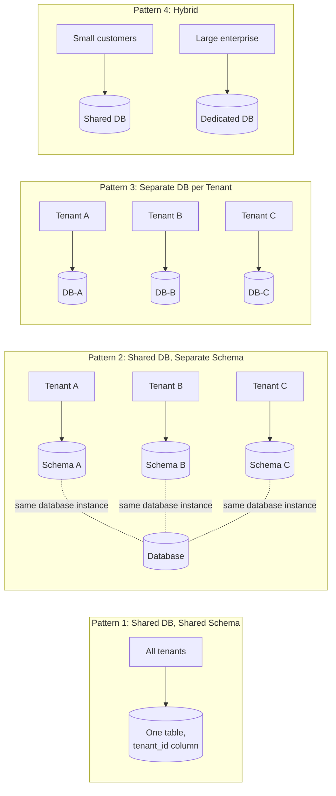

# 02 – Tenant Isolation Patterns

## Executive Summary

There are four standard patterns for isolating tenant data, and they sit
on a single spectrum: **more shared infrastructure and lower cost** at
one end, **stronger isolation and higher operational overhead** at the
other. This is the most frequently asked multi-tenancy interview
question — being able to draw all four, state their trade-offs, and say
which one fits a given scenario (and why) is the core skill this chapter
builds.

## Diagram

See [`diagrams/tenant-isolation-patterns.mmd`](diagrams/tenant-isolation-patterns.mmd).



## The Isolation Spectrum

```
Weakest isolation, cheapest              Strongest isolation, most expensive
├────────────────────────────────────────────────────────────────────────┤
Shared DB,        Shared DB,         Separate DB          Hybrid
Shared Schema      Separate Schema    per Tenant            (mix of the above,
(Pattern 1)         (Pattern 2)        (Pattern 3)           chosen per tenant tier)
```

Every real production system lands somewhere on this line — usually not
at a single fixed point, but at **Pattern 4**, because different
customer tiers have genuinely different isolation, compliance, and
budget requirements.

## Pattern 1 — Shared Database, Shared Schema

All tenants' rows live in the same tables, distinguished by a
`tenant_id` column.

```sql
-- Customers table, all tenants together
CREATE TABLE customers (
    id           BIGINT PRIMARY KEY,
    tenant_id    VARCHAR(50) NOT NULL,
    customer_name VARCHAR(255),
    order_id     BIGINT
);
```

| tenant_id | customer_name |
|---|---|
| A | John |
| A | Mary |
| B | David |
| C | Steve |

Every single query must include the tenant filter:

```sql
SELECT * FROM customers WHERE tenant_id = ?;
```

| | |
|---|---|
| **Advantages** | Cheapest to run; simplest to maintain (one schema, one migration path); best resource utilization (no idle per-tenant overhead) |
| **Disadvantages** | Weakest isolation of the four patterns; a single missed `WHERE tenant_id = ?` is a cross-tenant data leak, not a performance bug; noisy-neighbor risk — one tenant's heavy query load can degrade every other tenant sharing the table |
| **Used by** | Small SaaS companies, early-stage products, freemium/low-tier customer segments |

## Pattern 2 — Shared Database, Separate Schema

Same physical database instance, but each tenant gets its own schema —
its own `customers`, `orders`, `invoices` tables, namespaced by schema.

```
Database
├── Schema_A
│   ├── customers
│   ├── orders
│   └── invoices
├── Schema_B
│   ├── customers
│   ├── orders
│   └── invoices
└── Schema_C
    ├── customers
    └── orders
```

| | |
|---|---|
| **Advantages** | Meaningfully better isolation than Pattern 1 — no shared table, no risk of a forgotten `WHERE` clause leaking rows; easier per-tenant backup and restore; easier per-tenant migration or schema customization |
| **Disadvantages** | Schema sprawl — thousands of tenants means thousands of schemas to manage, migrate, and monitor; connection pooling and ORM tooling (Ch 04) need explicit multi-schema support, which not all frameworks handle cleanly out of the box |
| **Used by** | Mid-market SaaS with a moderate tenant count and a real, if not extreme, isolation requirement |

## Pattern 3 — Separate Database per Tenant ⭐

Every tenant gets a **dedicated database**.

```
                    Application
                         │
        ┌────────────────┼────────────────┐
        │                │                 │
      DB-A              DB-B              DB-C
```

| | |
|---|---|
| **Advantages** | Strongest isolation of the four; independent backup and restore per tenant; independent scaling per tenant; straightforward compliance story (a regulator can point at exactly one database and ask "is this customer's data isolated?" and the answer is unambiguously yes) |
| **Disadvantages** | Most expensive — infrastructure cost scales linearly with tenant count; real operational overhead — provisioning, monitoring, patching, and migrating N databases instead of one |
| **Used by** | Banks, healthcare, government, and any tenant with hard regulatory isolation requirements |

## Pattern 4 — Hybrid Model ⭐

What most large SaaS companies actually run: **different isolation
levels for different tenant tiers**, not one pattern applied uniformly.

```
Free / small customers  →  Shared DB (Pattern 1 or 2)
Large enterprise         →  Dedicated database (Pattern 3)
```

This isn't a compromise pattern bolted on top of the other three — it's
the recognition that a single-tenant SaaS free-tier user and a
Fortune 500 enterprise contract have fundamentally different cost
tolerance and isolation requirements, and forcing them onto the same
pattern either overcharges the small customer's infrastructure budget or
under-delivers on the enterprise customer's compliance requirements.
Chapter 09 covers the mechanics of **migrating** a tenant from the shared
tier to a dedicated database as they grow — this is a standard,
expected operational event in a hybrid model, not an edge case.

## Decision Framework

| Criterion | Pattern 1 | Pattern 2 | Pattern 3 | Pattern 4 |
|---|---|---|---|---|
| Isolation strength | Low | Medium | High | Tiered |
| Cost per tenant | Lowest | Low–Medium | Highest | Tiered |
| Operational complexity | Lowest | Medium | Highest (at scale) | Highest (must support all patterns) |
| Compliance-friendliness | Weak | Moderate | Strong | Strong for tiers that need it |
| Best for | High-volume, low-ARPU tenants | Mid-market | Regulated / enterprise | Real-world SaaS at scale |

**The interview-ready answer**: don't pick one pattern for an entire
product. Pick a **default** (usually Pattern 1, for cost reasons) and an
**escape hatch** (Pattern 3, for tenants whose compliance or scale
requirements demand it) — that's Pattern 4, and it's the answer that
signals you understand this is a business trade-off, not just a
technical one.

## Common Interview Questions

1. Compare all four multi-tenancy patterns on isolation, cost, and
   operational complexity.
2. Why is Pattern 1 (shared schema) still widely used despite its
   weaker isolation?
3. What specifically breaks at scale with Pattern 2 (separate schema per
   tenant) that doesn't break with Pattern 1?
4. Why do most large SaaS companies land on a hybrid model rather than
   picking a single pattern?
5. A regulated healthcare customer wants to onboard onto a platform that
   currently only uses Pattern 1. What do you tell them, and what do you
   build?

## Principal Engineer Notes

This is one of the highest-yield multi-tenancy questions to have fully
rehearsed — draw all four diagrams from memory, state one advantage and
one disadvantage for each without hesitation, and always land on "it
depends on the tenant tier, and most systems end up hybrid" rather than
declaring a single winner. That closing move is what separates a
memorized answer from a design judgment.

## Next Chapter

[03 – Database Design](03-Database-Design.md)
