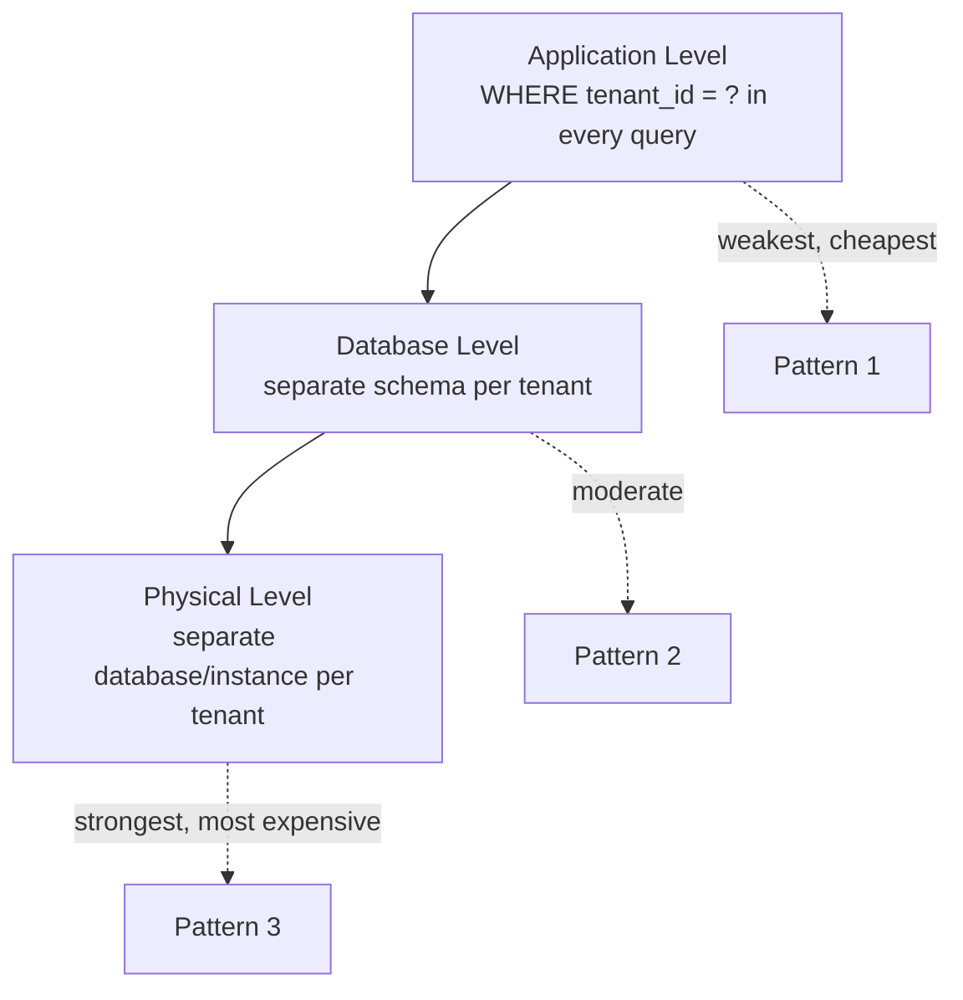

# 03 – Database Design

## Executive Summary

Each isolation pattern from Chapter 02 implies a different concrete
database design — different schema, different indexing strategy,
different backup story, and a different answer to "how do I know a
missed tenant filter can't leak data." This chapter makes each pattern
concrete at the DDL/index/backup level, then covers the operational
reality every hybrid system eventually faces: migrating a tenant from
one pattern to another.

## Diagram

See [`diagrams/data-isolation-levels.mmd`](diagrams/data-isolation-levels.mmd).



## Three Levels of Data Isolation

Restating Chapter 02's spectrum specifically as a **database design**
decision — this is the axis every schema choice in this chapter sits on:

1. **Application level** — one shared table, isolation enforced entirely
   by application code appending `WHERE tenant_id = ?` to every query.
2. **Database level** — one database instance, but tenants get separate
   schemas; isolation is enforced by the database's own schema
   boundaries, not solely by application discipline.
3. **Physical level** — separate database (potentially separate
   instance/server) per tenant; isolation is enforced by physical/
   infrastructure separation, the strongest guarantee available.

## Pattern 1 Schema Design (Shared Schema)

```sql
CREATE TABLE orders (
    id           BIGINT PRIMARY KEY,
    tenant_id    VARCHAR(50) NOT NULL,
    customer_id  BIGINT NOT NULL,
    amount       DECIMAL(12,2),
    created_at   TIMESTAMPTZ DEFAULT now()
);

-- tenant_id belongs in every index that supports a tenant-scoped query,
-- as the LEADING column — this is what keeps per-tenant queries fast
-- as the table grows into the tens of millions of rows across all tenants
CREATE INDEX idx_orders_tenant_customer ON orders (tenant_id, customer_id);
CREATE INDEX idx_orders_tenant_created ON orders (tenant_id, created_at);
```

**Defense in depth beyond application code**: relying purely on every
developer remembering `WHERE tenant_id = ?` is fragile — one missed
clause in one query, one raw SQL debugging script run against
production, is a cross-tenant leak. Postgres **Row-Level Security
(RLS)** enforces the filter at the database engine itself, as a backstop
that holds even if application code forgets:

```sql
ALTER TABLE orders ENABLE ROW LEVEL SECURITY;

CREATE POLICY tenant_isolation_policy ON orders
    USING (tenant_id = current_setting('app.current_tenant'));

-- application sets this once per connection/transaction:
SET app.current_tenant = 'tenant-a';
```

With RLS enabled, even a query that forgets `WHERE tenant_id = ?`
transparently only sees rows belonging to the tenant set in the session
— this is the single highest-leverage database-level control available
for Pattern 1, and worth naming unprompted in an interview as the answer
to "what if a developer forgets the filter."

## Pattern 2 Schema Design (Separate Schema)

```sql
-- provisioning a new tenant's schema
CREATE SCHEMA tenant_acme;

CREATE TABLE tenant_acme.orders (
    id BIGINT PRIMARY KEY,
    customer_id BIGINT NOT NULL,
    amount DECIMAL(12,2)
    -- no tenant_id column needed — the schema itself IS the tenant boundary
);
```

- **Routing**: the connection's `search_path` (or an explicit
  schema-qualified query) determines which tenant's tables a query hits
  — set per-request based on the resolved tenant (Chapter 04).
- **Migrations**: schema changes must be applied to every tenant's
  schema — tooling (Flyway, Liquibase) needs to loop over all tenant
  schemas, which is a meaningfully different operational shape than a
  single-schema migration and needs its own automation, monitored for
  partial-failure (schema 4,382 of 10,000 failed to migrate — now what).
- **Backup**: schema-level backup/restore is possible in most RDBMSs,
  giving a natural per-tenant backup boundary without needing separate
  database instances.

## Pattern 3 Schema Design (Separate Database)

Schema is identical across tenants (usually the exact same DDL,
deployed N times) — the isolation comes entirely from physical/instance
separation, not from anything expressed in SQL:

```
DB-Acme:    orders, customers, invoices  (identical schema)
DB-Globex:  orders, customers, invoices  (identical schema)
```

- **Provisioning automation** is the real engineering work here — spin
  up a new database (or logical database on a shared cluster), apply the
  standard schema/migrations, register it in a tenant-routing table
  (Chapter 04), all triggered by a tenant-onboarding event rather than a
  manual step (Chapter 09).
- **Connection management**: N tenants means N connection pools (or a
  dynamically-routed pool) — this needs explicit capacity planning,
  since a naive "one pool per tenant" design can exhaust database
  connection limits well before it exhausts application resources.
- **Backup/restore** is a clean, independent operation per tenant —
  restoring Tenant A's database can never affect Tenant B, which is
  exactly the guarantee regulated customers (Chapter 08) are paying for.

## Noisy Neighbor Mitigation at the Database Level

Relevant primarily to Patterns 1 and 2, where tenants share database
resources:

- **Connection pool limits per tenant** (or per tenant tier) — cap how
  many concurrent connections/queries one tenant can consume, so one
  tenant's traffic spike can't starve every other tenant's query
  latency.
- **Read replicas** for read-heavy reporting/analytics queries, kept
  separate from the primary that serves latency-sensitive transactional
  queries — an expensive analytics query from one tenant shouldn't
  degrade another tenant's checkout flow.
- **Query timeout and resource governor settings**, scoped per tenant
  tier where the database supports it — this is the DB-level analogue
  of the application-level rate limiting covered in Chapter 09.
- **Escalation path**: sustained noisy-neighbor behavior from a specific
  tenant is a signal to migrate that tenant to Pattern 3 (dedicated
  database) — see the migration runbook below.

## Migrating a Tenant Between Patterns

A real, expected operational event in a hybrid model (Chapter 02,
Pattern 4) — a tenant on the shared tier grows, or signs an enterprise
contract requiring dedicated infrastructure, and needs to move without a
visible outage.

```
1. Freeze writes for the tenant
     — briefly reject/queue new writes for this tenant only;
       other tenants are completely unaffected (this is the whole
       point of tenant isolation — a migration for one tenant should
       never be visible to any other tenant)

2. Export the tenant's data
     — extract every row/schema belonging to this tenant from the
       shared database

3. Import into the new dedicated database
     — apply the same schema, load the exported data

4. Update the routing layer
     — the tenant-resolver/routing table (Chapter 04) now points this
       tenant's requests at the new database

5. Resume traffic
     — unfreeze writes, now flowing to the new database

6. Validate consistency
     — row counts, checksums, or a reconciliation job comparing
       old vs. new before fully decommissioning the tenant's data
       in the old shared database
```

The freeze window is the part worth being explicit about in an
interview: it should be measured in seconds to low minutes for a
well-built export/import pipeline, not hours — and it should be
communicated to the customer if it's user-visible at all, which for a
well-designed migration it typically shouldn't be beyond a brief
read-only window.

## Common Interview Questions

1. What are the three levels of data isolation, and which pattern from
   Chapter 02 maps to each?
2. How do you protect against a developer forgetting `WHERE tenant_id = ?`
   in a shared-schema design?
3. What operational complexity does schema-per-tenant introduce for
   database migrations that shared-schema doesn't have?
4. Walk through migrating a tenant from a shared database to a dedicated
   database without a customer-visible outage.
5. How do you prevent one tenant's heavy query load from degrading
   latency for every other tenant sharing a database?

## Principal Engineer Notes

Row-Level Security is the single most under-mentioned answer in this
space — most candidates describe Pattern 1 purely as "filter by
tenant_id in application code" and stop there, which is exactly the
design that has caused real production data leaks industry-wide. Naming
RLS (or an equivalent database-level enforcement mechanism) as defense
in depth beyond application code is a strong, concrete signal of
hands-on experience with this problem, not just familiarity with the
pattern names.

## Next Chapter

04 – Spring Boot Implementation
