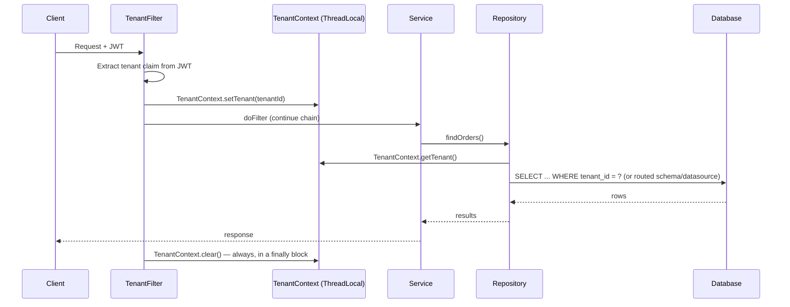

# 04 – Spring Boot Implementation

## Executive Summary

This chapter turns Chapters 02–03's patterns into working Spring Boot
code: resolving the tenant from the incoming request, propagating that
identity through the call stack via a request-scoped context, and
enforcing it at the repository layer for each of the three isolation
patterns. The sharp edge covered at the end — `ThreadLocal` leaking
across pooled threads — is the single most common real-world bug in
hand-rolled multi-tenant Spring implementations.

## Diagram

See [`diagrams/tenant-context-flow.mmd`](diagrams/tenant-context-flow.mmd).



## How Does the Application Know the Tenant?

The tenant identity has to be resolved from something on the incoming
request — never trusted as a plain client-supplied parameter, since that
would let any caller simply claim to be a different tenant. Common
sources, in order of how much trust each deserves:

| Source | Trust level | Notes |
|---|---|---|
| **JWT claim** | High | Signed by your own auth server — the standard, recommended approach |
| **OAuth token** | High | Same trust model as JWT, via an identity provider |
| API key | Medium–High | Fine if the key itself is securely provisioned and scoped server-side to one tenant |
| Subdomain (`acme.app.com`) | Medium | Useful for tenant-branded URLs, but should still be cross-checked against the authenticated identity, not trusted alone |
| Request header (`X-Tenant-Id`) | **Low — never trust alone** | A client-supplied header is trivially spoofable; only acceptable if verified against the authenticated session server-side |

**The rule that matters most**: never derive the tenant purely from
something the client can set unchecked. A raw `X-Tenant-Id` header with
no server-side verification against the authenticated user's actual
tenant membership is the most common real-world cause of cross-tenant
access bugs — always resolve tenant identity from something
cryptographically tied to authentication (a JWT claim), or explicitly
validate a claimed tenant against the authenticated user's real
memberships.

## TenantContext and the Resolution Filter

```java
public final class TenantContext {

    private static final ThreadLocal<String> CURRENT_TENANT = new ThreadLocal<>();

    public static void setTenant(String tenantId) {
        CURRENT_TENANT.set(tenantId);
    }

    public static String getTenant() {
        String tenantId = CURRENT_TENANT.get();
        if (tenantId == null) {
            throw new IllegalStateException("No tenant set on this thread");
        }
        return tenantId;
    }

    public static void clear() {
        CURRENT_TENANT.remove(); // critical — see "The ThreadLocal Trap" below
    }
}
```

```java
@Component
public class TenantResolutionFilter extends OncePerRequestFilter {

    @Override
    protected void doFilterInternal(HttpServletRequest request,
                                     HttpServletResponse response,
                                     FilterChain chain) throws IOException, ServletException {
        try {
            Jwt jwt = (Jwt) SecurityContextHolder.getContext()
                .getAuthentication().getPrincipal();
            String tenantId = jwt.getClaimAsString("tenant");

            if (tenantId == null) {
                throw new AccessDeniedException("No tenant claim on token");
            }

            TenantContext.setTenant(tenantId);
            chain.doFilter(request, response);
        } finally {
            TenantContext.clear(); // ALWAYS clear, even on exception
        }
    }
}
```

## The ThreadLocal Trap

This is the caveat worth raising unprompted in an interview, because
it's the specific way naive implementations of this pattern fail in
production.

**Application servers reuse threads from a pool.** If `TenantContext`
isn't cleared at the end of every request — including on the exception
path — a thread that just served Tenant A's request can be handed back
to the pool still holding Tenant A's tenant ID, and the *next* request
served by that same thread (potentially Tenant B's) silently inherits
the wrong tenant context. This is a live, real-world cross-tenant data
leak, not a theoretical concern — which is why `TenantContext.clear()`
belongs in a `finally` block, unconditionally, not just on the happy
path.

**The same trap resurfaces, differently, under async/reactive code**:
`ThreadLocal` does not automatically propagate across
`@Async` method boundaries, `CompletableFuture` chains, or a WebFlux
reactive pipeline, because those execute on different threads than the
one that set the context. Spring's `TaskDecorator` (for `@Async`/thread
pools) or Reactor's `Context` (for WebFlux, replacing `ThreadLocal`
entirely with a request-scoped reactive context) are the correct
mechanisms — reaching for `ThreadLocal` in a reactive codebase is a
common, subtle multi-tenancy bug source and worth naming explicitly if
the system in question is reactive.

## Enforcement per Pattern

### Pattern 1 (Shared Schema) — Hibernate Filter

```java
@Entity
@FilterDef(name = "tenantFilter", parameters = @ParamDef(name = "tenantId", type = String.class))
@Filters(@Filter(name = "tenantFilter", condition = "tenant_id = :tenantId"))
public class Order {
    @Id private Long id;
    private String tenantId;
    private BigDecimal amount;
}

@Repository
public class OrderRepositoryImpl {

    @PersistenceContext
    private EntityManager em;

    public List<Order> findAll() {
        Session session = em.unwrap(Session.class);
        session.enableFilter("tenantFilter")
               .setParameter("tenantId", TenantContext.getTenant());
        return session.createQuery("from Order", Order.class).list();
    }
}
```

A Hibernate `@Filter`, enabled per-session from `TenantContext`, applies
the `tenant_id` predicate to every query transparently — centralizing
the enforcement instead of relying on every repository method to append
its own `WHERE` clause. Pair this with the Postgres RLS policy from
Chapter 03 as a second, database-level layer that holds even if this
application-level filter is ever accidentally bypassed.

### Pattern 2 (Separate Schema) — Hibernate Multi-Tenancy

```java
@Component
public class SchemaTenantIdentifierResolver implements CurrentTenantIdentifierResolver<String> {
    @Override
    public String resolveCurrentTenantIdentifier() {
        return TenantContext.getTenant();
    }
    @Override
    public boolean validateExistingCurrentSessions() { return true; }
}

@Component
public class SchemaMultiTenantConnectionProvider implements MultiTenantConnectionProvider<String> {
    @Autowired private DataSource dataSource;

    @Override
    public Connection getConnection(String tenantIdentifier) throws SQLException {
        Connection connection = dataSource.getConnection();
        connection.createStatement().execute("SET search_path TO tenant_" + tenantIdentifier);
        return connection;
    }
    // releaseAnyConnection / releaseConnection reset search_path before returning to pool
}
```

Spring Boot / Hibernate's native multi-tenancy support switches the
Postgres `search_path` (or the equivalent schema-selection mechanism for
another RDBMS) per session, based on `TenantContext` — application code
above the repository layer stays completely unaware that schema routing
is even happening.

### Pattern 3 (Separate Database) — Dynamic Routing DataSource

```java
public class TenantRoutingDataSource extends AbstractRoutingDataSource {
    @Override
    protected Object determineCurrentLookupKey() {
        return TenantContext.getTenant();
    }
}

@Configuration
public class DataSourceConfig {

    @Bean
    public DataSource routingDataSource(TenantDataSourceRegistry registry) {
        TenantRoutingDataSource routingDataSource = new TenantRoutingDataSource();
        routingDataSource.setTargetDataSources(registry.allTenantDataSources()); // Map<Object, Object>
        routingDataSource.setDefaultTargetDataSource(registry.defaultDataSource());
        return routingDataSource;
    }
}
```

`AbstractRoutingDataSource` picks the physical `DataSource` per
transaction based on `TenantContext`, backed by a registry mapping
tenant ID → connection details (populated at tenant-onboarding time,
Chapter 09). Every layer above this — services, repositories — is
completely unaware that different tenants are hitting entirely
different databases.

## Testing Isolation

The single highest-value test class in a multi-tenant codebase is an
**automated cross-tenant access test**: authenticate as Tenant A, attempt
to read or write data belonging to Tenant B by ID, and assert it fails
(404/403, never a successful response with the wrong tenant's data).
This should run in CI on every change that touches the repository or
filter layer — it's the automated version of the manual "did anyone
forget a WHERE clause" review, and it's what actually catches the
`ThreadLocal`-leak class of bug before it reaches production.

## Common Interview Questions

1. Walk through how a tenant ID gets from an incoming HTTP request to a
   database query.
2. Why is a client-supplied `X-Tenant-Id` header unsafe to trust
   directly, and what should be used instead?
3. Explain the `ThreadLocal` leak risk in a pooled-thread server, and how
   you prevent it.
4. Why does `ThreadLocal` alone not work correctly in a reactive
   (WebFlux) or `@Async` codebase, and what's the fix?
5. How would you implement enforcement for each of the three isolation
   patterns at the Spring Data/Hibernate layer?
6. What's the single most valuable automated test for a multi-tenant
   system, and what does it actually catch?

## Principal Engineer Notes

The `ThreadLocal`-leak failure mode is the detail that most reliably
separates candidates who've implemented multi-tenancy from candidates
who've only read about it — it's rarely covered in high-level
descriptions of the pattern, but it's the actual, concrete way this
design breaks in a real Spring application under thread-pool reuse.
Raising it unprompted, along with the `finally`-block fix and the
reactive-context caveat, is a strong, specific signal.

## Next Chapter

05 – Multi-Tenant Kafka
