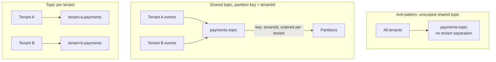

# 05 – Multi-Tenant Kafka

## Executive Summary

Kafka has no built-in concept of a "tenant" — isolation has to be
designed in, at the topic and partition-key level, using the same
mechanisms covered in the companion `Kafka_Interview_Guide.md`
(partitions, consumer groups, ordering) applied specifically to the
multi-tenancy problem. The central decision is topic-per-tenant vs. a
shared topic keyed by tenant ID, and — true to the rest of this
chapter — most systems at scale land on a hybrid of both.

## Diagram

See [`diagrams/multi-tenant-kafka.mmd`](diagrams/multi-tenant-kafka.mmd).



## Anti-Pattern: The Unscoped Shared Topic

```
payments-topic   ← every tenant's payment events, unkeyed, mixed together
```

Without a tenant-aware key or separate topics, every consumer sees
every tenant's events in one undifferentiated stream, with no ordering
guarantee per tenant (Kafka only orders within a partition — see the
Kafka guide's Ordering chapter — and an unkeyed producer round-robins
across partitions, meaning two events for the same tenant can land on
different partitions and be processed out of order relative to each
other). This is the starting point every real design needs to move away
from.

## Option 1 — Shared Topic, Partition Key = Tenant ID

```java
producer.send(new ProducerRecord<>("payments-topic",
    tenantId,          // partition key
    paymentEvent));
```

Keying by `tenantId` guarantees, per the Kafka guide's Ordering
chapter, that all of a given tenant's events land on the same partition
and are processed in order relative to each other — while different
tenants' events can freely parallelize across partitions.

| | |
|---|---|
| **Advantages** | No topic sprawl — one topic to monitor, one schema to evolve (Kafka guide's Schema Registry chapter applies once, not per tenant); simple for a large number of small tenants |
| **Disadvantages** | **Noisy neighbor risk carries over from the partition-hotspot problem** (Kafka guide §1) — a very high-volume tenant sharing a partition with smaller tenants can inflate consumer lag for everyone reading that partition; per-tenant broker-level access control (ACLs) isn't possible at the topic level since all tenants share the topic |
| **Best for** | A large number of small-to-medium tenants with roughly comparable volume |

## Option 2 — Topic per Tenant

```
tenant-a-payments
tenant-b-payments
tenant-c-payments
```

| | |
|---|---|
| **Advantages** | Strong isolation — a tenant's traffic spike only affects that tenant's own topic/consumers; Kafka ACLs can restrict produce/consume access per topic, giving broker-enforced tenant isolation, not just application-level discipline; independent retention/partition-count tuning per tenant |
| **Disadvantages** | **Topic sprawl** — thousands of tenants means thousands of topics, which strains broker metadata (every broker tracks metadata for every topic/partition cluster-wide) and complicates operational tooling (monitoring, alerting, schema evolution now multiplied by tenant count) |
| **Best for** | A smaller number of large, high-volume, or compliance-sensitive tenants |

## The Hybrid (Consistent With Every Other Chapter Here)

```
Small/medium tenants  →  Shared topic, keyed by tenantId (Option 1)
Large/enterprise tenants →  Dedicated topic per tenant (Option 2)
```

Exactly the same shape as the hybrid database and Redis patterns
elsewhere in this chapter — the isolation strategy is a per-tenant-tier
decision, not a single cluster-wide default. A tenant crossing a volume
or compliance threshold gets migrated from the shared topic to a
dedicated one (Chapter 09 covers the operational mechanics of this kind
of tenant migration).

## Consumer-Side Considerations

- **Shared topic**: a consumer group processing `payments-topic` sees
  every tenant's events — if a downstream service only cares about one
  tenant (e.g., a per-tenant webhook dispatcher), it filters by
  `tenantId` from the message itself/key, discarding what's irrelevant.
  This means **every consumer pays the I/O cost of reading every
  tenant's events**, even ones it discards — a real throughput cost at
  scale.
- **Topic per tenant**: consumers subscribe only to the topics relevant
  to them — no wasted read throughput — at the cost of a consumer
  potentially needing to manage subscriptions across many topics if it
  legitimately needs cross-tenant visibility (e.g., a platform-wide
  analytics consumer).
- **Consumer group scaling** follows the same partition-count ceiling
  covered in the Kafka guide regardless of which option is chosen — a
  shared topic's partition count caps shared-topic consumer parallelism;
  a per-tenant topic's partition count caps that tenant's own consumer
  parallelism independently.

## Access Control

Kafka ACLs (`kafka-acls` / a KRaft-native equivalent) can restrict which
principals may produce or consume from a given topic — this is the
**broker-enforced** tenant isolation control, directly analogous to
Postgres RLS in Chapter 03: even if application code has a bug, the
broker itself refuses an unauthorized principal's produce/consume
request. This control is only meaningfully available with **topic per
tenant** — a shared topic has no way to grant Tenant A access to "its"
messages only, since Kafka ACLs operate at topic (and consumer group)
granularity, not at the individual-message level.

## Common Interview Questions

1. Compare topic-per-tenant vs. shared-topic-with-partition-key for a
   multi-tenant event pipeline — what does each cost you?
2. Why does keying a shared topic by `tenantId` matter for correctness,
   not just for organization?
3. What's the noisy-neighbor failure mode in a shared, tenant-keyed
   topic, and how would you detect and mitigate it?
4. Why can Kafka ACLs enforce tenant isolation with topic-per-tenant but
   not with a shared topic?
5. Design the Kafka topic strategy for a SaaS platform with 50,000 small
   customers and 20 enterprise customers.

## Principal Engineer Notes

This chapter is largely an application of the Kafka guide's Partitions,
Consumer Groups, and Ordering chapters to a specific problem — the
underlying mechanisms (partition keys drive ordering, ACLs drive
broker-level access control, partition count caps parallelism) aren't
new, only the framing is. That's worth saying directly in an interview:
"multi-tenant Kafka" isn't a separate Kafka feature, it's the standard
partitioning/ACL toolkit applied deliberately to the tenant dimension.

## Next Chapter

[06 – Multi-Tenant Redis](06-Multi-Tenant-Redis.md)
