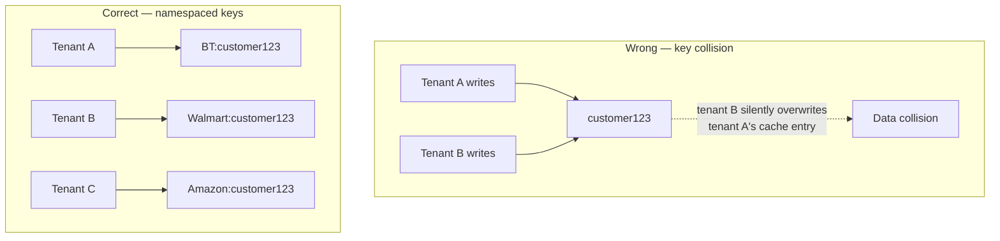

# 06 – Multi-Tenant Redis

## Executive Summary

Redis has no native tenant concept either — like Kafka, isolation is a
convention the application must enforce, primarily through **key
namespacing**. The failure mode is simple to state and easy to introduce
by accident: two tenants' data colliding under the same key.

## Diagram

See [`diagrams/multi-tenant-redis.mmd`](diagrams/multi-tenant-redis.mmd).



## The Collision Problem

```
Wrong:
  Tenant A writes key "customer123" → {name: "John", plan: "Pro"}
  Tenant B writes key "customer123" → {name: "David", plan: "Basic"}

  Second write silently overwrites the first. Whoever reads
  "customer123" next gets whichever tenant wrote last — a correctness
  bug indistinguishable, at the Redis level, from a security bug.
```

```
Correct:
  Tenant A → "BT:customer123"
  Tenant B → "Walmart:customer123"
  Tenant C → "Amazon:customer123"
```

**The rule**: every key touching Redis in a multi-tenant system must be
namespaced by tenant ID, with no exceptions — this applies to cache
entries, session data, rate-limit counters, distributed locks, and
pub/sub channel names alike. A single un-namespaced cache call anywhere
in the codebase reintroduces the collision risk for that one code path.

## Enforcing Namespacing in Code

The safest implementation centralizes key-building so individual call
sites can't forget the prefix — mirroring the Hibernate-filter approach
from Chapter 04's Pattern 1 enforcement:

```java
@Component
public class TenantAwareRedisTemplate {

    private final StringRedisTemplate delegate;

    public void set(String key, String value) {
        delegate.opsForValue().set(namespacedKey(key), value);
    }

    public String get(String key) {
        return delegate.opsForValue().get(namespacedKey(key));
    }

    private String namespacedKey(String key) {
        return TenantContext.getTenant() + ":" + key;
        // "BT:customer123", derived from the same TenantContext
        // populated by the filter in Chapter 04 — never passed in
        // by the caller, so it can't be forgotten or spoofed
    }
}
```

Application code calls `set("customer123", json)` and never has to
remember the tenant prefix itself — the wrapper derives it from
`TenantContext`, the same request-scoped source of truth used for
database routing.

## Redis Cluster: Hash Tags for Co-location

In **Redis Cluster** mode, keys are distributed across nodes by a hash
slot computed from the key — which means a naive `MULTI` transaction or
Lua script touching two of a tenant's keys can fail if those keys happen
to hash to different slots on different nodes (Cluster requires
multi-key operations to target keys in the same slot).

**Hash tags** solve this: wrapping the tenant ID in `{}` tells Redis
Cluster to hash *only* the tagged portion when computing the slot,
guaranteeing every key sharing that tag lands on the same node:

```
"{BT}:customer123"
"{BT}:orders:456"
"{BT}:session:xyz"

→ all three keys hash to the same slot (based on "BT" only),
  so they're guaranteed to live on the same Cluster node —
  multi-key operations across a single tenant's keys now work.
```

This is the Redis-specific mechanic worth naming directly if a Cluster
deployment comes up — it's the multi-tenant answer to "how do you do a
transaction across multiple keys in Redis Cluster" in general, applied
specifically to keeping one tenant's related keys co-located.

## Per-Tenant Memory and Eviction

- **Namespacing alone doesn't stop one tenant's cache usage from
  evicting another tenant's entries** — by default, all tenants share
  the same eviction policy (e.g., `allkeys-lru`) and the same memory
  budget, so a tenant caching aggressively can push other tenants' keys
  out under memory pressure. This is the Redis expression of the same
  noisy-neighbor problem covered for databases (Chapter 03) and Kafka
  (Chapter 05).
- **Logical databases** (`SELECT 1`, `SELECT 2`, ...) provide a weak
  form of separation in standalone Redis, but are **not supported in
  Cluster mode** and don't provide real memory isolation (still one
  shared memory pool) — not a recommended multi-tenancy mechanism for
  anything beyond small-scale, non-Cluster deployments.
- **Real isolation** for a large or noisy tenant means a **dedicated
  Redis instance** (or a dedicated Cluster) for that tenant — the same
  hybrid pattern as every other layer in this chapter: shared,
  namespaced Redis for the long tail of small tenants; dedicated Redis
  for tenants whose volume or SLA requirements justify it.
- **Per-tenant rate limiting** on cache/command volume (via a token
  bucket keyed by tenant, itself stored in Redis) bounds how much of the
  shared instance's throughput one tenant can consume before it starts
  affecting others — a lighter-weight mitigation than full dedicated
  infrastructure, worth trying first.

## Cache Stampede, Per Tenant

The standard cache-stampede problem (many concurrent requests all
missing the cache simultaneously and hammering the origin) is scoped
per tenant here too — a stampede for one high-traffic tenant's popular
key shouldn't be allowed to consume enough shared Redis/backend capacity
to degrade other tenants. The standard mitigations (a short-lived lock
around cache repopulation, request coalescing, jittered TTLs) apply
identically, just with tenant-namespaced keys and locks.

## Common Interview Questions

1. What's the actual failure mode of not namespacing Redis keys by
   tenant, and why is it hard to detect until it happens?
2. How would you enforce key namespacing so individual developers can't
   forget it?
3. What are Redis Cluster hash tags, and why do they matter for
   multi-tenant transactions/Lua scripts?
4. Why are Redis logical databases (`SELECT n`) not a recommended
   multi-tenancy mechanism at scale?
5. How would you prevent one tenant's cache usage from evicting another
   tenant's cached data under memory pressure?

## Principal Engineer Notes

Namespacing is necessary but not sufficient — it prevents *collisions*,
not resource contention. A design that only namespaces keys but ignores
the shared-eviction-policy and shared-throughput reality is still
exposed to noisy-neighbor effects; that distinction (collision
prevention vs. resource isolation, two different problems with two
different fixes) is worth drawing explicitly when this topic comes up.

## Next Chapter

07 – Multi-Tenant Vector Search
