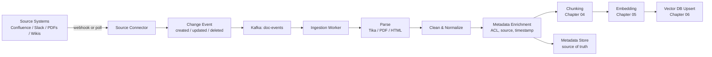

# 03 – Document Ingestion

## Executive Summary

Ingestion is the write path of a RAG system: pulling raw content from
source systems, normalizing it, and preparing it for chunking and
embedding. Retrieval quality is bounded by ingestion quality — a perfect
retriever over badly-ingested documents still returns garbage.

## Diagram

See [`diagrams/document-ingestion.mmd`](diagrams/document-ingestion.mmd).



## Source Types and Connection Strategy

| Source | Preferred strategy | Fallback |
|---|---|---|
| Confluence / wiki | Webhook on page update | Scheduled poll + diff |
| Slack | Event API subscription | Periodic export |
| PDFs (manual upload) | Direct upload → parse | — |
| Ticketing (Jira) | Webhook on ticket transition | Scheduled poll |
| Code repos | Git webhook on push/merge | Scheduled clone + diff |

Webhook-based ingestion keeps freshness tight (minutes); polling is
simpler to build but trades off freshness and adds load proportional to
poll frequency × corpus size.

## Parsing

Different source formats need different parsers — this is unglamorous
but is where most real-world ingestion bugs live:

- **HTML/wiki**: strip navigation chrome, keep headings (they carry
  structure used for semantic chunking in Chapter 04).
- **PDF**: layout-aware extraction (Apache Tika, `pdfplumber`,
  unstructured.io) — naive text extraction from PDFs frequently scrambles
  multi-column layouts and tables; validate against a sample before
  trusting it at scale.
- **Slack/chat**: thread structure matters — a message and its replies
  should be ingested as a coherent unit, not as unrelated flat lines.
- **Code**: parse along syntactic boundaries (functions, classes), not
  fixed line counts — this is a chunking decision (Chapter 04) but starts
  at parse time by preserving that structure instead of flattening it.

## Cleaning & Normalization

- Strip boilerplate (headers, footers, nav menus, tracking pixels).
- Normalize whitespace and encoding.
- De-duplicate near-identical content (a page and its printer-friendly
  mirror shouldn't both get embedded and returned as two separate hits).
- Preserve **structure signals** (headings, lists, tables) as metadata
  rather than discarding them — they materially improve chunk quality.

## Metadata Enrichment

Every ingested chunk needs metadata attached *before* it reaches the
vector store, because this metadata is what makes filtering and access
control possible at query time:

```
{
  "documentId": "conf-48213",
  "sourceSystem": "confluence",
  "title": "PTO Policy — Contractors",
  "aclGroups": ["hr-all", "contractors"],
  "url": "https://wiki.internal/pages/48213",
  "lastUpdated": "2026-07-30T10:15:00Z",
  "contentHash": "a1b2c3..."
}
```

- **`aclGroups`** — enforced as a pre-filter on every vector search
  (never a post-filter — see Chapter 06). This is the single
  highest-stakes field in the whole pipeline.
- **`contentHash`** — skip re-embedding when a source webhook fires but
  the actual content didn't change (a common false-positive trigger from
  some source systems' change events).

## Idempotency

Ingestion events are **at-least-once** — a webhook can fire twice, a poll
can double-detect a change, a consumer can crash and redeliver. Upsert
keyed by `(sourceSystem, sourceId)`, gated by `contentHash`, so
reprocessing the same event is a safe no-op. (Full treatment: the
Distributed Systems guide's Idempotency section, and the Kafka guide's
consumer-groups section for the delivery-semantics reasoning.)

## Failure Handling

| Failure | Handling |
|---|---|
| Unparseable document (corrupt PDF) | Non-retryable → straight to DLQ with reason, status `failed` in metadata store |
| Embedding API transient error | Retryable, bounded backoff, then DLQ |
| Source system rate-limits the poller | Backoff the poller itself, don't hammer it |
| Duplicate/near-duplicate content | De-dupe at clean/normalize step before it ever reaches embedding |

## Common Interview Questions

1. How do you keep an ingestion pipeline idempotent under at-least-once
   delivery?
2. Why enforce ACLs at ingestion/metadata time rather than only at query
   time?
3. How would you ingest a source system that only supports polling, not
   webhooks?
4. What's your strategy for a document that fails parsing repeatedly?
5. How do you avoid re-embedding a document that hasn't actually changed?

## Principal Engineer Notes

Treat ingestion as a first-class pipeline with its own SLOs (freshness
lag, failure rate, DLQ volume) — not a one-off ETL script. Most
production RAG quality complaints trace back to ingestion (bad parsing,
missing metadata, stale ACLs), not to the retriever or the model. Budget
review time here accordingly.

## Next Chapter

[04 – Chunking](04-Chunking.md)
