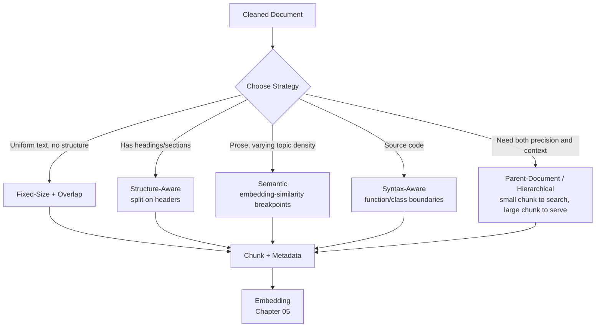

# 04 – Chunking

## Executive Summary

Chunking splits ingested documents into retrieval-sized units before
embedding. It is the highest-leverage, most under-discussed decision in a
RAG pipeline: chunk too coarse and embeddings dilute into an unusable
average; chunk too fine and you strip away the context a chunk needs to
be meaningful on its own. Every downstream stage — embedding quality,
retrieval precision, prompt token budget, answer faithfulness — inherits
whatever chunking got wrong, and none of them can fix it after the fact.

## Diagram

See [`diagrams/chunking-strategies.mmd`](diagrams/chunking-strategies.mmd).



## Why Chunking Is the Highest-Leverage Decision

A vector embedding compresses a piece of text into a single fixed-length
vector. Embed an entire 20-page document and the vector represents an
*average* of everything in it — searchable for nothing specific. Embed a
single word and the vector has no context to be meaningfully similar to
anything. The right chunk is **the smallest self-contained unit that
could plausibly answer a real question on its own** — this framing, not
a fixed token count, is what should drive the strategy choice below.

## Strategies

### 1. Fixed-Size Chunking (with overlap)

Split by a fixed token/character count, with an overlap window so
context isn't severed exactly at a chunk boundary.

```
Chunk 1: tokens [0, 400)
Chunk 2: tokens [350, 750)     ← 50-token overlap with Chunk 1
Chunk 3: tokens [700, 1100)
```

- **Pros**: trivial to implement, predictable size (predictable prompt
  token cost), works on any text regardless of structure.
- **Cons**: blind to semantic/structural boundaries — routinely cuts a
  sentence, a table row, or a step in a numbered procedure in half.
- **When to use**: unstructured plain text, a fast baseline to ship
  before investing in anything smarter, or as the fallback when a
  document's structure can't be reliably parsed.
- **Typical sizing**: 200–500 tokens per chunk, 10–20% overlap. Start
  here, then tune against a retrieval eval set (Chapter 06) rather than
  picking a number from a blog post.

### 2. Recursive Character/Token Splitting

A refinement of fixed-size: try to split on paragraph breaks first, then
sentence breaks, then word breaks, only falling back to a hard token cut
if nothing else fits within the size budget. This is what LangChain's
`RecursiveCharacterTextSplitter` and Spring AI's `TokenTextSplitter` do
under the hood — best-effort structural awareness without requiring the
document to have explicit markup.

### 3. Structure-Aware Chunking

Split along the document's own structural markers — Markdown/HTML
headings, PDF section boundaries, table boundaries — so a chunk is never
smaller or larger than a coherent structural unit.

```
## PTO Policy — Contractors          ← heading becomes chunk metadata
Contractors are not eligible for
company PTO. Time off must be...     ← this becomes one chunk

## PTO Policy — Full-Time Employees  ← new heading, new chunk
Full-time employees accrue...
```

- **Pros**: chunks are naturally coherent; the heading itself becomes
  valuable retrievable/citable metadata ("PTO Policy > Contractors").
- **Cons**: chunk sizes become uneven — a heading with one sentence
  underneath and a heading with three pages underneath both become "one
  chunk," which may need further splitting internally (compose with
  fixed-size/recursive splitting as a second pass within an oversized
  section).
- **When to use**: any well-structured source — wikis, docs sites,
  Markdown READMEs, PDFs with real section headers. This should be the
  **default** for enterprise documentation RAG, not fixed-size — most
  internal knowledge bases are structured, and ignoring that structure
  throws away free signal.

### 4. Semantic Chunking

Embed sentences (or small sentence groups) individually, then walk
through them measuring embedding similarity between consecutive
sentences; split at the points where similarity drops significantly
(a topic shift), rather than at a fixed size or a markup boundary.

- **Pros**: adapts to actual topic boundaries even in unstructured
  prose where no markup exists to lean on.
- **Cons**: meaningfully more expensive (an embedding call per sentence
  during chunking, not just once per chunk), non-deterministic sizing,
  harder to reason about/debug than a rule-based splitter.
- **When to use**: long-form unstructured prose with no reliable markup
  (legal documents, transcripts, research papers) where structure-aware
  splitting has nothing to key off of.

### 5. Syntax-Aware Chunking (Code)

For a codebase-assistant RAG variant: split along language syntax
(function, method, class boundaries) using a language parser (tree-sitter
is the common choice), never along raw line counts — a function split in
half mid-body is close to useless as retrieved context.

- Attach the enclosing class/file/module path as metadata on each chunk —
  a retrieved function body without its class context is often
  ambiguous.

### 6. Parent-Document / Hierarchical Chunking

Two-tier approach: embed and index **small** chunks for precise
retrieval matching, but when a small chunk is retrieved, return its
**larger parent** section (or the full original document) to the LLM as
context.

```
Index for search:  small chunk (~150 tokens)  → precise embedding match
Return to LLM:      parent section (~800 tokens) → full context, no gaps
```

- **Pros**: gets the retrieval precision of small chunks (a small chunk's
  embedding is a sharper, less-diluted signal) **and** the context
  completeness of large chunks — the best of both single-tier approaches.
- **Cons**: more moving parts — a parent/child relationship to maintain
  in the metadata store, and a lookup step (child chunk → parent content)
  at retrieval time.
- **When to use**: default recommendation for a production-grade
  enterprise RAG system once the simpler strategies' limitations start
  showing up in eval results — this is usually where mature RAG systems
  land.

## Chunk Size and Overlap: How to Actually Tune It

Don't pick a chunk size from a blog post; tune it empirically:

1. Build a small labeled eval set: 20–50 realistic questions with the
   document(s) that should be retrieved to answer them (Chapter 06 covers
   the retrieval metrics in depth — recall@k, MRR).
2. Chunk the corpus at a candidate size/overlap, embed, index.
3. Run the eval set, measure whether the *right* chunk is retrieved in
   the top-k.
4. Adjust size/overlap/strategy, re-run, compare.

This is a regression-testable, repeatable process — treat a chunking
strategy change exactly like a change to a ranking algorithm, gated by
this eval set before it ships, not shipped on intuition.

## Metadata Carried Through Chunking

Every chunk should carry forward, at minimum:

```json
{
  "chunkId": "conf-48213-c3",
  "documentId": "conf-48213",
  "chunkIndex": 3,
  "headingPath": "PTO Policy > Contractors",
  "text": "...",
  "tokenCount": 187,
  "sourceSystem": "confluence",
  "aclGroups": ["hr-all", "contractors"]
}
```

`headingPath` and `chunkIndex` matter beyond debugging — they let a
generation step cite "PTO Policy > Contractors" instead of an opaque
chunk ID (Chapter 07), and let a parent-document strategy reconstruct
the surrounding section.

## Common Pitfalls

- **Chunking before cleaning** — boilerplate (nav menus, footers) gets
  embedded as if it were content, polluting search results with
  irrelevant "chunks" that happen to share boilerplate text across many
  documents.
- **Ignoring tables** — naive text splitting mid-table produces
  nonsensical fragments ("Row 3: $450" with no header context). Tables
  need dedicated handling — keep header row attached to every row-chunk,
  or serialize the table as a single structured chunk.
- **One-size-fits-all across heterogeneous sources** — a chunking config
  tuned for prose wikis will misbehave on code or tabular data; the
  strategy should be selected per source type (see the diagram's
  decision branches), not applied uniformly.
- **No re-chunking plan** — like the re-embedding migration problem
  (Chapter 05), changing chunking strategy invalidates the existing
  index and requires a full re-process of the corpus; this should be
  treated as a planned migration, not a casual config change on a live
  system.

## Common Interview Questions

1. How do you decide what chunk size to use, and how would you validate
   the choice?
2. What's the difference between fixed-size and semantic chunking, and
   when would each underperform?
3. Explain parent-document chunking and why you'd choose it over a
   single-tier strategy.
4. How do you handle chunking for content with tables or code embedded in
   prose?
5. What breaks if you change your chunking strategy on a live, already-
   indexed system?
6. Why does overlap matter, and what's the failure mode of overlap = 0?

## Principal Engineer Notes

If a RAG system is returning irrelevant or incomplete context, chunking
is the first place to look — before blaming the embedding model or the
LLM. It's also the cheapest place to iterate: re-chunking and
re-embedding a corpus is far faster to test than swapping models, and the
eval-set-driven tuning loop above should be a standing part of the RAG
system's CI, not a one-time setup task.

## Next Chapter

05 – Embeddings
