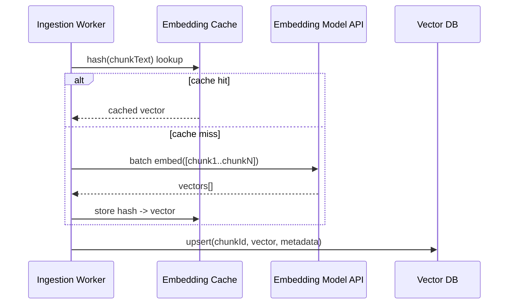

# 05 – Embeddings

## Executive Summary

An embedding model maps a chunk of text to a fixed-length dense vector
such that semantically similar text lands close together in vector
space. This chapter covers model selection, the mechanics of similarity,
throughput/cost engineering, and — the part interviews probe hardest —
what happens operationally when the embedding model itself needs to
change.

## Diagram

See [`diagrams/embedding-pipeline.mmd`](diagrams/embedding-pipeline.mmd).



## What an Embedding Actually Encodes

The model is trained (typically via contrastive learning — pulling
semantically similar pairs together, pushing dissimilar pairs apart in
vector space) so that cosine distance between vectors approximates
semantic distance between the original text. It does **not** encode
factual correctness, recency, or authority — a confidently wrong sentence
embeds just as "well" as a correct one. This is worth stating explicitly
in an interview: embeddings are a similarity index, not a truth index.

## Model Landscape

| Model | Dimensions | Notes |
|---|---|---|
| OpenAI `text-embedding-3-small` | 1536 (truncatable) | Strong general-purpose default, cheap, Matryoshka-style truncation supported |
| OpenAI `text-embedding-3-large` | 3072 (truncatable) | Higher quality, higher cost/storage |
| Cohere `embed-v3` | 1024 | Strong multilingual support, built-in input-type parameter (search_query vs search_document) |
| BAAI `bge-large-en` | 1024 | Open-weight, self-hostable, strong on MTEB leaderboard |
| `all-MiniLM-L6-v2` | 384 | Small, fast, self-hostable, lower quality ceiling — good for latency-sensitive or resource-constrained deployments |
| Domain-tuned (legal/medical/code-specific) | varies | Meaningfully outperforms general-purpose models on in-domain retrieval; worth the switch when the domain vocabulary is specialized |

**Selection criteria, in the order they should actually be weighed:**
1. **Domain fit** — a general-purpose model on highly specialized text
   (legal, medical, internal jargon-heavy docs) underperforms a
   domain-tuned or fine-tuned alternative more than any other single lever.
2. **Self-hosted vs. API** — API models (OpenAI, Cohere) are zero-ops but
   add a network hop and per-call cost at ingestion scale; self-hosted
   (BGE, MiniLM via a local inference server) removes both at the cost of
   owning the serving infrastructure.
3. **Dimensionality** — bigger isn't strictly better; it's a storage/
   latency cost that should be justified by a measured recall improvement
   on your eval set (Chapter 06), not assumed.
4. **MTEB benchmark scores** — a reasonable starting signal for general
   quality comparison, but benchmark rank does not guarantee it wins on
   *your* specific corpus and query distribution — validate on your own
   eval set before committing.

## Similarity Metrics

| Metric | Formula intuition | Notes |
|---|---|---|
| Cosine similarity | Angle between vectors, magnitude-invariant | Default, safest choice — measures pure semantic direction |
| Dot product | Cosine × magnitude of both vectors | Cheaper to compute; equivalent to cosine if vectors are pre-normalized — common optimization: normalize at write time, use dot product at query time |
| Euclidean distance | Straight-line distance | Less common for text embeddings; more typical in image/other domains |

**Normalization matters**: most production pipelines L2-normalize
vectors at write time so dot product and cosine similarity become
equivalent — this lets the ANN index use the cheaper dot-product
computation without giving up cosine's magnitude-invariance.

## Batching and Throughput

Embedding API calls have per-request overhead — batch multiple chunks
into a single call (most providers support batch sizes of 100+ inputs
per request) rather than one call per chunk. During bulk ingestion (a
large initial corpus load, or a bulk source import), this is the
difference between an ingestion job finishing in minutes vs. hours, and
directly reduces API cost where providers charge similarly per-token
regardless of batching, but reduces wall-clock time and connection
overhead substantially.

```java
// Spring AI — EmbeddingModel batches naturally over a List<Document>
EmbeddingResponse response = embeddingModel.embedForResponse(
    documents.stream().map(Document::getText).toList()
);
```

## Embedding Caching

- **Content-hash cache**: before calling the embedding API, check if a
  chunk with an identical content hash was already embedded — skips
  redundant calls when a source system fires a "changed" webhook but the
  actual text is unchanged (a common false-positive trigger — see
  Chapter 03).
- **Query embedding cache**: at query time, cache the embedding for
  repeated/common queries — meaningful for FAQ-shaped traffic, ties into
  the semantic caching discussion in the Performance Optimization
  chapter (Chapter 12).

## Re-Embedding: The Migration Nobody Plans For

**This is the single most-tested operational question in this chapter.**
Vectors from two different embedding models are **not comparable** —
cosine similarity between a `text-embedding-3-small` vector and a
`bge-large` vector is meaningless, even if both are 1024-dimensional by
coincidence. Changing embedding models (upgrading providers, moving to a
domain-tuned model, adopting a new model version) is therefore a **full
corpus migration**, not a config change:

1. Stand up a new vector collection/index (don't overwrite the live one
   in place).
2. Re-embed the entire corpus into the new collection — this can run
   fully in parallel with the live system, since it's a separate index.
3. Validate retrieval quality on the eval set (Chapter 06) against the
   new collection before cutting over.
4. Cut query traffic over (often via a feature flag / config swap in the
   assistant service), ideally with a brief shadow/parallel-run period
   comparing old vs. new retrieval on live traffic.
5. Decommission the old collection once confidence is established.

Treat this with the same rigor as a database schema migration —
including a rollback plan if the new embedding model underperforms on
production traffic in ways the eval set didn't catch.

## Evaluating Embedding Quality

- **MTEB (Massive Text Embedding Benchmark)** — standard public
  leaderboard, useful for initial model shortlisting.
- **In-domain eval set** — the labeled (query → correct chunk) set from
  Chapter 04's chunking-tuning process doubles as the embedding
  evaluation set: swap the embedding model, re-run recall@k/MRR
  (Chapter 06), compare. This is the number that actually matters, not
  the public leaderboard rank.

## Common Interview Questions

1. What does an embedding vector actually represent, and what does it
   *not* capture?
2. Cosine similarity vs. dot product — when are they equivalent, and why
   does that matter for ANN index performance?
3. Walk me through migrating a production RAG system from one embedding
   model to another without downtime.
4. How would you decide between a hosted embedding API and a
   self-hosted open-weight model?
5. Why might a domain-specific embedding model outperform a larger
   general-purpose one?
6. How do you avoid unnecessary embedding-API cost during ingestion?

## Principal Engineer Notes

Budget for re-embedding as a recurring operational cost, not a one-time
setup step — embedding models improve over time, and a system that can't
cheaply re-index its corpus will fall behind on quality as better models
become available. Building the migration tooling (parallel collection,
eval-gated cutover) once, early, pays for itself the first time a model
upgrade is worth doing.

## Next Chapter

06 – Vector Search
