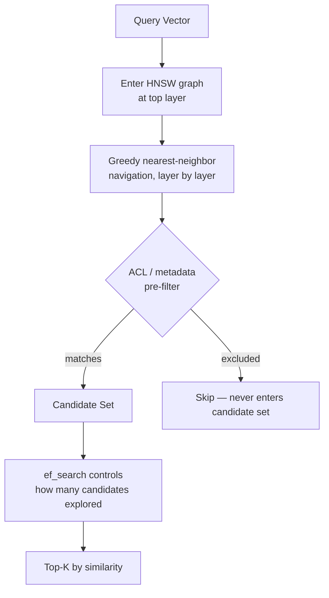
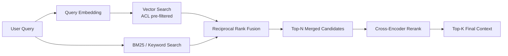

# 06 – Vector Search

## Executive Summary

Vector search answers "find the k most similar vectors to this query
vector" over potentially millions of embeddings, in milliseconds, using
**approximate** nearest neighbor (ANN) algorithms rather than exact
brute-force comparison. This chapter covers how ANN indexes actually
work, why hybrid (vector + keyword) search is the production default
rather than pure vector search, how access control gets enforced
correctly, and reranking as the precision layer on top of retrieval.

## Diagrams

See [`diagrams/vector-search-flow.mmd`](diagrams/vector-search-flow.mmd)
and [`diagrams/retrieval-flow.mmd`](diagrams/retrieval-flow.mmd).





## Why Not Brute Force?

Exact k-NN compares the query vector against every stored vector — O(n)
per query. At a few thousand vectors this is fine; at millions it's not
viable within a request-latency budget. ANN indexes trade a small,
tunable amount of recall for sub-linear query time.

## ANN Index Structures

### HNSW (Hierarchical Navigable Small World) — the production default

A multi-layer graph where each node connects to its approximate nearest
neighbors; search starts at a sparse top layer and greedily navigates
down to denser layers, converging on the true nearest neighbors without
visiting most of the index.

- **`ef_search`** (query-time knob): how many candidates to explore
  during the graph traversal — higher = better recall, higher latency.
  This is the single most important tuning knob for the recall/latency
  trade-off at query time.
- **`M`** (build-time knob): max connections per node — higher = better
  recall and faster search, more memory and slower index build/insert.
- Used by: Pinecone, Weaviate, Milvus, Qdrant, pgvector (via the `hnsw`
  index type).

### IVF (Inverted File Index)

Cluster the vector space (via k-means) into `nlist` cells at index-build
time; at query time, identify the nearest `nprobe` cells to the query
vector and search only within those, instead of the whole space.

- **`nprobe`** (query-time knob): how many clusters to search — same
  recall/latency trade-off role as HNSW's `ef_search`.
- Faster to build than HNSW at very large scale, but generally lower
  recall at a given latency budget compared to HNSW — HNSW has become
  the more common default for new systems.
- Used by: FAISS (as one of several index types), some pgvector
  configurations (`ivfflat`).

### Product Quantization (PQ)

Compresses each vector into a small code by splitting it into
sub-vectors and quantizing each sub-vector against a learned codebook —
dramatically reduces memory footprint (often 10–30x) at a real, measured
recall cost. Frequently combined with IVF (`IVF+PQ`) for very
large-scale, memory-constrained deployments. Not usually the first
choice — reach for it when index size itself becomes the bottleneck, not
by default.

## ACL Filtering: Pre-Filter, Never Post-Filter

This is the single most consequential correctness decision in vector
search for any multi-user system, and a favorite interview probe.

- **Pre-filter (correct)**: the ANN search itself is constrained to only
  consider vectors matching the user's ACL/tenant metadata — filtering
  happens *inside* the graph traversal or cluster search, so
  unauthorized vectors are never candidates in the first place.
- **Post-filter (incorrect for this use case)**: run the ANN search
  unfiltered, get top-k, *then* discard unauthorized results
  afterward. Two failure modes: (1) **security-adjacent correctness
  bug** — if all top-k happen to be unauthorized, the user gets an
  empty/degraded result even though authorized content existed further
  down, silently under-serving them; (2) it does not prevent the
  unauthorized content from being fetched into application memory,
  which is a worse posture even if it's filtered before ever reaching
  the user.
- Modern vector databases support **filtered ANN search** natively
  (pass a metadata predicate alongside the query vector) — this is a
  first-class feature specifically because pre-filtering is the correct
  pattern, not a workaround.

## Hybrid Search

Pure vector search misses exact-match signals — a user searching an
error code, SKU, or proper noun wants that literal string matched, and
semantic similarity can rank a "conceptually close but wrong" result
above the exact match.

**Reciprocal Rank Fusion (RRF)** is the standard, simple way to merge
two independently-ranked result lists (vector search results, BM25
keyword search results) into one:

```
RRF_score(doc) = Σ  1 / (k + rank_in_list_i)
                 over each list the doc appears in

// k is a small constant (commonly 60) that dampens the
// impact of very high ranks dominating the merged score
```

A document ranked #1 in keyword search and #40 in vector search still
scores well overall — RRF rewards appearing anywhere near the top of
*either* list, rather than requiring agreement between both.

## Reranking

Retrieval (vector + hybrid) is optimized for **recall at scale** —
cheaply narrowing millions of candidates to a few dozen. Reranking is a
second, more expensive but far more accurate pass over that **small**
candidate set:

- **Bi-encoder** (what the initial retrieval uses): query and document
  are embedded independently — fast, pre-computable, but a coarser
  similarity signal since the two embeddings never "see" each other.
- **Cross-encoder** (what reranking uses): query and document are fed
  into the model *together*, letting it attend across both — much more
  accurate relevance judgment, but can't be pre-computed and is too slow
  to run over an entire corpus.

```
Retrieve top-50 (cheap, bi-encoder, ANN)
        │
        ▼
Rerank those 50 → top-5 (expensive, cross-encoder, ~50-200ms)
        │
        ▼
Top-5 sent to the LLM as context (Chapter 07)
```

Common rerankers: Cohere Rerank (hosted API), `bge-reranker-large`
(self-hostable). Bound the input to the reranker (retrieve top-50, not
top-500) — reranking cost scales with candidate count, and beyond a
certain point additional candidates rarely change the final top-5.

## Vector Database Choice

| Option | Best fit |
|---|---|
| **pgvector** (Postgres extension) | Already on Postgres, moderate scale (<10M vectors), want ACL joins and vector search in one transactional system, simplest ops |
| **Pinecone / Weaviate / Milvus / Qdrant** | Tens of millions+ vectors, need best-in-class ANN performance and native hybrid/filtered search, managed ops preferred |
| **Redis Vector Search** | Already on Redis, need very low latency, smaller working sets |
| **OpenSearch / Elasticsearch k-NN** | Already running Elasticsearch for text search, want vector search added to the same system rather than a new one |

Justify the choice with the capacity-estimation numbers from the AI/RAG
Assistant System Design guide, not a default preference — pgvector is a
completely defensible choice at moderate scale, and reaching for a
dedicated vector DB "because that's what everyone uses" without the
scale to justify it is over-engineering.

## Evaluating Retrieval Quality

| Metric | What it measures |
|---|---|
| **Recall@k** | Of the queries where a known-correct chunk exists, what fraction had it appear in the top-k results |
| **MRR (Mean Reciprocal Rank)** | Average of `1/rank` of the first correct result across queries — rewards correct results appearing *earlier*, not just present somewhere in top-k |
| **nDCG** | Accounts for multiple relevant results per query with graded relevance, not just binary correct/incorrect |

Run these against the labeled eval set from Chapter 04 whenever chunking,
embedding model, ANN parameters, or reranking configuration changes —
gate deploys on this the same way you'd gate on a unit test suite.

## Spring AI Example

```java
SearchRequest request = SearchRequest.builder()
    .query(userQuery)
    .topK(50)
    .filterExpression("aclGroups in ['hr-all','contractors']")
    .build();

List<Document> candidates = vectorStore.similaritySearch(request);
// candidates then passed to a reranker before prompt assembly (Chapter 07)
```

`VectorStore.similaritySearch()` abstracts over pgvector, Redis,
Pinecone, etc. — the `filterExpression` is what implements ACL
pre-filtering (never fetch-then-filter in application code).

## Common Interview Questions

1. Explain how HNSW achieves sub-linear search, and what `ef_search`
   trades off.
2. Why must ACL filtering happen inside the vector search, not after it?
3. Design a hybrid search system combining keyword and vector search —
   how do you merge the two ranked lists?
4. What's the difference between a bi-encoder and a cross-encoder, and
   why can't you use a cross-encoder for the initial retrieval pass?
5. How would you choose between pgvector and a dedicated vector
   database for a given system?
6. How do you measure whether a change to your retrieval pipeline
   actually improved results?

## Principal Engineer Notes

Retrieval quality, not model choice, is usually the ceiling on RAG
answer quality — a stronger LLM cannot generate a correct answer from
context that was never retrieved. When a RAG system is "hallucinating,"
the first two places to check are chunking (Chapter 04) and retrieval
(this chapter) before assuming it's a generation-layer problem
(Chapter 08).

## Next Chapter

[07 – Prompt Augmentation](07-Prompt-Augmentation.md)
