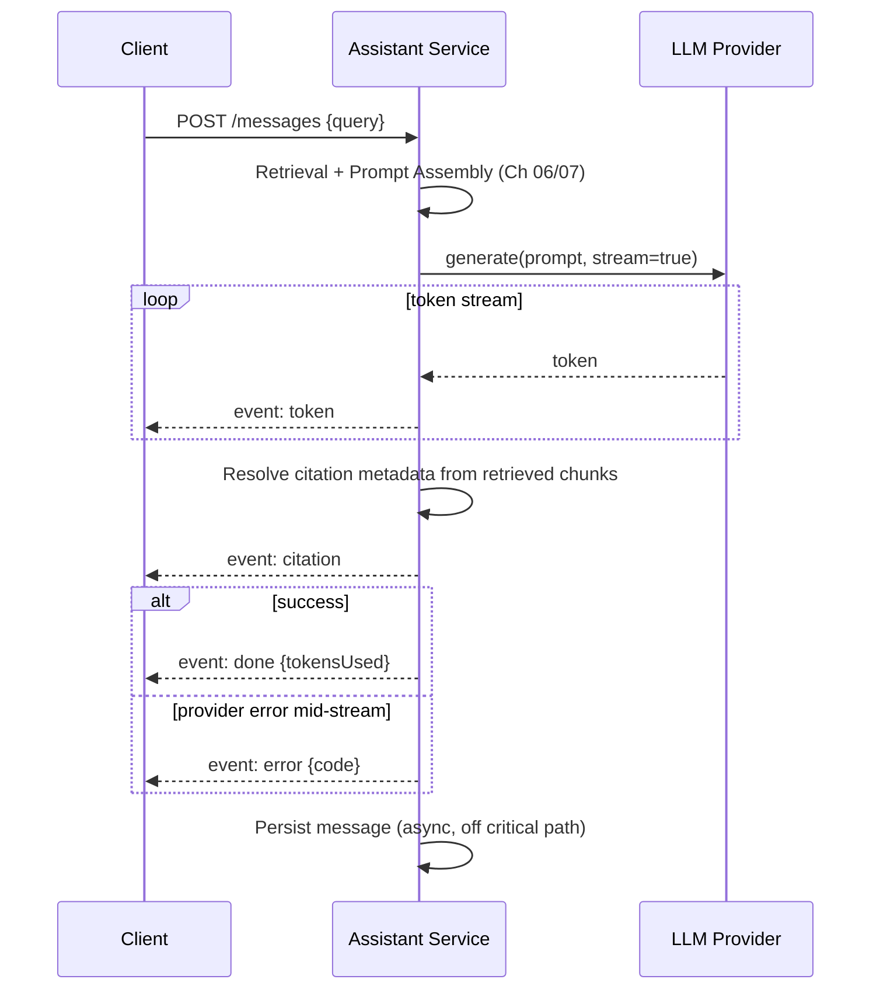

# 08 – Generation

## Executive Summary

Generation is the step where the assembled prompt (Chapter 07) is sent
to the LLM and turned into an answer. This chapter covers the decoding
parameters that shape output, why streaming is close to mandatory for
RAG UX, structured output for reliable downstream parsing, and the
generation-time levers for hallucination control — the layer above the
prompt-level grounding instructions from Chapter 07.

## Diagram

See [`diagrams/generation-sequence.mmd`](diagrams/generation-sequence.mmd).



## Decoding Parameters

| Parameter | Effect | RAG default |
|---|---|---|
| **Temperature** | Sampling randomness — 0 is near-deterministic, higher increases variation | Low (0–0.3) — factual, grounded answers benefit from determinism; high temperature actively works against faithfulness |
| **top_p** (nucleus sampling) | Restricts sampling to the smallest token set covering top_p cumulative probability | Usually left at provider default when temperature is already low; the two are somewhat redundant to tune together |
| **max_tokens** | Hard cap on output length | Set explicitly — an unbounded generation is an unbounded latency tail, same risk as an unbounded DB query |
| **Stop sequences** | Strings that end generation early | Useful for structured formats, e.g., stopping after a closing JSON brace |

**Why low temperature specifically for RAG**: the task is "synthesize an
answer faithful to the given context," not "generate creative text" —
higher temperature increases the odds of the model drifting from the
retrieved context into more "creative" (i.e., ungrounded) phrasing,
directly working against the grounding instruction set at the prompt
layer (Chapter 07).

## Streaming

Generation is sequential — one token at a time — and for anything beyond
a short answer, total generation time (seconds) is the dominant
contributor to end-to-end latency. Streaming doesn't reduce that total
time; it changes *perceived* latency by showing the first token in
under a second instead of making the user wait for the full response.

**SSE event protocol** (matching the AI/RAG Assistant System Design
guide's API):

```
event: token       data: {"text": "Contractors "}
event: token       data: {"text": "are not "}
...
event: citation     data: {"chunkId": "...", "source": "PTO Policy > Contractors", "url": "..."}
event: done         data: {"messageId": "...", "tokensUsed": 842}
event: error        data: {"code": "PROVIDER_TIMEOUT", "message": "..."}
```

- **Explicit terminal events** (`done` / `error`) rather than inferring
  completion from the connection closing — a client needs to distinguish
  "finished successfully" from "connection dropped mid-answer," because
  a silently truncated answer that looks complete is worse than a
  visibly-errored one.
- **Reverse proxy caveat**: a buffering proxy/load balancer in front of
  the SSE endpoint will silently defeat streaming by holding the full
  response before forwarding — disable response buffering explicitly for
  this route, and set the proxy's idle timeout longer than the expected
  generation duration.
- **Cancellation**: if the client disconnects, the server-side stream
  subscription should cancel and propagate that cancellation to the LLM
  provider call — otherwise you keep paying for (and generating) tokens
  nobody will see.

## Structured Output

For anything beyond free-text chat — a citation object, a downstream
system integration, an agent tool call — use schema-constrained
generation (JSON mode / function-calling schemas) rather than asking for
JSON in prose and parsing it with regex or hope.

```java
record Citation(String chunkId, String claim) {}
record StructuredAnswer(String answerText, List<Citation> citations) {}

StructuredAnswer result = chatClient.prompt()
    .user(userQuery)
    .call()
    .entity(StructuredAnswer.class); // Spring AI binds JSON output directly to the record
```

Note the tension with streaming: partial JSON isn't valid JSON. Two
practical resolutions carried over from the AI Knowledge guide's
Streaming Responses chapter — stream a narration/answer-text channel for
UX, and emit the structured citation object as one complete chunk at the
end; or use JSON Lines for genuinely incremental structured output where
each line is independently parseable.

## Hallucination Control at the Generation Layer

Prompt-level grounding instructions (Chapter 07) are necessary but not
sufficient — generation-layer levers add defense in depth:

- **Low temperature** (above) — reduces drift from provided context.
- **Similarity-threshold gate before generation even runs**: if the
  retrieved context's top similarity score is below a threshold, skip
  the LLM call entirely and return "no relevant information found" —
  cheaper and more reliable than hoping the model refuses on its own.
- **Verification/self-consistency pass**: for higher-stakes answers, a
  second (often cheaper/faster) model call checks "is this draft answer
  actually supported by the provided context?" before returning it to
  the user — added latency and cost, reserved for use cases where being
  wrong is expensive (this mirrors the AI Knowledge guide's Hallucination
  Mitigation chapter, applied specifically at this stage of the
  pipeline).
- **Citation-claim alignment check**: programmatically verify every
  citation marker in the output actually corresponds to a chunk that was
  in the retrieved context (not one the model invented) — cheap to check
  since you have the ground-truth chunk list server-side.

## Post-Processing

Before the answer reaches the user:

- **PII masking** — scan for and redact sensitive patterns the model
  might have surfaced from context it shouldn't fully echo (SSNs,
  internal system credentials accidentally present in a source document).
- **Citation hydration** — replace the model's inline reference markers
  with the full citation metadata resolved server-side from the actual
  retrieved chunk (Chapter 07) — never trust the model's own rendering of
  a URL or title.
- **Safety/content filtering** — provider-level moderation APIs or a
  lightweight in-house classifier, depending on domain risk.

None of this should block streaming entirely — citation hydration and
final safety checks typically run on the fully-assembled answer just
before or alongside the `done` event, not by holding back every token.

## Common Interview Questions

1. Why is a low temperature the right default for RAG generation, and
   when would you deviate from it?
2. Design the SSE protocol for a streaming RAG endpoint — what events do
   you need beyond raw tokens?
3. How do you reconcile streaming with a requirement for structured
   (JSON) output?
4. What generation-layer techniques reduce hallucination beyond the
   system prompt's grounding instructions?
5. What happens if the LLM provider's stream fails halfway through a
   response, and how should the client find out?
6. Why should citation metadata be resolved server-side rather than
   trusted from model output?

## Principal Engineer Notes

Generation is usually treated as a black box — "call the LLM, get an
answer" — but the decoding parameters, streaming protocol design, and
post-generation verification are all concrete engineering surface area
with measurable impact on latency, cost, and trust. This is also where a
faithfulness regression is easiest to introduce silently (a temperature
bump "to make answers sound more natural" is a common, quietly damaging
change) — gate any change here on the same eval set used for retrieval
and chunking.

## Next Chapter

[09 – End-to-End Flow](09-End-to-End-Flow.md)
