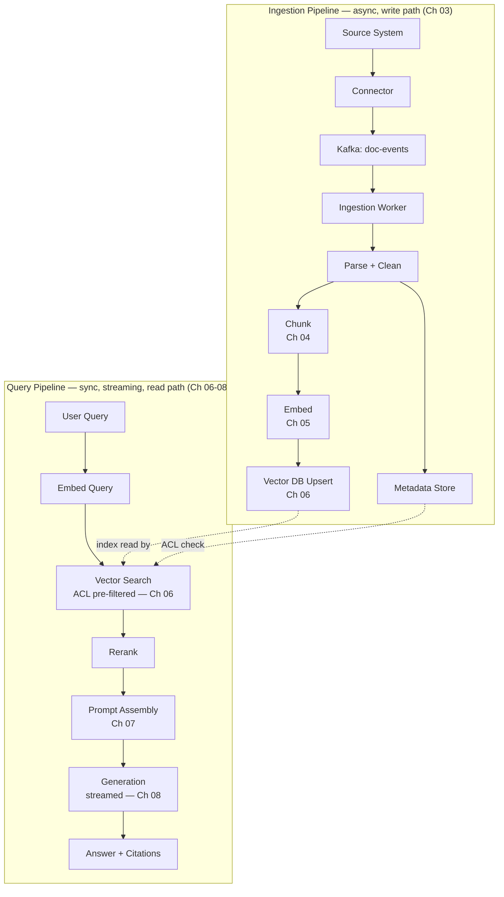

# 09 – End-to-End Flow

## Executive Summary

Chapters 3–8 each covered one stage in isolation. This chapter connects
them into a single trace — one document being ingested, one question
being answered — so the whole pipeline can be narrated fluently in an
interview without gaps at the seams between stages. This is the chapter
to rehearse out loud, whiteboard-style, timing yourself to 3–5 minutes.

## Diagram

See [`diagrams/end-to-end-rag.mmd`](diagrams/end-to-end-rag.mmd).



## Worked Example: One Document, One Question

Walking a single concrete case through every stage — this is the
narration script.

### Ingestion side

**1. Source event (Ch 03).** An HR admin edits the Confluence page
"PTO Policy." Confluence fires a webhook. The connector normalizes it
into a `doc-events` Kafka message:

```json
{"documentId": "conf-48213", "sourceSystem": "confluence",
 "eventType": "updated", "timestamp": "2026-08-01T09:12:00Z"}
```

**2. Ingestion worker consumes it (Ch 03).** Fetches the full page
content, parses HTML, strips navigation chrome, computes a content hash
— hash differs from the stored one, so this is a real change, not a
no-op webhook.

**3. Chunking (Ch 04).** Structure-aware split on headings produces
(among others) two chunks:

```
Chunk A — heading "PTO Policy > Contractors"
  "Contractors are not eligible for company PTO..."

Chunk B — heading "PTO Policy > Full-Time Employees"
  "Full-time employees accrue 15 days of PTO annually..."
```

**4. Embedding (Ch 05).** Both chunks batched into one embedding API
call, producing two 1536-dim vectors.

**5. Vector upsert (Ch 06).** Upserted keyed by `(documentId,
chunkIndex)`, carrying `aclGroups: ["hr-all", "contractors"]` (Chunk A)
and `aclGroups: ["hr-all"]` (Chunk B) as filterable metadata alongside
the vector.

At this point the corpus is current — end to end, on the order of
seconds to low minutes depending on ingestion queue depth.

### Query side

**6. User asks (Ch 06/07).** A contractor asks: *"What's our PTO policy
for contractors?"* The query is embedded, and vector search runs
pre-filtered to only consider chunks where `aclGroups` includes a group
this user belongs to — Chunk A is eligible, Chunk B is unaffected either
way since it's also in `hr-all`, but a document scoped to
`finance-only` would never enter the candidate set for this user
regardless of semantic similarity.

**7. Retrieval + rerank (Ch 06).** Vector search returns a top-50
candidate set; hybrid RRF merges in a keyword pass (catches the literal
term "contractors" too); a cross-encoder reranks down to the top-5,
with Chunk A ranked first.

**8. Prompt assembly (Ch 07).** System prompt + Chunk A (and the next
few reranked chunks) + no prior conversation turns (first message) +
the user's query, assembled within the token budget.

**9. Generation (Ch 08).** Streamed at low temperature:

```
event: token     "Contractors "
event: token     "are not eligible "
event: token     "for company PTO. Time off is negotiated "
event: token     "directly with your contracting agency."
event: citation  {"source": "PTO Policy > Contractors", "url": "..."}
event: done      {"tokensUsed": 340}
```

**10. Post-processing (Ch 08).** Citation hydrated from the actual
retrieved chunk's metadata (not model-generated), no PII detected,
message persisted asynchronously for history and audit.

## Where Each Consistency/Reliability Concern Actually Lives

A quick cross-reference — useful for answering "how does this handle
X" follow-ups without re-deriving from scratch:

| Concern | Where it's handled | Chapter |
|---|---|---|
| Duplicate ingestion events | Idempotent upsert keyed by `(sourceSystem, sourceId)` + content hash | 03 |
| Stale/wrong-sized context | Chunking strategy + eval-set-tuned size/overlap | 04 |
| Embedding model upgrade | Full corpus migration to a parallel collection, eval-gated cutover | 05 |
| Unauthorized content ever retrieved | ACL pre-filter inside the vector search, fail-closed | 06 |
| Weak/no relevant context found | Similarity threshold gate before generation even runs | 08 |
| Hallucinated/unsupported claim | Grounding system prompt (07) + low temperature + citation-claim alignment check (08) |
| Slow perceived response | Streaming (08), not a total-latency fix but a perceived-latency one |
| Fabricated citation URL | Citation metadata resolved server-side from the retrieved chunk, never trusted from model output | 07, 08 |

## Narrating This in an Interview

A structure that stays coherent under follow-up pressure, roughly
3–5 minutes unprompted, then drilling into whichever stage the
interviewer probes:

1. **Split ingestion from query up front** — "there are two independent
   pipelines here, one async write path and one sync streamed read
   path" — this framing alone signals the architectural maturity
   interviewers are checking for.
2. **Walk ingestion in one breath**: source event → parse → chunk →
   embed → upsert, name the idempotency mechanism once.
3. **Walk query in one breath**: embed query → ACL-filtered vector
   search → rerank → assemble prompt → stream generation → hydrate
   citations.
4. **Name where correctness lives** without being asked: ACL
   enforcement point, hallucination gate, citation trust boundary — this
   is what separates "described a RAG system" from "operated one."
5. **Only then go deep** wherever the interviewer steers — chunking
   strategy, vector DB choice, latency budget — using the relevant
   chapter's content.

## Common Interview Questions

1. Walk me through what happens, end to end, from a document being
   edited to a user getting an answer that reflects the edit.
2. At which exact point in this flow is access control enforced, and
   why there specifically?
3. If a user gets a wrong answer, which stage would you suspect first,
   and how would you narrow it down?
4. What's asynchronous in this design and what's synchronous, and why
   does that split matter?
5. Trace what happens if the vector index is 10 minutes behind the
   source system when a query comes in.

## Principal Engineer Notes

The ability to narrate this flow fluently, including naming *where*
each failure mode is handled rather than just that it's "handled
somewhere," is one of the highest-signal moments in a system design
interview for an AI-backed system. Rehearse the worked example above out
loud until the ingestion/query split and the four correctness
checkpoints (idempotency, ACL, grounding, citation trust) come out
without hesitation.

## Next Chapter

10 – Spring AI Implementation
