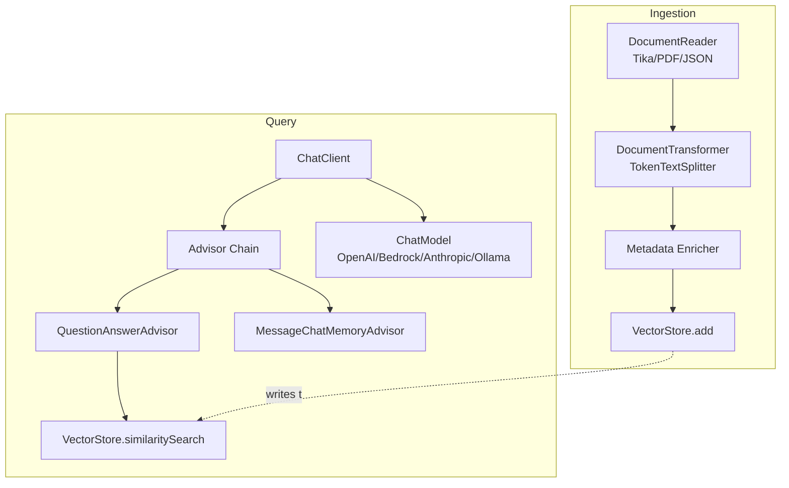
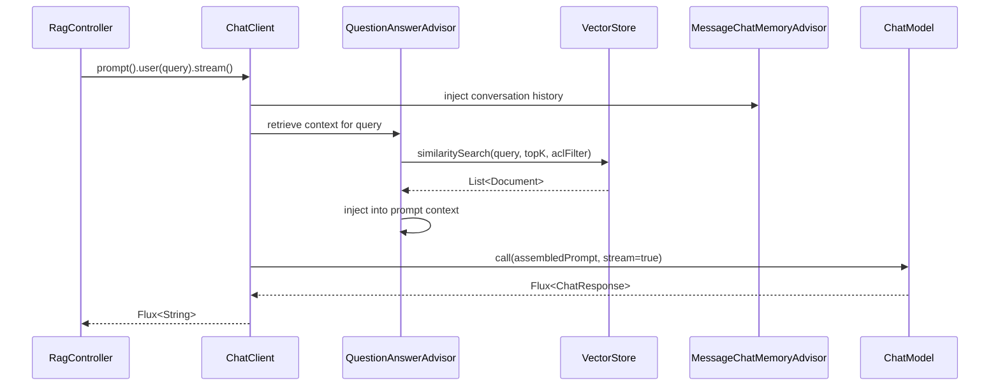

# 10 – Spring AI Implementation

## Executive Summary

Spring AI is Spring's abstraction layer for LLM integration — the
Spring Data/Spring Cloud equivalent for AI systems. This chapter builds
a complete, working RAG slice end to end: ingestion ETL, `VectorStore`,
`ChatClient`, the `Advisor` chain, structured output, and tool calling —
wired together the way you'd actually structure a Spring Boot service,
not isolated snippets.

## Diagrams

See [`diagrams/spring-ai-components.mmd`](diagrams/spring-ai-components.mmd)
and [`diagrams/spring-ai-sequence.mmd`](diagrams/spring-ai-sequence.mmd).





## Core Abstractions

| Abstraction | Role | Analogy |
|---|---|---|
| `ChatClient` | Fluent API over any chat model provider | `RestTemplate`/`WebClient` for LLM calls |
| `ChatModel` | The underlying provider binding (OpenAI, Bedrock, Anthropic, Ollama, Vertex AI) | JDBC driver behind `JdbcTemplate` |
| `VectorStore` | Pluggable backend for embedding storage/search (pgvector, Redis, Pinecone, Milvus) | `JpaRepository` for vectors |
| `Advisor` | Interceptor on a chat call — injects context, memory, guardrails | Servlet filter / AOP advice |
| `DocumentReader` / `DocumentTransformer` / `VectorStore` (as writer) | ETL pipeline stages for ingestion | Spring Batch `ItemReader`/`Processor`/`Writer` |
| `@Tool` | Annotated method the model can invoke | `@RequestMapping` for model-callable methods |

## Configuration

```yaml
# application.yml
spring:
  ai:
    openai:
      api-key: ${OPENAI_API_KEY}
      chat:
        options:
          model: gpt-4o
          temperature: 0.2
      embedding:
        options:
          model: text-embedding-3-small
    vectorstore:
      pgvector:
        index-type: HNSW
        distance-type: COSINE_DISTANCE
        dimensions: 1536
```

Auto-configuration wires the `ChatModel`, `EmbeddingModel`, and
`VectorStore` beans from these properties — swapping providers (OpenAI →
Bedrock → Anthropic) is a config change, not a code change, as long as
application code depends only on the Spring AI interfaces.

## Ingestion ETL Pipeline

```java
@Component
class DocumentIngestionService {

    private final VectorStore vectorStore;
    private final TokenTextSplitter splitter =
        new TokenTextSplitter(500, 100, 5, 10000, true); // chunkSize, overlap, minChunkSize, maxNumChunks, keepSeparator

    void ingest(Resource source, DocumentMetadata meta) {
        DocumentReader reader = new TikaDocumentReader(source);
        List<Document> rawDocs = reader.get();

        List<Document> chunks = splitter.apply(rawDocs);

        // Chapter 04's metadata enrichment — carried onto every chunk
        chunks.forEach(chunk -> chunk.getMetadata().putAll(Map.of(
            "documentId", meta.documentId(),
            "sourceSystem", meta.sourceSystem(),
            "aclGroups", meta.aclGroups(),
            "headingPath", meta.headingPath()
        )));

        vectorStore.add(chunks); // embeds + upserts in one call
    }
}
```

`TokenTextSplitter` is Spring AI's recursive splitter (Chapter 04) —
for structure-aware chunking, pre-split on headings before handing
sections to the splitter, or implement a custom `DocumentTransformer`.

## Query-Side ChatClient + Advisor Chain

```java
@Service
class RagAssistantService {

    private final ChatClient chatClient;

    RagAssistantService(ChatClient.Builder builder,
                         VectorStore vectorStore,
                         ChatMemory chatMemory) {
        this.chatClient = builder
            .defaultSystem("""
                You are an internal assistant. Answer ONLY from the
                provided context. Cite sources as [source: <title>].
                If the context lacks the answer, say so explicitly.
                """)
            .defaultAdvisors(
                MessageChatMemoryAdvisor.builder(chatMemory).build(),
                QuestionAnswerAdvisor.builder(vectorStore)
                    .searchRequest(SearchRequest.builder()
                        .topK(5)
                        .similarityThreshold(0.75) // Ch 08's generation-gate, enforced here
                        .build())
                    .build(),
                new PiiRedactionAdvisor()   // custom — Chapter 13
            )
            .build();
    }

    Flux<String> answer(String conversationId, String userQuery, String aclFilter) {
        return chatClient.prompt()
            .user(userQuery)
            .advisors(a -> a
                .param(ChatMemory.CONVERSATION_ID, conversationId)
                .param("aclFilter", aclFilter)) // per-request ACL, not a default
            .stream()
            .content();
    }
}
```

Per-request parameters (like the ACL filter, which must vary per calling
user and therefore cannot be a `default*` builder setting) are passed via
`.advisors(a -> a.param(...))` and read by a custom or configured
advisor at call time — this is the mechanism that keeps ACL enforcement
correct in a shared, singleton `ChatClient` bean serving many users
concurrently.

## Custom Advisor Example

Advisors are the natural place for cross-cutting RAG concerns —
guardrails, logging, redaction — without polluting business logic:

```java
class PiiRedactionAdvisor implements CallAroundAdvisor {

    @Override
    public AdvisedResponse aroundCall(AdvisedRequest request, CallAroundAdvisorChain chain) {
        AdvisedResponse response = chain.nextAroundCall(request);
        String redacted = piiScrubber.scrub(response.response().getResult().getOutput().getText());
        return response.updateContent(redacted); // Chapter 08's post-processing, as an advisor
    }

    @Override
    public String getName() { return "pii-redaction"; }

    @Override
    public int getOrder() { return Ordered.LOWEST_PRECEDENCE; } // run last, after generation
}
```

## Structured Output

```java
record Citation(String chunkId, String claim) {}
record RagAnswer(String answerText, List<Citation> citations) {}

RagAnswer result = chatClient.prompt()
    .user(userQuery)
    .call()
    .entity(RagAnswer.class);
```

Spring AI generates the JSON schema from the record and instructs the
model accordingly, then binds the response via Jackson — the Chapter 08
structured-output pattern, expressed natively.

## Tool Calling (`@Tool`)

```java
@Component
class OrderTools {

    @Tool(description = "Look up the current status of a customer order by ID")
    OrderStatus getOrderStatus(String orderId) {
        return orderService.findStatus(orderId);
    }
}

// wiring:
ChatClient.builder(chatModel)
    .defaultTools(new OrderTools())
    .build();
```

Spring generates the tool's JSON schema from the method signature and
`@Tool` description, handles the model's function-call output, invokes
the method, and feeds the result back — the AI Knowledge guide's AI
Agent Architecture pattern, expressed as ordinary Spring beans. As
covered there: **write tools scoped is least-privilege** — a
`getOrderStatus` tool should be a separate, narrower bean than any tool
capable of mutating state.

## Testing Strategy

- **Unit test advisors and tools directly** — they're plain Java classes/
  methods, testable without a live model call.
- **Contract-test the `VectorStore` integration** against a real (or
  testcontainer-backed) pgvector/Redis instance — mocking the vector
  store hides real ANN/filter-expression bugs.
- **Eval-set integration tests** — the recall@k / faithfulness harness
  from Chapters 04/06/13 should run against the actual `ChatClient` +
  `VectorStore` wiring in CI, not just unit-level mocks, since the
  advisor chain's assembly logic is exactly where regressions hide.

## Common Interview Questions

1. How does Spring AI let you swap LLM providers without changing
   business logic?
2. Walk through what `QuestionAnswerAdvisor` does under the hood.
3. How would you enforce per-request ACL filtering with a singleton,
   shared `ChatClient` bean serving many concurrent users?
4. How do you implement conversation memory in a horizontally-scaled,
   stateless Spring Boot service?
5. Design a custom `Advisor` for a cross-cutting concern not built into
   Spring AI (e.g., cost tracking per request).
6. How would you test a Spring AI RAG pipeline in CI without calling a
   real, billed LLM provider on every build?

## Principal Engineer Notes

The advisor chain is the architectural payoff of using Spring AI over
hand-rolled HTTP calls to a model provider — it turns retrieval
injection, memory, redaction, and guardrails into composable,
independently testable, independently ordered concerns, mirroring how
servlet filters or AOP advice keep cross-cutting logic out of business
code. Resist the temptation to inline RAG orchestration logic directly
in a controller "to keep it simple" — it recreates, by hand and
untested, what the advisor chain already gives you.

## Next Chapter

11 – Production Architecture
