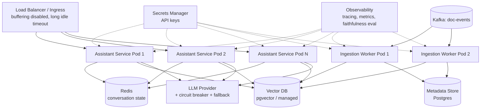

# 11 – Production Architecture

## Executive Summary

Moving a RAG pipeline from a working prototype to a production system
means treating it like any other distributed service: stateless
horizontal scaling, proper secrets management, observability, and a
deployment topology that respects the ingestion/query split established
in Chapter 09. This chapter covers the infrastructure layer specifically
— Kubernetes topology, load balancer/SSE interplay, multi-region, and
CI/CD for the AI-specific artifacts (prompts, eval sets) that a normal
service doesn't have.

## Diagrams

See [`diagrams/production-architecture.mmd`](diagrams/production-architecture.mmd)
and [`diagrams/scaling-rag.mmd`](diagrams/scaling-rag.mmd).



## Deployment Topology

**Two independently-scaled deployments**, matching the ingestion/query
split from Chapter 09 — this should be two Kubernetes `Deployment`
objects, not one:

```yaml
# assistant-service: scales with query traffic, stateless
apiVersion: apps/v1
kind: Deployment
metadata:
  name: assistant-service
spec:
  replicas: 3
  template:
    spec:
      containers:
        - name: assistant-service
          resources:
            requests: { cpu: "500m", memory: "1Gi" }
          envFrom:
            - secretRef: { name: llm-provider-secrets }
          readinessProbe:
            httpGet: { path: /actuator/health/readiness, port: 8080 }
---
apiVersion: autoscaling/v2
kind: HorizontalPodAutoscaler
metadata:
  name: assistant-service-hpa
spec:
  scaleTargetRef: { name: assistant-service, kind: Deployment }
  minReplicas: 3
  maxReplicas: 20
  metrics:
    - type: Resource
      resource: { name: cpu, target: { type: Utilization, averageUtilization: 70 } }
```

```yaml
# ingestion-worker: scales with Kafka consumer lag, not request traffic
apiVersion: apps/v1
kind: Deployment
metadata:
  name: ingestion-worker
spec:
  replicas: 4   # <= partition count on doc-events (Kafka guide, Ch 01)
```

Ingestion workers should scale on **Kafka consumer lag**, not CPU —
lag is the metric that actually reflects whether the pipeline is keeping
up (via KEDA's Kafka scaler or a custom metrics adapter), and is capped
by partition count regardless of how high you set `maxReplicas` (Kafka
guide, Partitions chapter).

## Load Balancer / Ingress Considerations for SSE

This is a common silent production bug, worth naming unprompted in an
interview: a reverse proxy or ingress that buffers responses will defeat
streaming (Chapter 08) even though the application code streams
correctly.

```yaml
# Nginx ingress annotations to disable buffering for the streaming route
nginx.ingress.kubernetes.io/proxy-buffering: "off"
nginx.ingress.kubernetes.io/proxy-read-timeout: "120"
nginx.ingress.kubernetes.io/proxy-http-version: "1.1"
```

- **Disable response buffering** on the streaming endpoint specifically.
- **Idle/read timeout** must exceed the expected maximum generation
  duration, not the typical short HTTP timeout defaults.
- **Sticky sessions are not required** for SSE here, since conversation
  state lives in Redis (Chapter 07), not in-process — any pod can serve
  any request, which is what makes the deployment horizontally scalable
  in the first place.

## Secrets Management

LLM provider API keys, embedding API keys, and vector DB credentials are
high-value secrets — treat them with the same rigor as database
credentials:

- Kubernetes `Secret` objects sourced from a real secrets manager (AWS
  Secrets Manager, HashiCorp Vault, GCP Secret Manager) via an operator/
  CSI driver, never committed to a repo or baked into an image.
- **Per-environment keys** (dev/staging/prod) so a runaway dev/test
  script can't burn production API budget or rate limits.
- **Rotation plan** — provider API keys should be rotatable without a
  full redeploy; source them from a mounted secret volume that can be
  refreshed, not baked into environment variables at build time if
  frequent rotation is a requirement.

## Vector Database Deployment

| Option | Production deployment shape |
|---|---|
| pgvector | Managed Postgres (RDS/Cloud SQL) with read replicas for query scaling; primary handles ingestion writes |
| Managed vector DB (Pinecone, etc.) | SaaS — no infra to run, but adds an external dependency to the failure-handling matrix (Chapter 09's reliability table) and a vendor-specific circuit breaker target |
| Self-hosted (Milvus, Weaviate, Qdrant) | Own the deployment, scaling, and backup story — justified only at a scale/cost point where SaaS pricing stops making sense |

Whichever option, **back it up** — a vector index is a derived artifact
of the metadata store (Chapter 03) technically, but re-embedding an
entire corpus from scratch after a data-loss event is a slow, expensive
recovery path; routine snapshotting is cheap insurance against needing
it.

## Multi-Region / Multi-Tenant

- **Assistant service**: stateless, so it deploys naturally close to
  users in multiple regions — but the LLM provider call itself is
  usually the fixed latency floor, so verify multi-region compute
  actually moves the needle before investing in it (capacity-estimation
  discipline from the AI/RAG Assistant System Design guide).
- **Vector DB partitioning**: shard by tenant/region for data residency
  requirements — a hard requirement in regulated industries (GDPR,
  data-sovereignty rules), not just a scaling nice-to-have.
- **Multi-tenant ACL isolation**: metadata-filtered (shared index,
  `tenantId` field, Chapter 06) for most SaaS scale; namespace-per-tenant
  for enterprise customers requiring stronger isolation guarantees — the
  same pool-vs-silo trade-off as any multi-tenant datastore design.

## CI/CD for AI-Specific Artifacts

A RAG system has deployable artifacts a typical service doesn't:
prompts (Chapter 07) and the retrieval/chunking/embedding configuration
(Chapters 04–06). Both need a release process:

- **Prompt changes**: version-controlled, PR-reviewed, gated on the
  faithfulness/recall eval suite (Chapters 04, 06, 13) before merge —
  treat exactly like an API contract change.
- **Chunking/embedding config changes**: require the re-embedding
  migration process (Chapter 05) — never a same-deploy config flip on a
  live index.
- **Canary/shadow deployment for prompt or model changes**: route a
  small percentage of live traffic to the new configuration, compare
  faithfulness/citation-accuracy/latency against the baseline before
  full rollout — the AI-system equivalent of a canary deploy for a
  behavioral, not just a code, change.

## Common Interview Questions

1. Why should the ingestion workers and the query-serving assistant
   service be separate deployments with separate scaling policies?
2. What specifically breaks if a load balancer buffers responses on a
   streaming endpoint, and how do you prevent it?
3. How would you scale ingestion throughput, and what caps that scaling?
4. Design multi-tenant vector database isolation for a B2B SaaS product
   with both small and enterprise customers.
5. How do you safely roll out a prompt change to production without an
   equivalent of a broken deploy?
6. What's your backup/recovery story if the vector database is lost?

## Principal Engineer Notes

Most of this chapter is "apply standard distributed-systems production
discipline to the AI-specific components" — the interesting engineering
judgment is knowing *which* standard practice needs an AI-specific
adaptation (canary deploys need an eval-based comparison metric, not
just error-rate; autoscaling needs a Kafka-lag signal, not just CPU) and
which needs none at all. Don't over-invent bespoke AI infrastructure
where the standard pattern already works unchanged.

## Next Chapter

12 – Performance Optimization
