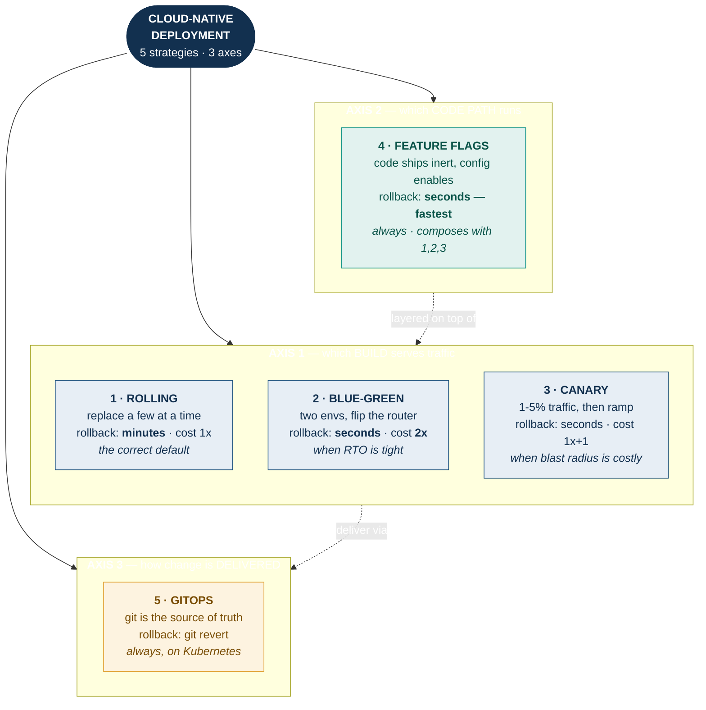
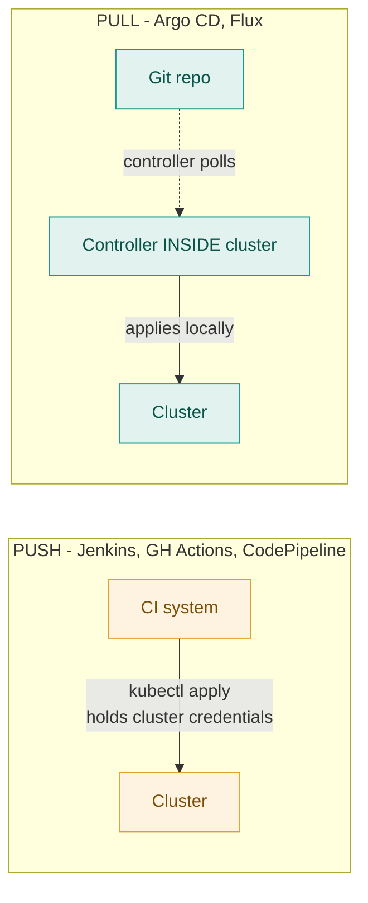
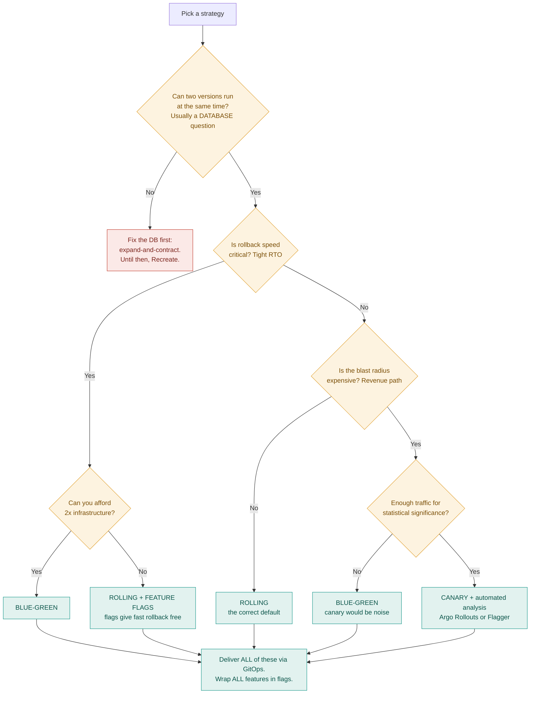

# Top 5 Deployment Strategies in Cloud-Native Production — Quick Revision

**Companion to:** `deployment-strategies-study-notes.md` (full reference)
**Purpose:** rapid revision, mind map, comparison, AWS vs Azure service mapping
**Currency:** July 2026

> [!IMPORTANT]
> **AI-generated content, and an honest note on the ranking.** No authoritative industry survey ranks deployment *strategies* by adoption share — CNCF, DORA and Stack Overflow surveys measure tools, platforms and outcomes, not strategy usage. This top 5 is therefore a **synthesis** of: which strategies platforms implement natively, which tools have real adoption, and what vendor and practitioner sources consistently describe as production practice. Where a hard number is cited, its source is named. Treat the ordering as informed judgement, not measured fact.

---

## How this top 5 was derived

Three grounded data points anchor the list:

| Evidence | Source | What it implies |
|---|---|---|
| **82% of container users run Kubernetes in production** (up from 66% in 2023); 98% of organisations use cloud-native techniques | CNCF Annual Cloud Native Survey, published Jan 2026 | Kubernetes' **default `RollingUpdate`** is, by volume, the most-executed deployment strategy in the world |
| **58% of "cloud native innovators" use GitOps extensively**, vs 23% of "adopters" | Same CNCF survey | GitOps is the delivery mechanism separating mature teams from the rest |
| **Only 21.3% of teams can recover from a failed deployment in under an hour** | DORA 2024, cited by Flagsmith | Rollback speed is the industry's weak point — which is why Blue-Green and feature flags matter |

Combined with the fact that AWS, Azure, Argo Rollouts and Flagger all implement the same small set of strategies natively, the list that emerges is:

| # | Strategy | Why it makes the list |
|---|---|---|
| **1** | **Rolling Update** | Kubernetes default. Highest execution volume of any strategy by a wide margin. |
| **2** | **Blue-Green** | Native in Azure App Service slots, AWS CodeDeploy, Lambda aliases, Argo Rollouts. The answer to the DORA rollback problem. |
| **3** | **Canary / Progressive Delivery** | Argo Rollouts and Flagger are both mature and actively maintained; the standard for high-blast-radius services. |
| **4** | **Feature Flags** | Pervasive. LaunchDarkly, Unleash, AWS AppConfig, Azure App Configuration, OpenFeature as the CNCF standard. |
| **5** | **GitOps-driven deployment** | Argo CD and Flux. How cloud-native teams actually *execute* strategies 1–3 in 2026. |

> [!TIP]
> **The most important thing on this page:** items 4 and 5 are **not peers of 1–3**. Strategies 1–3 control *which build receives traffic*. Feature flags control *which code path runs inside a build*. GitOps controls *how the change reaches the cluster*. They are three different axes, which is exactly why real production systems use all three at once rather than picking one.

---

## Mind map

The five strategies do not sit on one list — they sit on **three independent axes**. That is the structure worth memorising: axis 1 picks the build, axis 2 picks the code path inside it, axis 3 gets the change to the cluster. Real systems use all three at once.



---

## 1. Rolling Update

**What:** replace instances a few at a time until the fleet is updated. No downtime, no extra infrastructure.

**Why it dominates:** it is the Kubernetes `Deployment` default. With 82% of container users running Kubernetes in production, this is executed more than every other strategy combined.

**The two knobs:** `maxSurge` (extra instances allowed above desired) and `maxUnavailable` (instances allowed to be missing). `maxSurge: 25%, maxUnavailable: 0` is the safe default — never dips below capacity.

**Hard requirement:** adjacent versions must be **backward compatible in both directions**. Both serve traffic simultaneously and the load balancer does not pin a user to a version, so a single user's consecutive requests can hit v1 then v2.

**The bug everyone hits:** requests dropped on every deploy. Cause is the endpoint-removal race — when a pod is deleted, endpoint removal and SIGTERM happen in parallel, and endpoint propagation is not instant, so traffic keeps arriving after shutdown begins. Fix is a `preStop` sleep of 5–10 seconds plus `terminationGracePeriodSeconds` longer than your slowest request.

**Weakness:** rollback is a second full rolling deployment — minutes, not seconds. This is precisely the DORA problem above.

```yaml
strategy:
  type: RollingUpdate
  rollingUpdate:
    maxSurge: 25%
    maxUnavailable: 0        # never below full capacity
progressDeadlineSeconds: 600 # fail loudly instead of hanging
```

**Use it when:** stateless service, no tight RTO requirement. This is the correct default — most services should not use anything more complex.

---

## 2. Blue-Green

**What:** two complete production environments. Blue is live; Green runs the new version. Verify Green, then flip all traffic atomically. Keep Blue as an instant rollback target.

**Why it is on the list:** it directly answers the DORA finding that only ~21% of teams recover in under an hour. Blue-Green rollback is a routing change measured in **seconds**.

**The detail that breaks naive implementations:** the **database is not duplicated**. Both environments share one. So rollback is instant for the *application* and does nothing for *data*. If Green wrote a value Blue cannot read, flipping the router back exposes it. Expand-and-contract migrations are still mandatory.

**The second detail:** **warm Green before switching.** A cold environment receiving 100% of traffic instantly produces a latency spike and error burst. Azure App Service slot swap warms the target automatically — which is exactly why that feature exists. On AWS you must send synthetic traffic yourself.

**Never switch with DNS.** TTLs are advisory and clients cache unpredictably, so "roll back" leaves a long tail of users on the bad version for hours. Use a load balancer.

**Trade-off in one line:** **fast rollback, full blast radius** — 100% of users are exposed at the moment of switch.

**Use it when:** rollback speed is the binding constraint, you can afford roughly 2× infrastructure during the overlap, or you are deploying a monolith you cannot meaningfully canary.

---

## 3. Canary / Progressive Delivery

**What:** route 1–5% of live traffic to the new version, compare its metrics against the stable version, and progressively increase weight — or drop it to zero.

**Why it is on the list:** it has the smallest blast radius of any strategy, and the tooling is mature. **Argo Rollouts** (Argo CD ecosystem) and **Flagger** (Flux ecosystem) are both production-grade and actively maintained as of 2026.

**Progressive delivery vs canary:** progressive delivery *contains* canary. The defining ingredient is **automated analysis** — a canary promoted by a human watching Grafana is canary, but not progressive delivery.

**Argo Rollouts vs Flagger** — the choice is ecosystem-driven, not maturity-driven:

| | Argo Rollouts | Flagger |
|---|---|---|
| Resource model | Replaces `Deployment` with a `Rollout` CRD | Works **alongside** existing `Deployment`s — no manifest changes |
| Control | Explicit step-based, supports manual approval gates | Fully automated, metric-driven promotion |
| UI | Dashboard + Argo CD extension | None first-party |
| Pick it when | You want explicit control, approval gates, a UI | You want zero-touch automation and minimal migration |

**Three things that make canary work — or make it theatre:**

1. **Compare against a baseline, not a threshold.** A fixed threshold cannot tell "the code is broken" from "it is Monday and traffic tripled." Ideally deploy a *fresh* baseline of the old version so both are equally cold — comparing a cold canary against warm production instances makes the canary look slower regardless of code quality.
2. **Include at least one business metric.** A pricing bug returning HTTP 200 with a wrong number passes every technical check. Error rate and latency alone will promote a release that is commercially broken.
3. **Set `failureLimit: 2–3`.** Without it, one transient blip aborts the rollout, the team loses trust, and they route around the gate entirely.

```yaml
steps:
  - setWeight: 5
  - pause: { duration: 10m }
  - setWeight: 25
  - pause: { duration: 10m }
  - setWeight: 50
  - pause: { duration: 10m }
  - setWeight: 100
```

**Trade-off in one line:** **small blast radius, slow rollout.** The mirror image of Blue-Green.

**Do not use it when:** traffic is too low for statistical significance. A service handling 100 requests per minute gives a 10-minute bake about 17 requests to judge by, which is worthless. For low-traffic services canary adds complexity and deployment latency and buys no safety.

---

## 4. Feature Flags

**What:** ship code to production with the new behaviour **disabled by runtime configuration**. Enabling it is a config change, not a deployment.

**Why it is on the list, and why it is different:** it **decouples deploy from release**. Every other strategy controls which build is running. Flags control which code path executes inside a build. That is why they compose with all of them — and why they give the **fastest rollback available**: no routing change, no environment switch, no deployment. Seconds.

**Platform landscape:** LaunchDarkly, Unleash, Flagsmith commercially; **AWS AppConfig** and **Azure App Configuration** natively; **OpenFeature** as the CNCF vendor-neutral SDK standard — use it to avoid lock-in.

**Two non-negotiables:**

- **Evaluate locally.** The SDK caches rules streamed from the flag service. A network call per evaluation adds latency to every request and makes an external service a hard dependency in your request path.
- **Fail safe.** If the flag service is unreachable, serve last-known-good cached values; with no cache, fall back to hardcoded defaults — and the default must always be the **existing** behaviour, never the new path.

**The dominant failure mode is flag debt.** N boolean flags define 2^N nominal states, of which you test a handful. A codebase with 400 undeleted flags has behaviour nobody can reason about and stale flags that have quietly become load-bearing. Mitigations: mandatory owner and expiry date at creation, `oldest-flag-age` tracked as an operational metric, and flag removal as part of the definition of done.

**Distinguish flag types** — they have very different lifecycles:

| Type | Lifespan | Example |
|---|---|---|
| Release flag | Days–weeks, **delete after rollout** | New checkout flow |
| Experiment flag | Duration of the A/B test | Pricing variant |
| Ops flag / kill switch | **Permanent** | Disable recommendations under load |
| Permission flag | **Permanent** | Enterprise-tier features |

**Use it when:** always. There is no cloud-native service that would not benefit.

---

## 5. GitOps-Driven Deployment

**What:** Git is the single source of truth for desired cluster state. A controller **inside** the cluster continuously reconciles actual state toward it.

**Why it is on the list:** CNCF's 2026 survey found 58% of "cloud native innovators" use GitOps extensively versus 23% of "adopters" — it is the clearest marker separating mature teams from the rest. And it is *how* strategies 1–3 are executed in practice: Argo CD ships the manifests, Argo Rollouts runs the canary.

**Push vs pull — the distinction that matters:**



The pull model's advantages are concrete:

- **No inbound cluster access, no CI-held credentials.** A compromised CI system cannot reach the cluster.
- **Continuous drift correction.** `selfHeal: true` reverts anyone's manual `kubectl` change automatically.
- **Rollback is `git revert`** — reviewable, audited, atomic. A materially better story for regulated environments than someone running commands from a laptop.

```yaml
syncPolicy:
  automated:
    prune: true
    selfHeal: true      # reverts manual drift
```

**The one thing to get right:** **secrets must never be committed to Git.** Use the External Secrets Operator or Secrets Store CSI Driver pulling from AWS Secrets Manager or Azure Key Vault. This is the most common GitOps implementation mistake.

**Argo CD vs Flux:** Argo CD has a strong UI and pairs with Argo Rollouts; Flux is lighter-weight, more composable, and pairs with Flagger. Azure offers **managed Flux as an AKS extension**, which removes the operational burden entirely — a genuine differentiator.

---

## Comparison

| Dimension | Rolling | Blue-Green | Canary | Feature Flags | GitOps |
|---|---|---|---|---|---|
| **Axis** | Which build | Which build | Which build | Which **code path** | How it's **delivered** |
| **Downtime** | No | No | No | No | No |
| **Rollback speed** | Minutes | **Seconds** | Seconds | **Seconds (fastest)** | Minutes (`git revert` + sync) |
| **Blast radius** | Random subset | **100% at switch** | **1–5%** | Configurable | n/a |
| **Extra infra cost** | None | **~2× during overlap** | +1 instance | None | Controller only |
| **Deploy duration** | Minutes | Minutes | **Hours** | Instant | Minutes |
| **Needs traffic splitting** | No | No (LB switch) | **Yes** | No | No |
| **Needs backward compat** | **Yes** | Strongly advised | **Yes** | Yes | n/a |
| **Automated rollback** | Via probes | Via alarms | **Native** | Via alarms | Via sync failure |
| **Complexity** | Low | Medium | High | Medium (+ debt) | Medium |
| **Best for** | Stateless services — the default | Tight RTO, monoliths | Revenue paths, high traffic | Everything | Kubernetes at any scale |
| **Avoid when** | Tight RTO | Cost-sensitive | Low traffic (<~1k rpm) | No cleanup discipline | Non-declarative infra |

**The two trade-offs to memorise:**

1. **Blue-Green = fast rollback, full blast radius. Canary = small blast radius, slow rollout.** This single sentence answers most comparison questions.
2. **Flags and GitOps are orthogonal to all three.** Production systems combine them: GitOps delivers a rolling or canary deployment of a build whose features are flag-controlled.

---

## AWS vs Azure — service mapping

| Concern | AWS | Azure | Notes / who wins |
|---|---|---|---|
| **Rolling — containers** | ECS rolling (`minimumHealthyPercent`/`maximumPercent`); EKS | AKS rolling; **Container Apps** revisions | Even |
| **Rolling — VMs** | ASG **instance refresh** with `CheckpointPercentages` + alarm gate | **VMSS** rolling upgrade (`maxBatchInstancePercent`, `pauseTimeBetweenBatches`) | Even |
| **Blue-Green — PaaS** | Beanstalk swap-CNAME (**DNS-based, slow**) | **App Service deployment slots — warms target, atomic swap** | **Azure clearly.** Warm-up solves the cold-start problem AWS leaves to you |
| **Blue-Green — containers** | **CodeDeploy** `ECSBlueGreen`, two ALB target groups | App Gateway backend pool swap; Container Apps revision weights | **AWS** — CodeDeploy's hooks + auto-rollback are stronger |
| **Blue-Green — serverless** | **Lambda alias** + CodeDeploy `AllAtOnce` | **Functions slots** + swap | **AWS** — alarm-driven auto-rollback is built in |
| **Canary — L7 without a mesh** | **ALB weighted target groups** (⚠ enable `TargetGroupStickinessConfig`) | **Container Apps revision weights**; Front Door weighted origins | **Azure** more ergonomic; **AWS** more universally applicable |
| **Canary — serverless** | `Canary10Percent5Minutes`, `Linear10PercentEvery1Minute` | Functions slot traffic percentage | **AWS** — richer built-in configurations |
| **Canary — Kubernetes** | EKS + Argo Rollouts / Flagger | AKS + Argo Rollouts / Flagger | Even — same OSS on both |
| **Service mesh** | App Mesh, or Istio on EKS | Istio/Linkerd on AKS; Dapr built into Container Apps | Both rely on OSS in practice |
| **Feature flags** | **AWS AppConfig** — gradual rollout + **CloudWatch auto-rollback** | **Azure App Configuration** — richer targeting filters (users, groups, %) | **Azure** better targeting; **AWS** better automated rollback |
| **GitOps** | EKS + Argo CD / Flux (self-managed) | AKS **GitOps extension — managed Flux** | **Azure** — managed Flux is a real convenience |
| **CI/CD orchestration** | CodePipeline (V2) + CodeBuild + **CodeDeploy** | **Azure Pipelines** — native `canary` and `rolling` strategies, environments with gates | **AWS** deeper deploy engine; **Azure** better CI-level strategy support |
| **Source control** | **CodeCommit** (⚠ returned to **full GA Nov 2025** after being closed 2024), GitHub via CodeStar Connections | Azure Repos, GitHub | GitHub is the default on both |
| **Registry** | ECR | ACR | Even |
| **L7 load balancer** | ALB | Application Gateway (WAF v2) | Even |
| **L4 load balancer** | NLB | Azure Load Balancer | Even |
| **Global edge / CDN / WAF** | CloudFront + Global Accelerator + AWS WAF (**three services**) | **Azure Front Door** (**one service**: CDN + global LB + WAF) | **Azure simpler**; AWS more granular |
| **Global failover** | Route 53 (DNS, TTL-bound) or **Global Accelerator** (anycast, seconds) | Traffic Manager (DNS) or **Front Door** (anycast) | Even — use the anycast option on both |
| **API gateway** | API Gateway (REST ~$3.50/M, HTTP ~$1.00/M) | **API Management** — revisions & versions, richer policy engine | **Azure** if coming from APIGEE |
| **Secrets** | Secrets Manager, SSM Parameter Store | **Key Vault** | Even |
| **Metrics for canary analysis** | CloudWatch, Managed Prometheus | **Application Insights** — strong distributed tracing | **Azure** stronger out of the box |
| **IaC** | CloudFormation, **CDK** | **Bicep**, ARM, Terraform | CDK more expressive; Bicep simpler to learn |
| **Cost note — blue-green** | ECS/EC2 costs **~2×** during overlap; Lambda **negligible** | **App Service slots included in the plan — effectively free** | **Azure** has a genuine cost advantage for PaaS blue-green |

> [!WARNING]
> **Three service facts that make older study material wrong.**
> **(1) ingress-nginx reached end-of-life March 2026** — no security patches; ~50% of clusters used it. Annotation-based canary (`nginx.ingress.kubernetes.io/canary`) is legacy. **Gateway API** (v1.6.0 as of June 2026) is the successor; `ingress2gateway` automates conversion.
> **(2) AWS CodeCommit returned to full GA on 24 Nov 2025** after being closed to new customers in July 2024. Material saying it is dead is out of date.
> **(3) Amazon CodeCatalyst is in maintenance mode and AWS Proton is sunsetting** — do not build new pipelines on either.

---

## Decision tree



---

## Cheat sheet

| Strategy | One line | Rollback | Cost | Pick when |
|---|---|---|---|---|
| **Rolling** | Replace a few at a time | Minutes | 1× | Default for stateless services |
| **Blue-Green** | Two envs, flip the router | **Seconds** | **2×** | Rollback speed is critical |
| **Canary** | 1–5% traffic, compare, ramp | Seconds | 1× + 1 | Blast radius is expensive |
| **Feature Flags** | Code inert until enabled | **Seconds** | 1× | Always |
| **GitOps** | Git is truth, cluster reconciles | `git revert` | Controller | Always, on Kubernetes |

### Ten things to remember

1. **Rolling is the default and that is correct.** Most services should not use anything more complex. Sophistication has real costs.
2. **Blue-Green = fast rollback, full blast radius. Canary = small blast radius, slow rollout.** Pick by which cost is higher for your service.
3. **Feature flags are a different axis** — code path, not build. Fastest rollback available. Compose them with everything.
4. **GitOps is a third axis** — delivery mechanism, not traffic strategy. Pull model, no cluster credentials in CI, drift self-heals.
5. **The database decides what is possible.** Expand-and-contract — four deployments to rename a column — is what actually unlocks zero downtime. Almost every "we need a maintenance window" traces back here.
6. **Version-label every metric, log and trace.** Without it, during any multi-version rollout you see a blended aggregate and cannot attribute failure to a version. Non-negotiable.
7. **Compare canary against a fair baseline, not a threshold.** Equally cold, equally provisioned. Otherwise you get false alarms at peak and miss regressions at trough.
8. **Include business metrics.** HTTP 200 with a wrong price passes every technical check.
9. **Add a `preStop` sleep of 5–10s.** Closes the endpoint-removal race. Without it you drop requests on every single pod replacement — the most common rolling-deployment bug.
10. **Pin images by digest, never `:latest`.** Otherwise identical specs run different code and rollback is unreliable.

### Interview one-liners

- *"Blue-green or canary?"* → Blue-green optimises rollback speed at full blast radius; canary optimises blast radius at slower rollout. Choose by which cost is higher.
- *"Is canary the same as progressive delivery?"* → No. Progressive delivery *contains* canary; the distinguishing ingredient is **automated** analysis. A human approving each step is canary but not progressive delivery.
- *"How do you achieve zero-downtime deployment?"* → Zero downtime is a **property**, not a strategy. It depends far more on backward compatibility of schema, API and session state than on the deployment mechanism.
- *"Why is `:latest` incompatible with immutable deployment?"* → The tag is mutable, so identical specs can run different code and rollback may not retrieve the previous image.
- *"Should a rate limiter fail open or closed?"* → **Open** — it must never become the outage. Authentication is the opposite and fails **closed**.
- *"Do you duplicate the database in blue-green?"* → Almost never. Which is why rollback is instant for the application and does nothing for data.

---

*Verify service names, versions, quotas and pricing against current vendor documentation before relying on them in a design review.*
